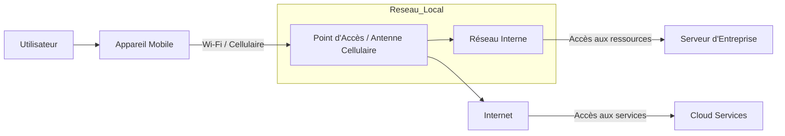

---
tags:
  - materiel
  - hardware
  - mobile
  - endpoint
aliases:
  - Mobile Device
  - Appareil Mobile
  - Terminal Mobile
  - Device Mobile
archetype: materiel
constructeur: Multiples
cssclasses:
  - max
---

# Appareil Mobile

> [!info] Rôle Principal
> Un appareil mobile est un terminal informatique portable et multifonctionnel (smartphone, tablette) qui permet aux utilisateurs d'accéder à des applications et des services, de communiquer et de naviguer sur Internet via des réseaux sans fil. Il sert de point d'accès personnel aux ressources numériques et aux services réseau.

## ⚙️ Fonctionnement Interne
Les appareils mobiles sont des terminaux équipés de processeurs, de mémoire, de stockage, de capteurs et d'un système d'exploitation (comme Android ou iOS). Ils se connectent à des réseaux via des interfaces sans fil (Wi-Fi, Bluetooth, cellulaire) pour échanger des données. Leur fonctionnement repose sur l'exécution d'applications qui interagissent avec les services réseau, souvent via le Cloud.

## 🛡️ Sécurité & Risques
> [!warning] Menaces Physiques
> * **Vol ou Perte** : L'accès physique à l'appareil peut permettre l'exfiltration de données sensibles ou l'usurpation de compte.
> * **Accès non autorisé** : Contournement des mesures de verrouillage pour accéder aux informations stockées.
> * **Exposition involontaire** : Laissé sans surveillance dans un lieu public, vulnérable à la curiosité malveillante.

> [!warning] Menaces Logiques
> * **Logiciels malveillants** : Applications vérolées, Ransomware, Spyware conçus pour voler des données ou perturber le fonctionnement.
> * **Hameçonnage et Smishing** : Tentatives d'obtenir des informations d'identification via des messages ou sites contrefaits.
> * **Prise de contrôle de compte** : Exploitation de mots de passe faibles, de l'réutilisation de mots de passe ou de failles d'authentification.
> * **Fuites de données** : Vulnérabilités dans les applications ou le système d'exploitation menant à la compromission d'informations personnelles.

> [!tip] Bonnes Pratiques
> 1.  **Authentification Multi-Facteurs (MFA)** : Utiliser la MFA pour protéger les accès aux comptes.
> 2.  **Mises à jour Régulières** : Maintenir le système d'exploitation et les applications à jour pour corriger les vulnérabilités.
> 3.  **Gestion des Appareils Mobiles (MDM)** : Implémenter des solutions MDM pour les flottes d'entreprise afin de sécuriser, surveiller et gérer les appareils à distance.
> 4.  **Applications Sécurisées** : Télécharger des applications uniquement depuis des sources fiables et vérifier les autorisations demandées.
> 5.  **Sauvegardes Régulières** : Effectuer des sauvegardes des données importantes.
> 6.  **Verrouillage d'écran** : Utiliser un code PIN, un mot de passe fort ou la biométrie pour protéger l'accès à l'appareil.

## 🔗 Notes Connexes
*   Sécurité Mobile
*   Gestion des Appareils Mobiles
*   Sécurité des Endpoints
*   Système d'exploitation