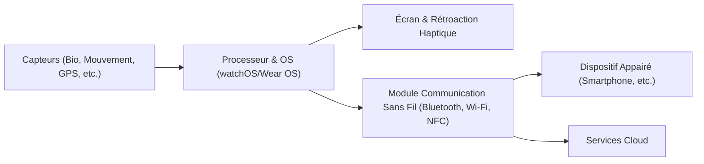

---
tags:
  - materiel
  - hardware
  - objet/connecte
aliases:
  - Montre connectée
  - Smart Watch
archetype: materiel
constructeur: Générique
cssclasses:
  - max
---

# Smartwatch

> [!info] Rôle Principal
> Une Smartwatch est un [[EndDevices|dispositif terminal]] portable conçu pour être porté au poignet, offrant des fonctionnalités étendues au-delà d'une simple montre. Elle sert de compagnon pour le [[Smartphone]], affichant les notifications, suivant l'activité physique et la santé, et permettant l'utilisation d'applications. C'est un exemple notable d'[[InternetofThings|objet connecté]].

## 🛠️ Spécifications Techniques
| Caractéristique | Valeur |
|---|---|
| **Type** | Dispositif terminal, Objet connecté |
| **Débit Max** | Variable (ex: jusqu'à 24 Mbps pour Bluetooth 5.x) |
| **Connecteurs** | Sans fil (Bluetooth, Wi-Fi, NFC pour paiements); USB (pour recharge et certaines synchronisations) |
| **Couche OSI** | Couche d'Accès Réseau (Physique et Liaison de Données pour les communications sans fil) |

## ⚙️ Fonctionnement Interne
Une Smartwatch intègre un [[OperatingSystem|système d'exploitation]] dédié (ex: watchOS, Wear OS), un [[Process|processeur]] basse consommation, de la [[Buffer|mémoire]], et une variété de [[InputDevices|capteurs]] (accéléromètre, gyroscope, capteur de fréquence cardiaque, GPS, baromètre). Les [[Data|données]] collectées sont traitées localement, affichées sur l'écran, et souvent synchronisées via [[Bluetooth]] ou [[IEEE80211|Wi-Fi]] avec un [[Smartphone]] ou des [[Cloud|services cloud]].

## 🛡️ Sécurité & Risques
> [!warning] Menaces Physiques
> *   **Vol ou perte** : Risque de perte de l'appareil et d'accès non autorisé aux [[PersonalData|données personnelles]] stockées.
> *   **Accès non autorisé** : Si non verrouillée, une smartwatch peut être utilisée pour accéder à des informations sensibles ou contrôler des fonctions du [[Smartphone]] appairé.
> *   **InadvertentExposure** : Exposition involontaire de données sensibles affichées à l'écran dans des lieux publics.

> [!tip] Bonnes Pratiques
> 1.  Utiliser un [[Password|code PIN]] ou un [[Biometric|verrouillage biométrique]] pour sécuriser l'appareil.
> 2.  Gérer attentivement les autorisations d'application (non présente dans la liste, à omettre) et les données partagées.
> 3.  Maintenir le [[Firmware|micrologiciel]] et les applications à jour pour corriger les [[SecurityVulnerabilities|failles de sécurité]].
> 4.  Prendre en compte les implications en matière de [[PrivacyInvasion|vie privée]] lors de l'utilisation des capteurs et de la collecte de [[LocationData|données de localisation]].

## 🔗 Notes Connexes
*   **Protocole utilisé** : [[Bluetooth]], [[NearFieldCommunication|NFC]], [[IEEE80211|Wi-Fi]]
*   **Dépendance logicielle** : [[Android]], [[IPhoneOperatingSystem|iOS]]
*   **Type de données** : [[Biometric|Biométrie]], [[PersonalData|Données personnelles]], [[LocationData|Données de localisation]]
*   **Concept de sécurité** : [[MobileSecurity|Sécurité Mobile]], [[IoTSecurity|Sécurité de l'IoT]]
*   **Concept général** : [[InternetofThings|Internet des Objets]]