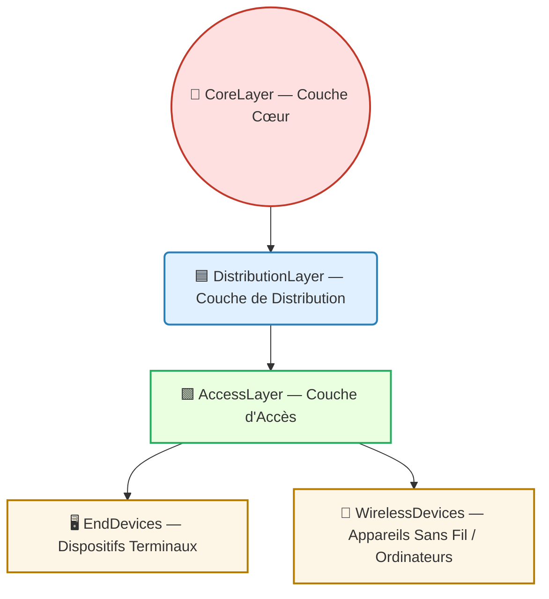

---
tags:
  - modele
  - modele/reseau
  - couche/acces
aliases:
  - Couche d'Accès
  - Access Layer
  - Couche d'accès (réseau)
archetype: modele
source:
  - 
cssclasses:
  - max
---

# Couche d'Accès (Access Layer)

## 🎯 Principe Fondamental

> La Couche d'Accès est le niveau le plus bas et le point d'entrée initial d'une architecture de réseau hiérarchique. Son rôle est de permettre aux dispositifs terminaux et aux utilisateurs de se connecter au réseau, d'agréger leur trafic, et d'appliquer les premières mesures de sécurité et de gestion de service.

## 🧩 Composants / Éléments Clés

- **Commutateurs d'accès**: Périphériques qui connectent directement les terminaux (ordinateurs, imprimantes, téléphones VoIP) au réseau via des ports Ethernet.
- **Points d'Accès Sans Fil (WAP)**: Permettent la connectivité des appareils sans fil (comme les smartphones et tablettes) en convertissant les signaux sans fil en signaux électriques ou optiques.
- **Dispositifs Terminaux**: Représentent les utilisateurs finaux et leurs appareils qui se connectent à la couche d'accès.

## 📜 Règles de Fonctionnement

- **Connectivité et Agrégation**: La couche d'accès collecte et consolide le trafic réseau des terminaux connectés avant de le transférer à la couche de distribution.
- **Segmentation Logique**: Implémente des Réseaux Locaux Virtuels (VLAN) pour isoler logiquement des groupes de dispositifs ou d'utilisateurs, améliorant la sécurité et la performance.
- **Priorisation du Trafic (QoS)**: Applique des politiques pour prioriser certains types de trafic (ex: voix sur IP, vidéo) afin de garantir une expérience utilisateur optimale.
- **Alimentation via Ethernet (PoE)**: Fournit de l'alimentation électrique aux appareils compatibles (ex: points d'accès sans fil, téléphones VoIP) directement via le câble Ethernet.
- **Contrôles d'Accès Initiaux**: Première ligne de défense où des mesures comme la sécurité des ports (liaison d'adresses MAC spécifiques à des ports) et l'authentification 802.1X sont appliquées pour valider les dispositifs.

## 💡 Applications Pratiques

- **Réseaux d'Entreprise et Campus**: Conception standard pour connecter les utilisateurs et leurs appareils aux ressources du réseau d'entreprise.
- **Petits Réseaux Domestiques et SOHO**: Fonction d'accès implémentée via un routeur sans fil qui connecte les appareils au réseau principal et offre des services d'accès basiques.

## 📊 Diagramme Conceptuel d'une Architecture Hiérarchique
La Couche d'Accès est la base d'une conception de réseau hiérarchique, où elle est reliée à la Couche de Distribution qui elle-même se connecte à la Couche Cœur.

## ✅ Avantages et Limites

- **Avantages**:
    - **Connectivité Efficace**: Point de connexion direct et fiable pour les dispositifs terminaux.
    - **Gestion Granulaire du Trafic**: Permet une agrégation et une gestion fine du trafic réseau au plus proche de sa source.
    - **Application de Contrôles de Sécurité**: Point stratégique pour l'application des premières lignes de défense et de contrôle d'accès au réseau.
    - **Évolutivité Locale**: Facilite l'ajout ou la suppression de dispositifs sans perturber le reste du réseau.
- **Limites**:
    - **Potentiel de Surcharge**: Une mauvaise conception ou un nombre excessif de terminaux peut entraîner une congestion réseau et des performances dégradées si la bande passante vers la couche de distribution est insuffisante.
    - **Point d'Attaque**: Étant le point d'entrée, la couche d'accès est une surface d'attaque privilégiée. Les vulnérabilités à ce niveau peuvent permettre l'accès non autorisé au réseau.

## 🔗 Notes Connexes

- **Concept parent**: Conception de Réseau Hiérarchique
- **Couche supérieure**: Couche de Distribution
- **Couche supérieure**: Couche Cœur
- **Mécanisme clé**: VLAN
- **Contrôle de sécurité**: Contrôle d'Accès