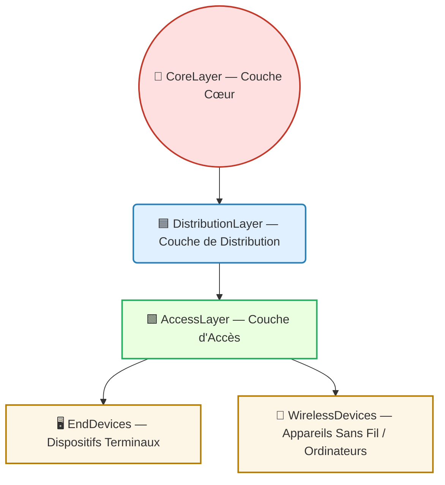

---
tags:
  - modele
  - modele/reseau
  - couche/acces
aliases:
  - Couche d'Accès
  - Access Layer
  - Couche d'accès (réseau)
archetype: modele
source:
  - 
cssclasses:
  - max
---

# Couche d'Accès (Access Layer)

## 🎯 Principe Fondamental

> La [[AccessLayer|Couche d'Accès]] est le niveau le plus bas et le point d'entrée initial d'une [[HierarchicalNetworkDesign|architecture de réseau hiérarchique]]. Son rôle est de permettre aux [[EndDevices|dispositifs terminaux]] et aux [[User|utilisateurs]] de se connecter au [[Network|réseau]], d'agréger leur [[NetworkTraffic|trafic]], et d'appliquer les premières mesures de [[Security|sécurité]] et de gestion de service.

## 🧩 Composants / Éléments Clés

- **[[NetworkSwitch|Commutateurs d'accès]]**: Périphériques qui connectent directement les [[EndDevices|terminaux]] (ordinateurs, imprimantes, téléphones VoIP) au réseau via des [[EthernetPorts|ports Ethernet]].
- **[[AccessPoint|Points d'Accès Sans Fil (WAP)]]**: Permettent la connectivité des [[WirelessDevices|appareils sans fil]] (comme les smartphones et tablettes) en convertissant les [[WirelessSignals|signaux sans fil]] en [[ElectricalSignals|signaux électriques]] ou [[OpticalSignals|optiques]].
- **[[EndDevices|Dispositifs Terminaux]]**: Représentent les [[User|utilisateurs]] finaux et leurs appareils qui se connectent à la couche d'accès.

## 📜 Règles de Fonctionnement

- **Connectivité et Agrégation**: La [[AccessLayer|couche d'accès]] collecte et consolide le [[NetworkTraffic|trafic réseau]] des [[EndDevices|terminaux]] connectés avant de le transférer à la [[DistributionLayer|couche de distribution]].
- **[[NetworkSegmentation|Segmentation Logique]]**: Implémente des [[VirtualLocalAreaNetwork|Réseaux Locaux Virtuels (VLAN)]] pour isoler logiquement des groupes de dispositifs ou d'utilisateurs, améliorant la sécurité et la performance.
- **[[QualityOfService|Priorisation du Trafic (QoS)]]**: Applique des politiques pour prioriser certains types de [[NetworkTraffic|trafic]] (ex: voix sur IP, vidéo) afin de garantir une [[UserExperience|expérience utilisateur]] optimale.
- **[[PowerOverEthernet|Alimentation via Ethernet (PoE)]]**: Fournit de l'alimentation électrique aux [[NetworkDevice|appareils]] compatibles (ex: points d'accès sans fil, téléphones VoIP) directement via le [[EthernetPatchCable|câble Ethernet]].
- **Contrôles d'[[AccessControl|Accès]] Initiaux**: Première ligne de défense où des mesures comme la [[PortSecurity|sécurité des ports]] (liaison d'[[MediaAccessControlAddress|adresses MAC]] spécifiques à des [[EthernetPorts|ports]]) et l'[[EightZeroTwoOneXAuthentication|authentification 802.1X]] sont appliquées pour valider les dispositifs.

## 💡 Applications Pratiques

- **[[EnterpriseNetwork|Réseaux d'Entreprise]] et Campus**: Conception standard pour connecter les utilisateurs et leurs appareils aux ressources du [[CorporateNetwork|réseau d'entreprise]].
- **[[SOHONetwork|Petits Réseaux Domestiques et SOHO]]**: Fonction d'accès implémentée via un [[WirelessRouter|routeur sans fil]] qui connecte les [[EndDevices|appareils]] au [[Internet|réseau principal]] et offre des services d'accès basiques.

## 📊 Diagramme Conceptuel d'une Architecture Hiérarchique
La [[AccessLayer|Couche d'Accès]] est la base d'une [[HierarchicalNetworkDesign|conception de réseau hiérarchique]], où elle est reliée à la [[DistributionLayer|Couche de Distribution]] qui elle-même se connecte à la [[CoreLayer|Couche Cœur]].

## ✅ Avantages et Limites

- **Avantages**:
    - **Connectivité Efficace**: Point de connexion direct et fiable pour les [[EndDevices|dispositifs terminaux]].
    - **Gestion Granulaire du Trafic**: Permet une agrégation et une gestion fine du [[NetworkTraffic|trafic réseau]] au plus proche de sa source.
    - **Application de Contrôles de Sécurité**: Point stratégique pour l'application des premières lignes de défense et de [[AccessControl|contrôle d'accès]] au réseau.
    - **Évolutivité Locale**: Facilite l'ajout ou la suppression de [[EndDevices|dispositifs]] sans perturber le reste du réseau.
- **Limites**:
    - **Potentiel de Surcharge**: Une mauvaise conception ou un nombre excessif de [[EndDevices|terminaux]] peut entraîner une [[NetworkCongestion|congestion réseau]] et des [[NetworkPerformance|performances]] dégradées si la bande passante vers la [[DistributionLayer|couche de distribution]] est insuffisante.
    - **Point d'[[AttackSurface|Attaque]]**: Étant le point d'entrée, la [[AccessLayer|couche d'accès]] est une [[AttackSurface|surface d'attaque]] privilégiée. Les [[SecurityVulnerabilities|vulnérabilités]] à ce niveau peuvent permettre l'[[UnauthorizedAccess|accès non autorisé]] au réseau.

## 🔗 Notes Connexes

- **Concept parent**: [[HierarchicalNetworkDesign|Conception de Réseau Hiérarchique]]
- **Couche supérieure**: [[DistributionLayer|Couche de Distribution]]
- **Couche supérieure**: [[CoreLayer|Couche Cœur]]
- **Mécanisme clé**: [[VirtualLocalAreaNetwork|VLAN]]
- **Contrôle de sécurité**: [[AccessControl|Contrôle d'Accès]]