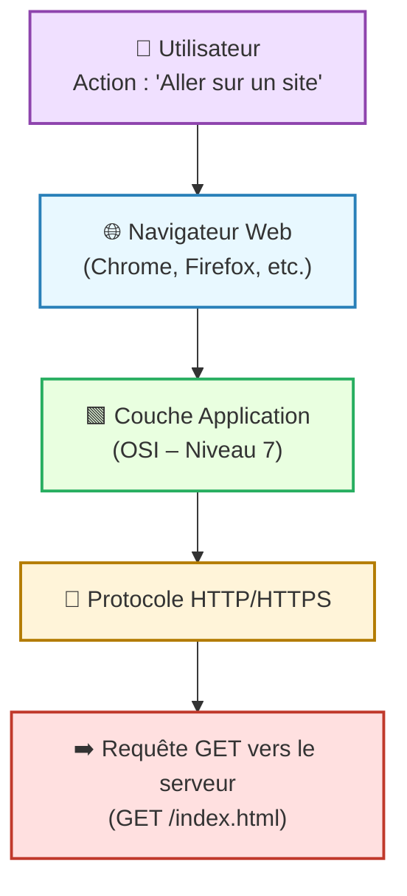
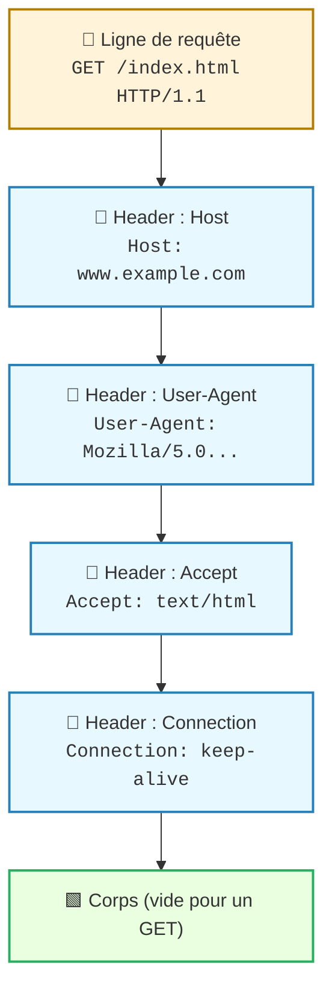

---
tags:
  - modele
  - couche/application
  - modele/osi
  - reseau
  - communication
aliases:
  - Couche Application
  - Application Layer
  - Couche 7 (OSI)
archetype: modele
source:
  - 
cssclasses:
  - max
---

# Couche Application (Modèle OSI)

## 🎯 Principe Fondamental
> La [[ApplicationLayer|Couche Application]] est la septième et la plus haute couche du [[OpenSystemsInterconnectionModel|Modèle OSI]]. Son rôle principal est de faciliter l'interaction directe entre les [[SoftwareApplication|applications logicielles]] des [[User|utilisateurs]] finaux et les services réseau sous-jacents, permettant ainsi aux utilisateurs d'accéder aux ressources et de communiquer à travers le [[Network|réseau]]. Elle fournit les services qui prennent directement en charge les [[SoftwareApplication|applications]].

## 🧩 Composants / Éléments Clés
*   **Protocoles d'Application**: Chaque protocole spécifique à cette couche définit la manière dont des [[SoftwareApplication|applications]] données communiquent. Des exemples incluent [[HypertextTransferProtocol|HTTP]], [[FileTransferProtocol|FTP]], [[DomainNameSystem|DNS]], SMTP, POP3, IMAP.
*   **Interfaces de Service**: Points d'accès standardisés qui permettent aux [[SoftwareApplication|applications]] d'utiliser les services offerts par la [[PresentationLayer|couche de présentation]] et les couches inférieures du [[OpenSystemsInterconnectionModel|modèle OSI]].
*   **Données d'Application**: Les informations réelles échangées entre les [[SoftwareApplication|applications]], formatées selon les règles du protocole d'application utilisé.

## 📜 Règles de Fonctionnement
*   **Fourniture de Services**: La [[ApplicationLayer|Couche Application]] définit et fournit les fonctions qui permettent aux [[SoftwareApplication|applications]] de communiquer sur un [[Network|réseau]]. Cela inclut le transfert de fichiers, la messagerie électronique, l'accès au [[WorldWideWeb|Web]], et la gestion de [[Database|bases de données]] distribuées.
*   **Syntaxe et Sémantique**: Elle spécifie la syntaxe et la sémantique de l'information échangée entre les [[SoftwareApplication|applications]] communicantes, garantissant que les [[SoftwareApplication|applications]] puissent interpréter correctement les [[Data|données]] reçues.
*   **Interaction avec l'utilisateur**: Étant la couche la plus proche de l'utilisateur final, elle est directement responsable de l'interface et de l'interaction avec le [[User|utilisateur]] et ses [[SoftwareApplication|applications]].
*   **Indépendance des couches inférieures**: Elle opère de manière indépendante des détails de [[DataTransmission|transmission des données]] des couches inférieures, se concentrant uniquement sur les besoins de communication des [[SoftwareApplication|applications]].

## 📊 Diagramme Conceptuel

---

---

## 💡 Applications Pratiques
*   [[WebBrowsers|Navigateurs Web]] (utilisant [[HypertextTransferProtocol|HTTP]] et [[HypertextTransferProtocolSecure|HTTPS]]) pour l'accès aux sites web.
*   Clients de messagerie électronique (comme Outlook, Thunderbird) pour l'envoi et la réception d'[[Email|e-mails]] (utilisant SMTP, POP3, IMAP).
*   [[FileTransfer|Logiciels de transfert de fichiers]] (comme FileZilla) basés sur [[FileTransferProtocol|FTP]] ou [[SSHFileTransferProtocol|SFTP]].
*   Systèmes de résolution de noms (tels que [[DomainNameSystem|DNS]]) qui traduisent les noms de domaine en [[InternetProtocol|adresses IP]].
*   Applications de communication instantanée ou de visioconférence.

## ✅ Avantages et Limites
*   **Avantages**:
    *   Fournit une interface standardisée pour les [[SoftwareApplication|applications]] et les [[User|utilisateurs]] pour interagir avec le [[Network|réseau]].
    *   Permet la [[Interoperability|compatibilité]] entre différentes [[SoftwareApplication|applications]] et [[System|systèmes]] à travers des protocoles bien définis.
    *   Facilite le développement d'[[SoftwareApplication|applications]] réseau en abstrayant les complexités des couches inférieures.
*   **Limites**:
    *   Les [[SoftwareVulnerability|vulnérabilités logicielles]] et les [[SoftwareBugs|bugs]] au niveau de cette couche peuvent avoir un impact direct sur la [[Security|sécurité]] des [[SoftwareApplication|applications]] et des [[Data|données]].
    *   Elle est souvent la principale [[AttackSurface|surface d'attaque]] pour les [[ThreatActor|attaquants]] qui ciblent les [[SoftwareApplication|applications]] et les [[User|utilisateurs]].
    *   La performance de la [[ApplicationLayer|couche application]] est fortement dépendante de l'efficacité des couches inférieures du [[OpenSystemsInterconnectionModel|modèle OSI]].

## 🔗 Notes Connexes
*   **Modèle parent**: [[OpenSystemsInterconnectionModel|Modèle OSI]]
*   **Couche inférieure**: [[PresentationLayer|Couche Présentation]]
*   **Protocole emblématique**: [[HypertextTransferProtocol|HTTP]]
*   **Implication de sécurité**: [[AttackSurface|Surface d'attaque]]
*   **Service clé**: [[DomainNameSystem|DNS]]