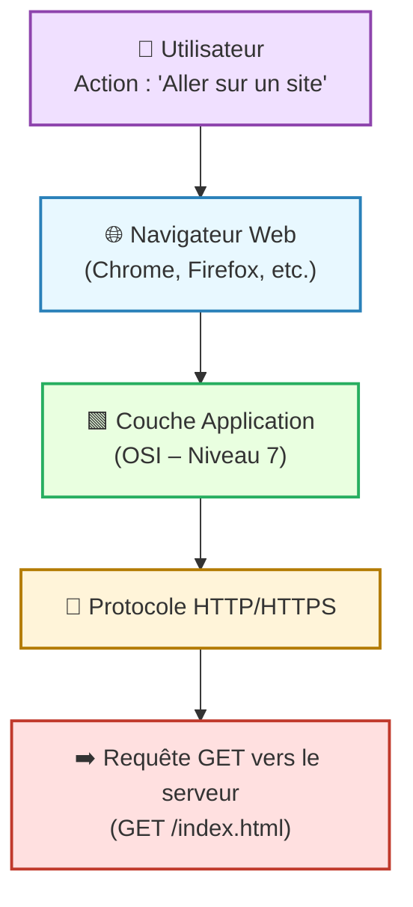
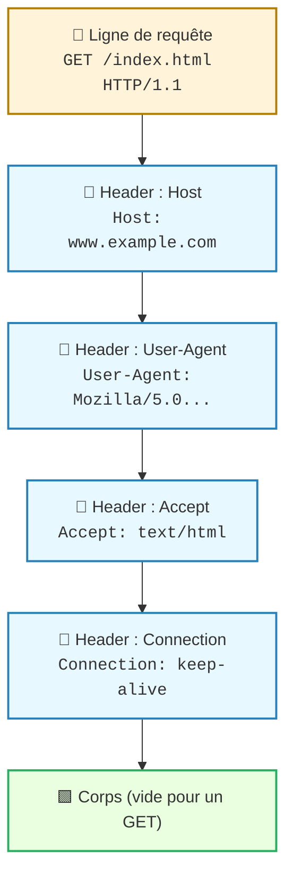

---
tags:
  - modele
  - couche/application
  - modele/osi
  - reseau
  - communication
aliases:
  - Couche Application
  - Application Layer
  - Couche 7 (OSI)
archetype: modele
source:
  - 
cssclasses:
  - max
---

# Couche Application (Modèle OSI)

## 🎯 Principe Fondamental
> La Couche Application est la septième et la plus haute couche du Modèle OSI. Son rôle principal est de faciliter l'interaction directe entre les applications logicielles des utilisateurs finaux et les services réseau sous-jacents, permettant ainsi aux utilisateurs d'accéder aux ressources et de communiquer à travers le réseau. Elle fournit les services qui prennent directement en charge les applications.

## 🧩 Composants / Éléments Clés
*   **Protocoles d'Application**: Chaque protocole spécifique à cette couche définit la manière dont des applications données communiquent. Des exemples incluent HTTP, FTP, DNS, SMTP, POP3, IMAP.
*   **Interfaces de Service**: Points d'accès standardisés qui permettent aux applications d'utiliser les services offerts par la couche de présentation et les couches inférieures du modèle OSI.
*   **Données d'Application**: Les informations réelles échangées entre les applications, formatées selon les règles du protocole d'application utilisé.

## 📜 Règles de Fonctionnement
*   **Fourniture de Services**: La Couche Application définit et fournit les fonctions qui permettent aux applications de communiquer sur un réseau. Cela inclut le transfert de fichiers, la messagerie électronique, l'accès au Web, et la gestion de bases de données distribuées.
*   **Syntaxe et Sémantique**: Elle spécifie la syntaxe et la sémantique de l'information échangée entre les applications communicantes, garantissant que les applications puissent interpréter correctement les données reçues.
*   **Interaction avec l'utilisateur**: Étant la couche la plus proche de l'utilisateur final, elle est directement responsable de l'interface et de l'interaction avec le utilisateur et ses applications.
*   **Indépendance des couches inférieures**: Elle opère de manière indépendante des détails de transmission des données des couches inférieures, se concentrant uniquement sur les besoins de communication des applications.

## 📊 Diagramme Conceptuel

---

---

## 💡 Applications Pratiques
*   Navigateurs Web (utilisant HTTP et HTTPS) pour l'accès aux sites web.
*   Clients de messagerie électronique (comme Outlook, Thunderbird) pour l'envoi et la réception d'e-mails (utilisant SMTP, POP3, IMAP).
*   Logiciels de transfert de fichiers (comme FileZilla) basés sur FTP ou SFTP.
*   Systèmes de résolution de noms (tels que DNS) qui traduisent les noms de domaine en adresses IP.
*   Applications de communication instantanée ou de visioconférence.

## ✅ Avantages et Limites
*   **Avantages**:
    *   Fournit une interface standardisée pour les applications et les utilisateurs pour interagir avec le réseau.
    *   Permet la compatibilité entre différentes applications et systèmes à travers des protocoles bien définis.
    *   Facilite le développement d'applications réseau en abstrayant les complexités des couches inférieures.
*   **Limites**:
    *   Les vulnérabilités logicielles et les bugs au niveau de cette couche peuvent avoir un impact direct sur la sécurité des applications et des données.
    *   Elle est souvent la principale surface d'attaque pour les attaquants qui ciblent les applications et les utilisateurs.
    *   La performance de la couche application est fortement dépendante de l'efficacité des couches inférieures du modèle OSI.

## 🔗 Notes Connexes
*   **Modèle parent**: Modèle OSI
*   **Couche inférieure**: Couche Présentation
*   **Protocole emblématique**: HTTP
*   **Implication de sécurité**: Surface d'attaque
*   **Service clé**: DNS