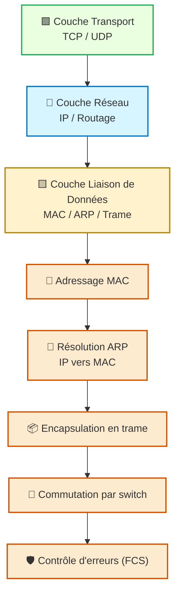
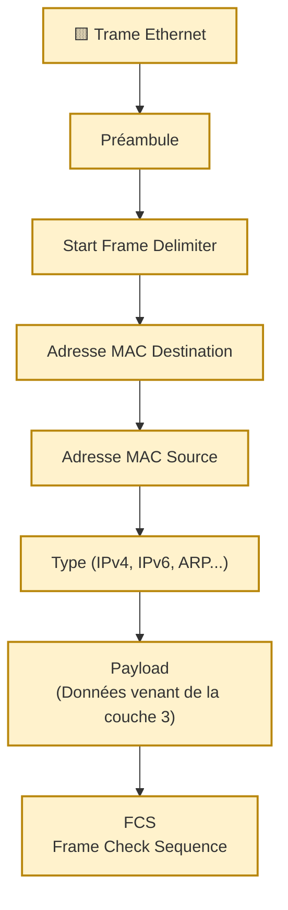

---
tags:
  - modele
  - couche/liaison/donnees
  - modele/osi
  - reseau
  - protocole/mac
  - adresse-mac
  - ethernet
  - trame/ethernet
archetype: modele
aliases:
  - Couche Liaison de Données
  - Data Link Layer
source:
  - 
cssclasses:
  - max
---

# Couche Liaison de Données (Data Link Layer)

## 🎯 Principe Fondamental
> La [[DataLinkLayer|Couche Liaison de Données]] (couche 2 du [[OpenSystemsInterconnectionModel|Modèle OSI]]) a pour objectif de permettre la [[DataTransmission|transmission de données]] fiable entre deux [[Host|hôtes]] directement connectés au sein du même [[NetworkSegment|segment réseau]]. Elle gère l'adressage physique, le contrôle d'accès au média et la détection/correction d'erreurs pour les données transmises, assurant que les données sont correctement formatées pour le support physique.

## 🧩 Composants / Éléments Clés
*   **Logical Link Control (LLC)**: Cette sous-couche supérieure de la [[DataLinkLayer|Couche Liaison de Données]] gère la communication avec la [[NetworkLayer|Couche Réseau]] et fournit les services de contrôle de flux et de détection d'erreurs logiques.
*   **Media Access Control (MAC)**: La sous-couche inférieure qui gère l'accès physique au [[NetworkMedia|support de transmission réseau]]. Elle définit l'adressage physique via l'[[MediaAccessControlAddress|adresse MAC]] et gère les mécanismes d'accès partagé, tels que le CSMA/CD pour [[Ethernet]].
*   **Trame (Frame)**: L'unité de données de la [[DataLinkLayer|Couche Liaison de Données]], appelée [[Frame|trame]], qui encapsule le [[Packet|paquet]] de la couche réseau avec des informations d'[[Header|en-tête]] et de fin pour la transmission sur le support physique.

## 📜 Règles de Fonctionnement
> La [[DataLinkLayer|Couche Liaison de Données]] opère selon des protocoles qui définissent comment les [[NetworkDevice|dispositifs réseau]] accèdent et partagent le support physique de transmission. Ces règles sont essentielles pour la [[Reliability|fiabilité]] de la [[NetworkCommunication|communication réseau]].
*   **Encapsulation**: Ajoute un [[Header|en-tête]] et un champ de fin (par exemple, la [[FrameCheckSequence|séquence de vérification de trame (FCS)]]) aux données du [[Packet|paquet]] provenant de la [[NetworkLayer|Couche Réseau]] pour former une [[Frame|trame]]. L'en-tête contient les [[SourceMacAddress|adresses MAC source]] et [[DestinationMacAddress|destination]].
*   **Accès au média**: Régule quand un [[NetworkDevice|dispositif réseau]] peut transmettre des données sur le support partagé afin d'éviter les [[Collision|collisions]] et de gérer l'ordre des transmissions (par exemple, via des mécanismes comme CSMA/CD ou CSMA/CA).
*   **Détection d'erreurs**: Utilise des mécanismes, comme la [[FrameCheckSequence|FCS]], pour détecter les erreurs survenues pendant la [[SignalTransmission|transmission du signal]] sur le support physique. En cas d'erreur, une [[Retransmission|retransmission]] de la [[Frame|trame]] peut être demandée.
*   **Contrôle de flux**: S'assure que l'émetteur ne submerge pas le récepteur avec des données, gérant ainsi la vitesse à laquelle les [[Frame|trames]] sont envoyées.

## 📊 Diagramme Conceptuel

---

---

## 💡 Applications Pratiques
*   **[[Ethernet|Réseaux Ethernet]]**: Le protocole le plus couramment utilisé pour les [[LocalAreaNetwork|réseaux locaux (LAN)]], définissant le format des [[EthernetFrame|trames Ethernet]] et les mécanismes d'accès au média.
*   **[[WirelessFidelity|Wi-Fi]] (IEEE 802.11)**: Définit les normes pour les [[WirelessLocalAreaNetwork|réseaux locaux sans fil (WLAN)]], incluant l'adressage physique et le contrôle d'accès au support radio.
*   **[[AddressResolutionProtocol|ARP]]**: Protocole de la [[DataLinkLayer|Couche Liaison de Données]] qui mappe les [[MediaAccessControlAddress|adresses MAC]] aux [[InternetProtocol|adresses IP]] dans un [[LocalAreaNetwork|réseau local]].
*   **[[VirtualLocalAreaNetwork|VLAN]]**: Permet de segmenter logiquement un [[PhysicalNetwork|LAN physique]] en plusieurs [[Subnet|sous-réseaux]] virtuels, opérant principalement au niveau de la [[DataLinkLayer|Couche Liaison de Données]] grâce aux [[NetworkSwitch|commutateurs réseau]].

## ✅ Avantages et Limites
*   **Avantages**:
    *   **Fiabilité de la transmission locale**: Gère les erreurs et le contrôle de flux sur les liens directs, augmentant la [[Reliability|fiabilité]] des [[DataTransmission|transmissions de données]] sur un support physique spécifique.
    *   **Indépendance du support physique**: S'adapte à différents types de supports ([[CopperWire|câbles en cuivre]], [[FiberOpticCable|fibre optique]], [[WirelessMedia|supports sans fil]]) en masquant leurs spécificités à la [[NetworkLayer|couche réseau]] supérieure.
    *   **Contrôle d'accès au média**: Régule l'utilisation des supports partagés, évitant les [[Collision|collisions]] et assurant une utilisation ordonnée des ressources.
*   **Limites**:
    *   **Portée locale**: Ne gère pas le [[Routing|routage]] au-delà du [[NetworkSegment|segment réseau]] local ; ne fournit pas d'adressage de bout en bout entre différents réseaux.
    *   **Complexité pour les grands réseaux**: Une [[FlatNetwork|architecture réseau plate]] uniquement basée sur la [[DataLinkLayer|Couche Liaison de Données]] peut entraîner des [[CollisionDomain|domaines de collision]] et des [[BroadcastDomain|domaines de diffusion]] trop grands, réduisant les [[NetworkPerformance|performances réseau]] et la [[Security|sécurité]].

## 🔗 Notes Connexes
*   **Modèle parent**: [[OpenSystemsInterconnectionModel|Modèle OSI]]
*   **Couche inférieure**: [[PhysicalLayer|Couche Physique]]
*   **Couche supérieure**: [[NetworkLayer|Couche Réseau]]
*   **Protocole clé**: [[AddressResolutionProtocol|ARP]]
*   **Implémentation courante**: [[Ethernet]]