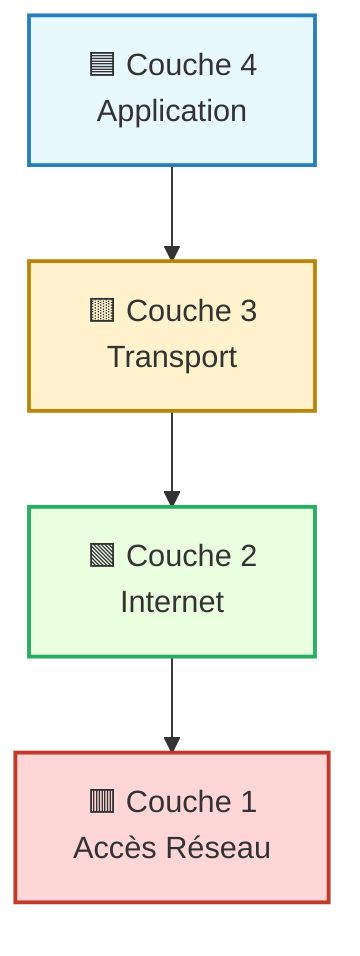
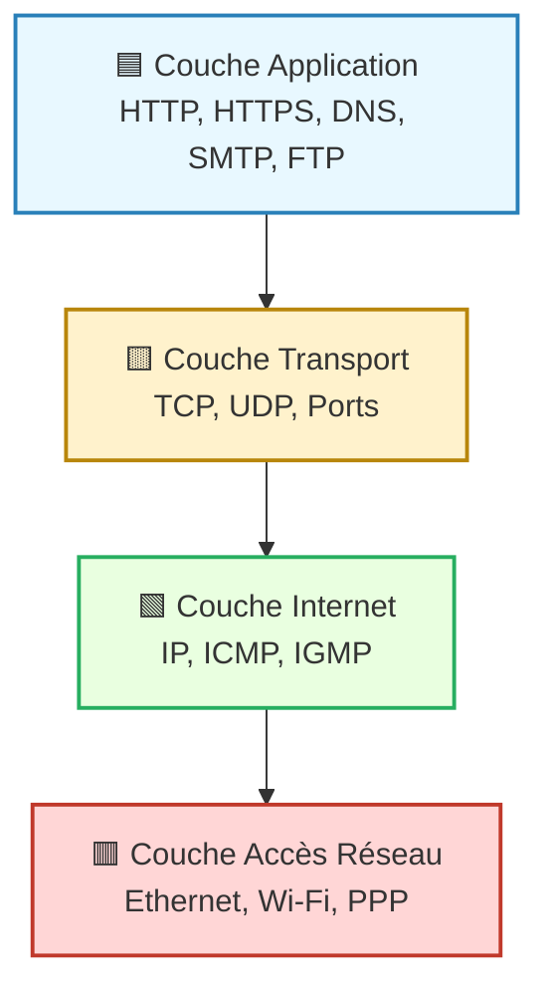

---
tags:
  - modele
  - modele/tcp-ip
  - protocole/tcp-ip
  - reseau
  - architecture-reseau
  - communication
  - couche
  - internet
aliases:
  - Suite de Protocoles Internet
  - TCP/IP Stack
  - Protocoles TCP/IP
  - TCP/IP
  - Transmission Control Protocol/Internet Protocol
  - Pile de protocoles TCP/IP
  - Internet Protocol Suite
archetype: modele
source:
  -
cssclasses:
  - max
---

# Suite de Protocoles Internet (TCP/IP)

## 🎯 Principe Fondamental
> La [[InternetProtocolSuite|Suite de Protocoles Internet]], communément appelée [[InternetProtocolSuite|TCP/IP]], est un ensemble de [[NetworkProtocol|protocoles]] de [[NetworkCommunication|communication réseau]] qui constitue la base technique de l'[[Internet|Internet]] et de la plupart des réseaux informatiques modernes. Son objectif principal est de permettre la communication et l'échange de données entre des [[Host|hôtes]] hétérogènes, quel que soit leur matériel ou leur [[OperatingSystem|système d'exploitation]] sous-jacent.

## 🧩 Composants / Éléments Clés
Le modèle [[InternetProtocolSuite|TCP/IP]] est traditionnellement structuré en quatre couches, chacune ayant des responsabilités spécifiques :

*   **[[ApplicationLayer|Couche Application]]**: Elle fournit des services de [[NetworkService|réseau]] aux [[SoftwareApplication|applications]] et gère les données de l'[[User|utilisateur]]. Des [[Protocol|protocoles]] comme le [[HypertextTransferProtocol|HTTP]] (pour le [[WorldWideWeb|Web]]), le [[FileTransferProtocol|FTP]] (pour le [[FileTransfer|transfert de fichiers]]) et le [[DomainNameSystem|DNS]] (pour la résolution de noms) résident à ce niveau.
*   **[[TransportLayer|Couche Transport]]**: Responsable de la communication de bout en bout entre les [[SoftwareApplication|applications]]. Les principaux [[Protocol|protocoles]] sont le [[TransmissionControlProtocol|TCP]] (fiable, orienté connexion) et l'[[UserDatagramProtocol|UDP]] (sans connexion, rapide).
*   **[[InternetLayer|Couche Internet]]**: Gère l'[[Routing|adressage logique]] et le [[Routing|routage]] des [[Packet|paquets]] de données à travers les [[InterconnectedNetworks|réseaux interconnectés]]. Le [[InternetProtocol|Protocole Internet (IP)]] est le protocole central de cette couche, avec ses versions [[InternetProtocolVersion4|IPv4]] et [[InternetProtocolVersion6|IPv6]].
*   **[[NetworkAccessLayer|Couche d'Accès Réseau]]**: Combine les fonctionnalités des [[PhysicalLayer|couches physique]] et [[DataLinkLayer|liaison de données]] du [[OpenSystemsInterconnectionModel|Modèle OSI]]. Elle gère les détails spécifiques de l'[[NetworkMedia|accès au support réseau]], tels que l'[[Ethernet|Ethernet]] pour les [[LocalAreaNetwork|LAN]] filaires ou l'[[WirelessFidelity|Wi-Fi]] pour les [[WirelessNetwork|réseaux sans fil]], et l'adressage [[MediaAccessControlAddress|MAC]].

## 📜 Règles de Fonctionnement
> La [[InternetProtocolSuite|Suite de Protocoles Internet]] fonctionne sur le principe de l'[[Encapsulation|encapsulation]] et de la [[Decapsulation|décapsulation]]. Lorsqu'une [[Data|donnée]] est envoyée, elle descend les couches, et chaque couche ajoute son propre [[Header|en-tête]] d'[[Protocol|informations de protocole]] avant d'être transmise. À la réception, le processus inverse se produit (décapsulation).

*   **Adressage Hiérarchique**: Utilisation de l'[[IPAddressing|adressage IP]] logique pour identifier de manière unique les [[Host|hôtes]] et les [[NetworkSegment|segments de réseau]], complété par l'adressage [[MediaAccessControlAddress|MAC]] physique à la [[NetworkAccessLayer|couche d'accès réseau]].
*   **Communication par Paquets**: Les données sont décomposées en [[Packet|paquets]] plus petits pour une [[DataTransmission|transmission]] efficace et résiliente, permettant à différents paquets d'un même [[Message|message]] de suivre des chemins différents.
*   **Modèle [[ClientServerArchitecture|Client-Serveur]]**: De nombreux [[Protocol|protocoles]] de la [[ApplicationLayer|couche application]] s'appuient sur ce modèle, où un [[Client|client]] demande un [[NetworkService|service]] à un [[Server|serveur]].

## 🖼️ Diagramme Conceptuel

---

---

## 💡 Applications Pratiques
*   **Fondation de l'Internet**: Le modèle [[InternetProtocolSuite|TCP/IP]] est la base même de l'[[Internet|Internet]], permettant à des milliards d'[[Computer|appareils]] et de réseaux de communiquer mondialement.
*   **Réseaux Locaux (LAN)**: Largement utilisé pour la conception et la mise en œuvre de tous les [[LocalAreaNetwork|réseaux locaux]] et [[WideAreaNetwork|réseaux étendus (WAN)]] modernes.
*   **Développement d'Applications**: Tous les [[SoftwareApplication|développeurs d'applications]] [[OnlineServices|en ligne]] et [[ClientServerArchitecture|client-serveur]] s'appuient sur les [[NetworkProtocol|protocoles]] [[InternetProtocolSuite|TCP/IP]] pour leurs communications.
*   **[[InternetofThings|IoT]] et [[Cloud|Cloud Computing]]**: Essentiel pour la connectivité et la communication des [[InternetofThings|appareils IoT]] et des [[Cloud|services cloud]].

## ✅ Avantages et Limites
*   **Avantages**:
    *   **[[Interoperability|Interopérabilité]]**: Standard ouvert garantissant la compatibilité entre divers équipements et logiciels.
    *   **[[Scalability|Évolutivité]]**: Capacité à s'étendre à des réseaux de toutes tailles, du petit [[SOHONetwork|réseau domestique]] à l'[[Internet|Internet]] mondial.
    *   **Robustesse**: Conçu pour être résilient aux pannes en permettant le [[Routing|routage]] dynamique des [[Packet|paquets]].
    *   **Indépendance du Matériel**: Fonctionne sur n'importe quel type de [[NetworkMedia|support réseau]].
*   **Limites**:
    *   **[[Complexity|Complexité]]**: Peut être complexe à comprendre et à configurer pour les [[User|utilisateurs]] inexpérimentés.
    *   **[[Overhead|Surcharge]]**: Les [[Header|en-têtes]] des [[Packet|paquets]] ajoutent une certaine [[Overhead|surcharge]] aux [[DataTransmission|transmissions de données]].
    *   **[[SecurityVulnerabilities|Vulnérabilités]] Inhérentes**: Certains [[Protocol|protocoles]] plus anciens (comme [[InternetProtocolVersion4|IPv4]] ou certains aspects de [[TransmissionControlProtocol|TCP]]) ont des faiblesses qui nécessitent des [[SecurityControl|mesures de sécurité]] supplémentaires (ex: [[TransportLayerSecurity|TLS]], [[VirtualPrivateNetwork|VPN]]).

## 🔗 Notes Connexes
*   **Modèle de référence**: [[OpenSystemsInterconnectionModel|Modèle OSI]]
*   **Protocole clé (Transport)**: [[TransmissionControlProtocol|TCP]]
*   **Protocole clé (Internet)**: [[InternetProtocol|IP]]
*   **Mécanisme fondamental**: [[Encapsulation|Encapsulation]]
*   **Protocole d'adressage**: [[DynamicHostConfigurationProtocol|DHCP]]