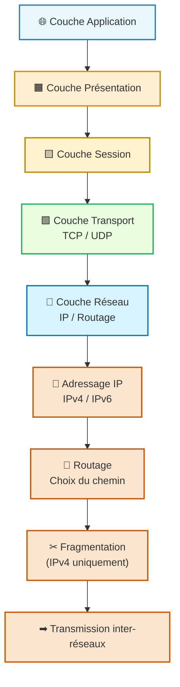
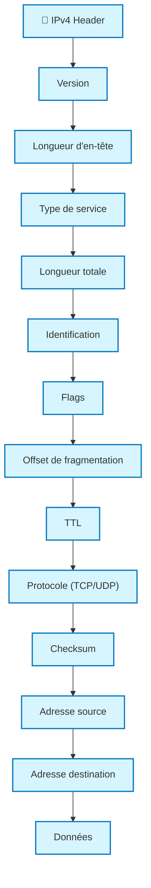
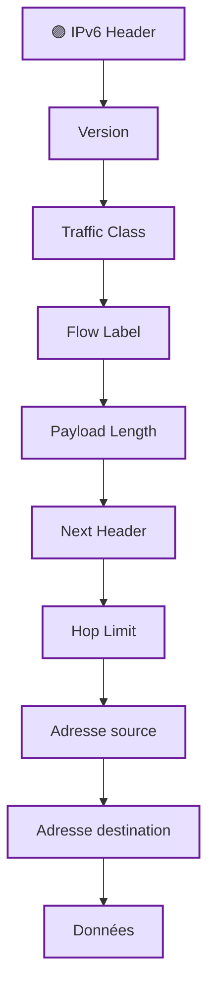

---
tags:
  - modele
  - couche/reseau
  - modele/osi
  - modele/tcp-ip
  - reseau
  - protocole/ip
  - adressage
  - routage
aliases:
  - Couche Réseau
  - Network Layer
  - Internet Layer
archetype: modele
source:
  - 
cssclasses:
  - max
---

# Couche Réseau (Network Layer)

## 🎯 Principe Fondamental
> La [[NetworkLayer|Couche Réseau]] est une couche fondamentale des modèles de référence comme le [[OpenSystemsInterconnectionModel|modèle OSI]] et la [[InternetProtocolSuite|pile de protocoles TCP/IP]]. Son principe est de fournir un service de livraison de paquets de bout en bout, sans connexion, à travers des [[InterconnectedNetworks|réseaux interconnectés]]. Elle est responsable du [[Routing|routage]] logique des [[Packet|paquets]] d'une source à une destination, potentiellement à travers plusieurs [[Network|réseaux]] différents, en utilisant des [[InternetProtocol|adresses IP]] logiques.

## 🧩 Composants / Éléments Clés
* **[[InternetProtocol|Protocole IP]]**: Le protocole principal de cette couche, définissant la structure des paquets et le schéma d'[[IPAddressing|adressage IP]]. Il existe deux versions majeures : [[InternetProtocolVersion4|IPv4]] et [[InternetProtocolVersion6|IPv6]].
* **[[Router|Routeurs]]**: Des [[NetworkDevice|dispositifs réseau]] qui opèrent à cette couche pour transférer les paquets entre différents [[Subnet|sous-réseaux]] ou [[NetworkSegment|segments de réseau]] basés sur leur [[DestinationInternetProtocolVersion4Address|adresse IP de destination]]. Ils maintiennent des [[RoutingTable|tables de routage]] pour déterminer les meilleurs chemins.
* **Paquets (Datagrammes)**: L'unité de données de base à cette couche. Un paquet contient les données utiles ([[Payload|charge utile]]) ainsi que les [[Header|en-têtes]] d'[[InternetProtocol|IP]] incluant les adresses [[SourceInternetProtocolVersion4Address|IP source]] et [[DestinationInternetProtocolVersion4Address|destination]].

## 📜 Règles de Fonctionnement
* **[[IPAddressing|Adressage Logique]]**: Chaque [[Host|hôte]] ou interface de [[NetworkDevice|périphérique réseau]] sur un [[Network|réseau IP]] reçoit une [[InternetProtocol|adresse IP]] unique, qui est une adresse logique hiérarchique utilisée pour l'identification et la localisation au sein d'un [[InterconnectedNetworks|internetwork]].
* **[[Routing|Routage]] des Paquets**: Les [[Router|routeurs]] examinent l'[[DestinationInternetProtocolVersion4Address|adresse IP de destination]] de chaque [[Packet|paquet]] et utilisent leurs [[RoutingTable|tables de routage]] pour déterminer la prochaine "hop" (saut) ou interface de sortie par laquelle le paquet doit être envoyé pour atteindre sa destination.
* **Fragmention/Réassemblage**: Si un [[Packet|paquet]] est trop grand pour être transmis sur un [[NetworkMedia|support réseau]] spécifique (ex: une taille de [[EthernetFrame|trame Ethernet]] maximale), la [[NetworkLayer|couche réseau]] peut fragmenter le paquet en morceaux plus petits qui sont ensuite réassemblés à la destination.
* **Service Sans Connexion**: Le [[InternetProtocol|protocole IP]] fournit un service de livraison "au mieux" (best-effort), sans garantie de livraison, d'ordre ou de détection d'erreurs au niveau de cette couche. Ces fonctions sont gérées par la [[TransportLayer|couche de transport]].

## 📊 Diagramme Conceptuel

---
### **Structure / Trame logique — IPv4 & IPv6**
#### 🔵 **IPv4 Header**

---
#### 🔴 🟣 **IPv6 Header (plus simple, plus moderne)**

---

## 💡 Applications Pratiques
* **[[Internet]]**: La [[NetworkLayer|couche réseau]], avec le [[InternetProtocol|protocole IP]], est le fondement même de l'[[Internet]]. Elle permet la communication globale en connectant des millions de [[LocalAreaNetwork|LAN]] et de [[WideAreaNetwork|WAN]] à travers le monde.
* **[[Routing|Routage Inter-réseaux]]**: Essentielle pour les [[CorporateNetwork|réseaux d'entreprise]] et les [[EnterpriseNetwork|grandes organisations]] qui doivent segmenter leurs [[Network|réseaux]] en plusieurs [[Subnet|sous-réseaux]] pour des raisons de performance, de [[NetworkSecurity|sécurité]] ou d'administration.
* **[[VirtualPrivateNetwork|VPN]]**: Les technologies de [[VirtualPrivateNetwork|VPN]] s'appuient souvent sur des concepts de la [[NetworkLayer|couche réseau]] pour créer des [[Tunneling|tunnels]] sécurisés à travers des [[PublicNetwork|réseaux publics]].

## ✅ Avantages et Limites
* **Avantages**:
  * **Interopérabilité globale**: Permet une interconnexion hétérogène de [[Network|réseaux]] de différentes technologies, grâce à l'[[InternetProtocol|IP]] standardisé.
  * **[[Scalability|Évolutivité]]**: Le modèle d'[[IPAddressing|adressage]] hiérarchique et le [[Routing|routage]] permettent aux [[Network|réseaux]] de croître considérablement.
  * **Indépendance du support**: La [[NetworkLayer|couche réseau]] n'est pas liée à une [[NetworkTechnology|technologie réseau]] spécifique (comme [[Ethernet]]) et peut fonctionner sur divers [[NetworkMedia|supports]].
* **Limites**:
  * **Absence de garantie de livraison**: Le [[InternetProtocol|protocole IP]] est "sans connexion" et ne garantit pas que les [[Packet|paquets]] arriveront, ni dans le bon ordre. Les mécanismes de [[Reliability|fiabilité]] sont implémentés dans les [[TransportLayer|couches de transport]] supérieures.
  * **Pas de [[FlowControl|contrôle de flux]] intégré**: Ne gère pas directement le débit entre la source et la destination, ce qui peut entraîner de la [[NetworkCongestion|congestion réseau]] ou de la [[DataLoss|perte de données]] si la [[TransportLayer|couche de transport]] ne compense pas.

## 🔗 Notes Connexes
* **Modèle parent**: [[OpenSystemsInterconnectionModel|Modèle OSI]]
* **Modèle associé**: [[InternetProtocolSuite|Pile TCP/IP]]
* **Couche supérieure**: [[TransportLayer|Couche de Transport]]
* **Couche inférieure**: [[DataLinkLayer|Couche Liaison de Données]]
* **Fonction clé**: [[Routing|Routage]]
* **Fonction clé**: [[IPAddressing|Adressage IP]]