---
tags:
  - modele
  - couche/reseau
  - modele/osi
  - modele/tcp-ip
  - reseau
  - protocole/ip
  - adressage
  - routage
aliases:
  - Couche Réseau
  - Network Layer
  - Internet Layer
archetype: modele
source:
  - 
cssclasses:
  - max
---

# Couche Réseau (Network Layer)

## 🎯 Principe Fondamental
> La Couche Réseau est une couche fondamentale des modèles de référence comme le modèle OSI et la pile de protocoles TCP/IP. Son principe est de fournir un service de livraison de paquets de bout en bout, sans connexion, à travers des réseaux interconnectés. Elle est responsable du routage logique des paquets d'une source à une destination, potentiellement à travers plusieurs réseaux différents, en utilisant des adresses IP logiques.

## 🧩 Composants / Éléments Clés
* **Protocole IP**: Le protocole principal de cette couche, définissant la structure des paquets et le schéma d'adressage IP. Il existe deux versions majeures : IPv4 et IPv6.
* **Routeurs**: Des dispositifs réseau qui opèrent à cette couche pour transférer les paquets entre différents sous-réseaux ou segments de réseau basés sur leur adresse IP de destination. Ils maintiennent des tables de routage pour déterminer les meilleurs chemins.
* **Paquets (Datagrammes)**: L'unité de données de base à cette couche. Un paquet contient les données utiles (charge utile) ainsi que les en-têtes d'IP incluant les adresses IP source et destination.

## 📜 Règles de Fonctionnement
* **Adressage Logique**: Chaque hôte ou interface de périphérique réseau sur un réseau IP reçoit une adresse IP unique, qui est une adresse logique hiérarchique utilisée pour l'identification et la localisation au sein d'un internetwork.
* **Routage des Paquets**: Les routeurs examinent l'adresse IP de destination de chaque paquet et utilisent leurs tables de routage pour déterminer la prochaine "hop" (saut) ou interface de sortie par laquelle le paquet doit être envoyé pour atteindre sa destination.
* **Fragmention/Réassemblage**: Si un paquet est trop grand pour être transmis sur un support réseau spécifique (ex: une taille de trame Ethernet maximale), la couche réseau peut fragmenter le paquet en morceaux plus petits qui sont ensuite réassemblés à la destination.
* **Service Sans Connexion**: Le protocole IP fournit un service de livraison "au mieux" (best-effort), sans garantie de livraison, d'ordre ou de détection d'erreurs au niveau de cette couche. Ces fonctions sont gérées par la couche de transport.

## 📊 Diagramme Conceptuel

```mermaid
graph TD
    classDef app fill:#e8f8ff,stroke:#2980b9,stroke-width:2px;
    classDef pres fill:#ffeecf,stroke:#d68910,stroke-width:2px;
    classDef session fill:#fff2cc,stroke:#b8860b,stroke-width:2px;
    classDef trans fill:#e9ffe0,stroke:#27ae60,stroke-width:2px;
    classDef net fill:#d6f5ff,stroke:#0b79c1,stroke-width:2px;
    classDef route fill:#fce5cd,stroke:#d35400,stroke-width:2px;

    A["🌐 Couche Application"]:::app
    B["🟧 Couche Présentation"]:::pres
    C["🟨 Couche Session"]:::session
    D["🟩 Couche Transport<br/>TCP / UDP"]:::trans
    E["🔷 Couche Réseau<br/>IP / Routage"]:::net

    R1["📍 Adressage IP<br/>IPv4 / IPv6"]:::route
    R2["🧭 Routage<br/>Choix du chemin"]:::route
    R3["✂ Fragmentation<br/>(IPv4 uniquement)"]:::route
    R4["➡ Transmission inter-réseaux"]:::route

    A --> B --> C --> D --> E
    E --> R1 --> R2 --> R3 --> R4

```

---
### **Structure / Trame logique — IPv4 & IPv6**
#### 🔵 **IPv4 Header**

```mermaid
graph TD
    classDef ipv4 fill:#d6f5ff,stroke:#0b79c1,stroke-width:2px;

    H["🔵 IPv4 Header"]:::ipv4
    V["Version"]:::ipv4
    HL["Longueur d'en-tête"]:::ipv4
    TOS["Type de service"]:::ipv4
    TL["Longueur totale"]:::ipv4
    ID["Identification"]:::ipv4
    FR["Flags"]:::ipv4
    OF["Offset de fragmentation"]:::ipv4
    TTL["TTL"]:::ipv4
    P["Protocole (TCP/UDP)"]:::ipv4
    CHK["Checksum"]:::ipv4
    SIP["Adresse source"]:::ipv4
    DIP["Adresse destination"]:::ipv4
    DATA["Données"]:::ipv4

    H --> V --> HL --> TOS --> TL --> ID --> FR --> OF --> TTL --> P --> CHK --> SIP --> DIP --> DATA

```

---
#### 🔴 🟣 **IPv6 Header (plus simple, plus moderne)**

```mermaid
graph TD
    classDef ipv6 fill:#e8e0ff,stroke:#6a1b9a,stroke-width:2px;

    H6["🟣 IPv6 Header"]:::ipv6
    V6["Version"]:::ipv6
    TC["Traffic Class"]:::ipv6
    FL["Flow Label"]:::ipv6
    PL["Payload Length"]:::ipv6
    NH["Next Header"]:::ipv6
    HL6["Hop Limit"]:::ipv6
    S6["Adresse source"]:::ipv6
    D6["Adresse destination"]:::ipv6
    DTA["Données"]:::ipv6

    H6 --> V6 --> TC --> FL --> PL --> NH --> HL6 --> S6 --> D6 --> DTA

```

---

## 💡 Applications Pratiques
* **Internet**: La couche réseau, avec le protocole IP, est le fondement même de l'Internet. Elle permet la communication globale en connectant des millions de LAN et de WAN à travers le monde.
* **Routage Inter-réseaux**: Essentielle pour les réseaux d'entreprise et les grandes organisations qui doivent segmenter leurs réseaux en plusieurs sous-réseaux pour des raisons de performance, de sécurité ou d'administration.
* **VPN**: Les technologies de VPN s'appuient souvent sur des concepts de la couche réseau pour créer des tunnels sécurisés à travers des réseaux publics.

## ✅ Avantages et Limites
* **Avantages**:
  * **Interopérabilité globale**: Permet une interconnexion hétérogène de réseaux de différentes technologies, grâce à l'IP standardisé.
  * **Évolutivité**: Le modèle d'adressage hiérarchique et le routage permettent aux réseaux de croître considérablement.
  * **Indépendance du support**: La couche réseau n'est pas liée à une technologie réseau spécifique (comme Ethernet) et peut fonctionner sur divers supports.
* **Limites**:
  * **Absence de garantie de livraison**: Le protocole IP est "sans connexion" et ne garantit pas que les paquets arriveront, ni dans le bon ordre. Les mécanismes de fiabilité sont implémentés dans les couches de transport supérieures.
  * **Pas de contrôle de flux intégré**: Ne gère pas directement le débit entre la source et la destination, ce qui peut entraîner de la congestion réseau ou de la perte de données si la couche de transport ne compense pas.

## 🔗 Notes Connexes
* **Modèle parent**: Modèle OSI
* **Modèle associé**: Pile TCP/IP
* **Couche supérieure**: Couche de Transport
* **Couche inférieure**: Couche Liaison de Données
* **Fonction clé**: Routage
* **Fonction clé**: Adressage IP