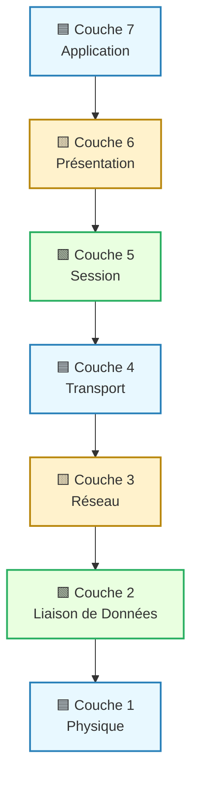
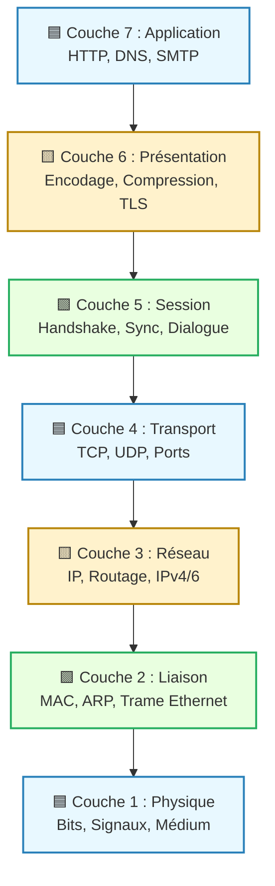

---
tags:
  - modele
  - modele/osi
  - modele/reference
  - reseau
  - communication
  - couche
aliases:
  - Modèle OSI
  - OSI Model
  - OSI
  - Open Systems Interconnection Model
archetype: modele
source:
  - 
cssclasses:
  - max
---

# Modèle : Interconnexion de Systèmes Ouverts (OSI)

## 🎯 Principe Fondamental

> Le Modèle OSI (Open Systems Interconnection) est un modèle de référence conceptuel développé par l'ISO qui décrit la communication réseau en la décomposant en sept couches distinctes et interdépendantes. 
> Son but est de fournir un cadre universel pour la standardisation des protocoles de communication, facilitant ainsi l'interopérabilité entre différents systèmes et équipements réseau.

## 🧩 Composants / Éléments Clés

Le Modèle OSI est composé de sept couches de protocole superposées, chacune ayant une fonction spécifique :

*   **7. Couche Application**: Interface directe avec les applications utilisateur. Elle fournit des services réseau aux applications (ex: HTTP, FTP, SMTP).
*   **6. Couche Présentation**: Gère la représentation des données, y compris l'encodage, le chiffrement/déchiffrement et la compression pour assurer que les données sont compréhensibles par la couche application du destinataire.
*   **5. Couche Session**: Établit, gère et termine les sessions de communication entre les applications. Elle assure le dialogue et la synchronisation.
*   **4. Couche Transport**: Responsable de la segmentation, du transfert et de la réassemblage des données pour des applications spécifiques. Elle assure la fiabilité de la transmission de données et le contrôle de flux (ex: TCP, UDP).
*   **3. Couche Réseau**: Gère l'adressage logique et le routage des paquets de données entre différents réseaux. Elle détermine le meilleur chemin pour les données (ex: IP).
*   **2. Couche Liaison de Données**: Fournit un transfert de données fiable sur une liaison physique directe. Elle gère l'accès au support physique, le formatage de trame et la détection d'erreurs (ex: Ethernet).
*   **1. Couche Physique**: Définit les spécifications électriques, mécaniques, fonctionnelles et procédurales pour l'activation, le maintien et la désactivation des liaisons physiques entre les dispositifs réseau. Elle gère la transmission des bits (ex: Ethernet, fibre optique).

## 📜 Règles de Fonctionnement

> Le Modèle OSI opère selon plusieurs règles fondamentales :

*   **Encapsulation et Décapsulation**: À chaque couche émettrice, les données reçoivent un en-tête (et parfois un pied de page) spécifique à la couche, processus appelé encapsulation. À la réception, le processus inverse (décapsulation) se produit, où chaque couche retire son en-tête.
*   **Communication de couche à couche**: Chaque couche ne communique qu'avec la couche directement supérieure ou inférieure, et logiquement, avec la couche homologue sur le système distant.
*   **Indépendance des couches**: Les couches sont conçues pour être indépendantes les unes des autres, permettant à une couche d'être modifiée sans affecter les autres, tant que son interface avec les couches adjacentes reste inchangée.

## 📊 Diagramme Conceptuel

---

---

## 💡 Applications Pratiques

*   **Enseignement et Compréhension**: Largement utilisé comme outil pédagogique pour expliquer le fonctionnement des réseaux informatiques et des communications de données.
*   **Conception de réseau**: Sert de guide pour la conception et le développement de protocoles réseau et de dispositifs.
*   **Dépannage**: Les administrateurs réseau utilisent le modèle pour isoler et résoudre les problèmes réseau en identifiant la couche affectée.
*   **Standardisation**: Bien que le modèle TCP/IP soit plus couramment implémenté, le Modèle OSI a influencé de nombreux standards réseau et le développement de protocoles.

## ✅ Avantages et Limites

*   **Avantages**:
    *   **Modularité**: Facilite le développement et le test des protocoles en les décomposant en fonctions plus petites.
    *   **Standardisation**: Favorise l'interopérabilité en fournissant un langage et un cadre commun pour les fabricants et les développeurs.
    *   **Dépannage**: Simplifie la résolution de problèmes en permettant d'isoler les dysfonctionnements à une couche spécifique.
    *   **Flexibilité**: Permet à différentes technologies réseau de coexister et de communiquer.
*   **Limites**:
    *   **Complexité**: Le modèle est très détaillé, ce qui peut rendre son implémentation directe difficile et moins flexible que le modèle TCP/IP.
    *   **Chevauchement de fonctions**: Certaines fonctions peuvent se chevaucher entre les couches, comme le chiffrement qui peut se produire à plusieurs niveaux (présentation, session, transport).
    *   **Inadéquation pratique**: Dans la pratique, le modèle TCP/IP est devenu le standard de facto pour l'Internet, étant plus simple et plus adapté aux implémentations réelles.

## 🔗 Notes Connexes
*   **Modèle concurrent**: Suite de Protocoles Internet (TCP/IP)
*   **Concept général**: Pile de Protocoles
*   **Mécanisme clé**: Encapsulation de données
*   **Application réseau**: Surveillance réseau
*   **Organisme de normalisation**: ISO