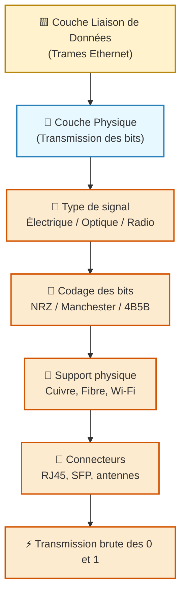
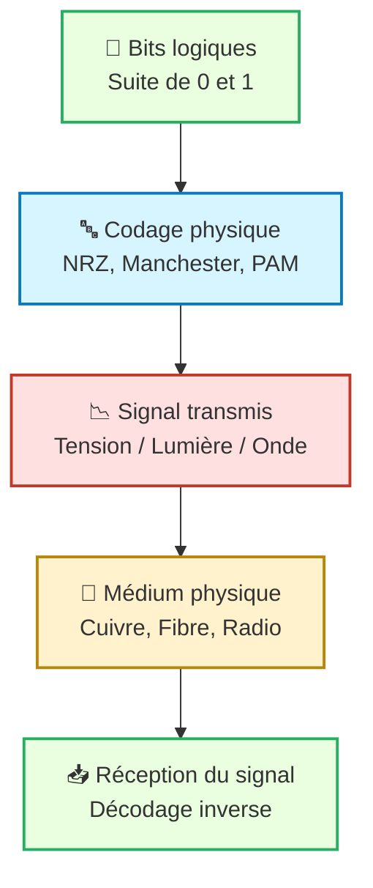

---
tags:
  - modele
  - modele/osi
  - couche/physique
  - reseau
  - communication
  - materiel
archetype: modele
source:
  - 
cssclasses:
  - max
---

# Couche Physique (Physical Layer)

## 🎯 Principe Fondamental
> La Couche Physique (ou Couche 1) est la couche la plus basse du Modèle OSI. Son rôle principal est de définir les spécifications électriques, mécaniques, procédurales et fonctionnelles pour l'activation, le maintien et la désactivation des liaisons physiques entre les périphériques réseau. Elle est responsable de la transmission brute des bits sur un support physique.

## 🧩 Composants / Éléments Clés
*   **Supports Physiques**: Comprend tous les médias de transmission comme les câbles à paire torsadée (UTP, STP), les câbles coaxiaux, les fibres optiques et les supports sans fil (ondes radio, infrarouges).
*   **Connecteurs**: Les interfaces physiques telles que les connecteurs RJ45 pour les câbles Ethernet, les connecteurs SC/LC pour la fibre optique, ou les ports USB.
*   **Dispositifs Réseau**: Équipements qui opèrent à ce niveau, comme les cartes d'interface réseau (NIC), les concentrateurs, les répéteurs et les modems.
*   **Signalisation**: Les méthodes de conversion des bits numériques en signaux physiques (signaux électriques, signaux optiques, signaux sans fil) et la façon dont ces signaux sont envoyés sur le support.

## 📜 Règles de Fonctionnement
*   **Encodage des Données**: Définit comment les bits (0 et 1) sont représentés par des signaux physiques (ex: niveaux de tension, impulsions lumineuses, fréquences radio).
*   **Modulation/Démodulation**: Pour les signaux analogiques, elle décrit comment les données numériques sont converties en signaux analogiques (modulation) et vice-versa (démodulation).
*   **Synchronisation**: Assure que les horloges de l'expéditeur et du destinataire sont synchronisées pour interpréter correctement le flux de bits.
*   **Topologie Physique**: Influence la manière dont les terminaux sont connectés physiquement (ex: étoile, bus, anneau).
*   **Spécifications Matérielles**: Établit les normes pour les câbles (longueur maximale, types de blindage), les connecteurs et les niveaux de puissance.

## 📊 Diagramme Conceptuel

---

---

## 💡 Applications Pratiques
*   **Réseaux Ethernet**: Standard largement utilisé pour les réseaux locaux câblés, définissant les caractéristiques des câbles, des connecteurs et la transmission des signaux.
*   **Wi-Fi (IEEE 802.11)**: Ensemble de normes pour les réseaux sans fil, utilisant des ondes radio pour la transmission de données.
*   **Bluetooth**: Technologie sans fil à courte portée pour connecter des appareils personnels.
*   **DSL et Internet par câble**: Technologies qui utilisent les lignes téléphoniques ou les câbles coaxiaux pour fournir un accès Internet à haut débit.

## ✅ Avantages et Limites
*   **Avantages**:
    *   Fournit le fondement matériel indispensable à toute communication réseau.
    *   Permet l'interopérabilité entre différents fabricants de matériel via des normes établies.
    *   Offre potentiellement de très hauts débits et une fiabilité sur des liaisons dédiées (ex: fibre optique).
*   **Limites**:
    *   Sensible aux interférences électromagnétiques et à l'atténuation du signal, qui peuvent dégrader la qualité des signaux numériques.
    *   Portée limitée par les propriétés physiques du support.
    *   Ne gère pas la correction d'erreurs ni la segmentation des données, ce qui est le rôle des couches supérieures.
    *   Vulnérabilités liées à la sécurité physique (coupure de câble, écoute clandestine) qui peuvent compromettre l'disponibilité ou la confidentialité.

## 🔗 Notes Connexes
*   **Couche supérieure**: Couche Liaison de Données
*   **Technologies associées**: Ethernet, Wi-Fi
*   **Concept fondamental**: Supports réseau
*   **Aspect connexe**: Transmission de Signal
*   **Menace directe**: Écoute clandestine