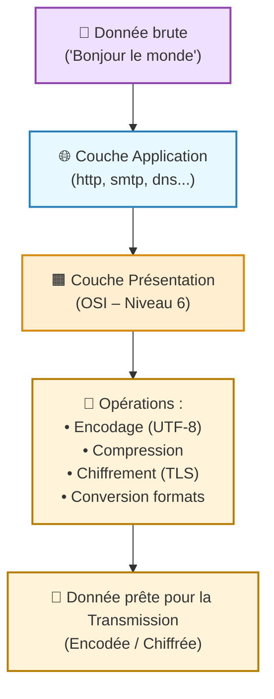
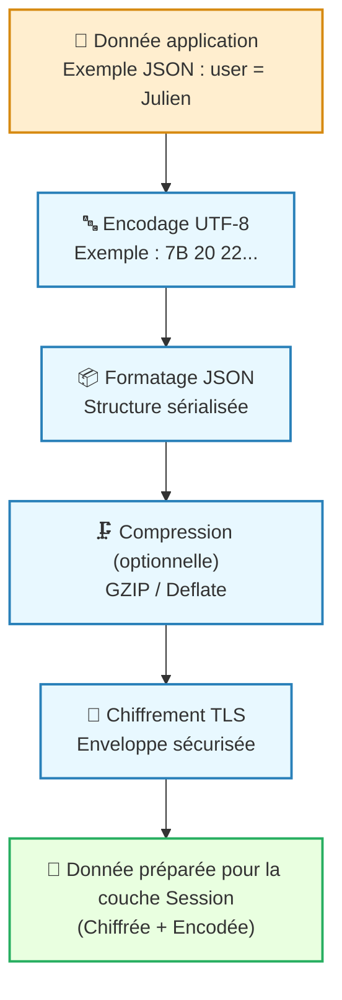

---
tags:
  - modele
  - modele/osi
  - couche/presentation
  - reseau
  - communication
  - chiffrement
  - compression
  - format-donnees
aliases:
  - Couche de Présentation
  - Présentation Layer
  - Presentation Layer
archetype: modele
source:
cssclasses:
  - max
---

# Couche de Présentation (Presentation Layer)

## 🎯 Principe Fondamental
> La Couche de Présentation, également appelée Couche 6 du Modèle OSI, est responsable de la transformation des données en un format standardisé et compréhensible par la Couche Application. Son but est d'assurer l'interopérabilité et la lisibilité des données entre différents systèmes qui peuvent utiliser des représentations de données internes diverses. Elle gère la syntaxe et la sémantique de l'information transmise.

## 🧩 Composants / Éléments Clés
*   **Formatage et Conversion des Données**: Traduit les données d'un format spécifique à l'application vers un format commun pour la transmission sur le réseau, et vice-versa.
*   **Encodage et Décodage**: Gère la représentation des caractères (ex: ASCII, EBCDIC) et l'encodage/décadage des données.
*   **Chiffrement et Déchiffrement**: Effectue le chiffrement des données avant leur transmission et le déchiffrement à la réception pour garantir la confidentialité.
*   **Compression et Décompression**: Réduit la taille des données pour optimiser la bande passante et accélérer la transmission de données.

## 📜 Règles de Fonctionnement
> La Couche de Présentation agit comme un traducteur universel, garantissant que les données envoyées par un système peuvent être lues et comprises par la Couche Application d'un autre système, indépendamment de leurs représentations internes.
*   **Standardisation de la Représentation**: Elle établit une syntaxe de transfert commune pour que les données soient interchangeables.
*   **Gestion des Structures de Données**: Elle gère la structure des données (ex: type entier, chaîne de caractères) afin qu'elles soient interprétées correctement.
*   **Négociation de la Syntaxe**: Elle peut négocier la syntaxe de transfert à utiliser entre les deux points de communication.

## 📊 Diagramme Conceptuel

---

---

## 💡 Applications Pratiques
*   **Formater les images et vidéos**: La conversion de formats comme JPEG, MPEG, GIF ou TIFF est gérée par cette couche.
*   **Mise en œuvre du chiffrement/déchiffrement**: Des protocoles comme SSL et TLS opèrent souvent à ce niveau pour sécuriser la communication réseau.
*   **Gestion des flux de données structurées**: Aide à l'échange de données dans des formats comme XML ou JSON entre applications.
*   **Transformation de caractères**: S'assure que les caractères envoyés par un système sont correctement interprétés par un autre (ex: de EBCDIC à ASCII).

## ✅ Avantages et Limites
*   **Avantages**:
    *   Fournit une interopérabilité essentielle entre différents systèmes et applications.
    *   Libère la Couche Application des préoccupations de formatage et de chiffrement/déchiffrement des données.
    *   Optimise l'utilisation du réseau grâce à la compression des données.
*   **Limites**:
    *   Peut introduire une latence supplémentaire due aux processus de chiffrement/déchiffrement et de compression/décompression.
    *   Des bugs logiciels ou des vulnérabilités de sécurité dans son implémentation peuvent avoir des conséquences importantes sur la confidentialité et l'intégrité des données.
    *   Parfois, sa distinction avec la Couche Application est floue dans les implémentations modernes (ex: pile TCP/IP).

## 🔗 Notes Connexes
*   **Cadre de référence**: Modèle OSI
*   **Couche adjacente (supérieure)**: Couche Application
*   **Couche adjacente (inférieure)**: Couche de Session
*   **Fonction clé**: Chiffrement
*   **Concept de manipulation**: Encodage