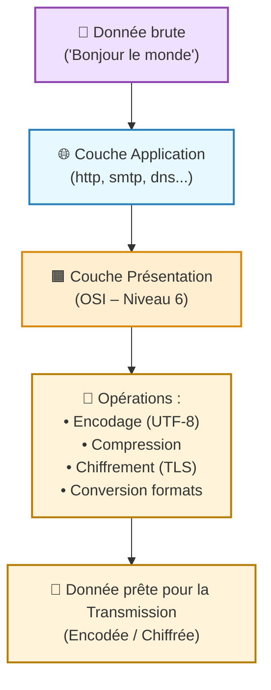
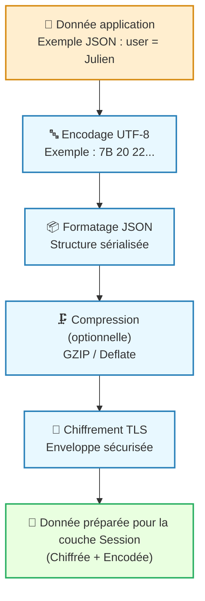

---
tags:
  - modele
  - modele/osi
  - couche/presentation
  - reseau
  - communication
  - chiffrement
  - compression
  - format-donnees
aliases:
  - Couche de Présentation
  - Présentation Layer
  - Presentation Layer
archetype: modele
source:
cssclasses:
  - max
---

# Couche de Présentation (Presentation Layer)

## 🎯 Principe Fondamental
> La [[PresentationLayer|Couche de Présentation]], également appelée Couche 6 du [[OpenSystemsInterconnectionModel|Modèle OSI]], est responsable de la transformation des données en un format standardisé et compréhensible par la [[ApplicationLayer|Couche Application]]. Son but est d'assurer l'[[Interoperability|interopérabilité]] et la lisibilité des données entre différents [[Computer|systèmes]] qui peuvent utiliser des représentations de données internes diverses. Elle gère la syntaxe et la sémantique de l'information transmise.

## 🧩 Composants / Éléments Clés
*   **Formatage et Conversion des Données**: Traduit les données d'un format spécifique à l'application vers un format commun pour la transmission sur le [[Network|réseau]], et vice-versa.
*   **[[Encoding|Encodage]] et [[Decryption|Décodage]]**: Gère la représentation des caractères (ex: ASCII, EBCDIC) et l'[[Encoding|encodage]]/décadage des données.
*   **[[Encryption|Chiffrement]] et [[Decryption|Déchiffrement]]**: Effectue le [[Encryption|chiffrement]] des données avant leur transmission et le [[Decryption|déchiffrement]] à la réception pour garantir la [[Confidentiality|confidentialité]].
*   **[[Compression|Compression]] et Décompression**: Réduit la taille des données pour optimiser la [[Bandwidth|bande passante]] et accélérer la [[DataTransmission|transmission de données]].

## 📜 Règles de Fonctionnement
> La [[PresentationLayer|Couche de Présentation]] agit comme un traducteur universel, garantissant que les données envoyées par un [[ApplicationLayer|système]] peuvent être lues et comprises par la [[ApplicationLayer|Couche Application]] d'un autre [[Computer|système]], indépendamment de leurs représentations internes.
*   **Standardisation de la Représentation**: Elle établit une syntaxe de transfert commune pour que les données soient interchangeables.
*   **Gestion des Structures de Données**: Elle gère la structure des données (ex: type entier, chaîne de caractères) afin qu'elles soient interprétées correctement.
*   **Négociation de la Syntaxe**: Elle peut négocier la syntaxe de transfert à utiliser entre les deux points de communication.

## 📊 Diagramme Conceptuel

---

---

## 💡 Applications Pratiques
*   **Formater les images et vidéos**: La conversion de formats comme JPEG, MPEG, GIF ou TIFF est gérée par cette couche.
*   **Mise en œuvre du [[Encryption|chiffrement]]/[[Decryption|déchiffrement]]**: Des protocoles comme [[SecureSocketLayer|SSL]] et [[TransportLayerSecurity|TLS]] opèrent souvent à ce niveau pour sécuriser la [[NetworkCommunication|communication réseau]].
*   **Gestion des flux de données structurées**: Aide à l'échange de données dans des formats comme XML ou JSON entre [[SoftwareApplication|applications]].
*   **Transformation de caractères**: S'assure que les caractères envoyés par un [[OperatingSystem|système]] sont correctement interprétés par un autre (ex: de EBCDIC à ASCII).

## ✅ Avantages et Limites
*   **Avantages**:
    *   Fournit une [[Interoperability|interopérabilité]] essentielle entre différents [[Computer|systèmes]] et [[SoftwareApplication|applications]].
    *   Libère la [[ApplicationLayer|Couche Application]] des préoccupations de formatage et de [[Encryption|chiffrement]]/[[Decryption|déchiffrement]] des données.
    *   Optimise l'utilisation du [[Network|réseau]] grâce à la [[Compression|compression]] des données.
*   **Limites**:
    *   Peut introduire une [[Latency|latence]] supplémentaire due aux processus de [[Encryption|chiffrement]]/[[Decryption|déchiffrement]] et de [[Compression|compression]]/décompression.
    *   Des [[SoftwareBugs|bugs logiciels]] ou des [[SecurityVulnerabilities|vulnérabilités de sécurité]] dans son implémentation peuvent avoir des conséquences importantes sur la [[Confidentiality|confidentialité]] et l'[[Integrity|intégrité]] des données.
    *   Parfois, sa distinction avec la [[ApplicationLayer|Couche Application]] est floue dans les implémentations modernes (ex: [[InternetProtocolSuite|pile TCP/IP]]).

## 🔗 Notes Connexes
*   **Cadre de référence**: [[OpenSystemsInterconnectionModel|Modèle OSI]]
*   **Couche adjacente (supérieure)**: [[ApplicationLayer|Couche Application]]
*   **Couche adjacente (inférieure)**: [[SessionLayer|Couche de Session]]
*   **Fonction clé**: [[Encryption|Chiffrement]]
*   **Concept de manipulation**: [[Encoding|Encodage]]