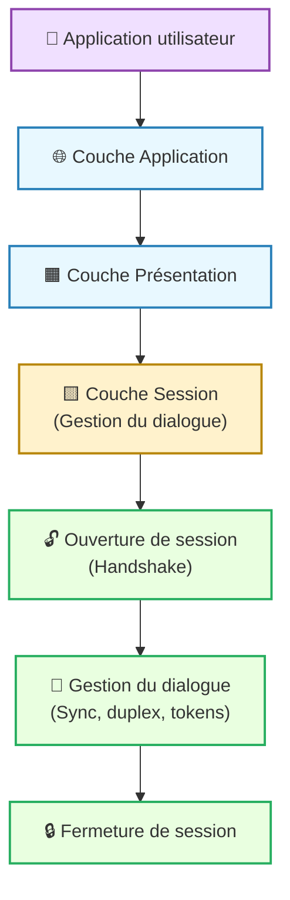
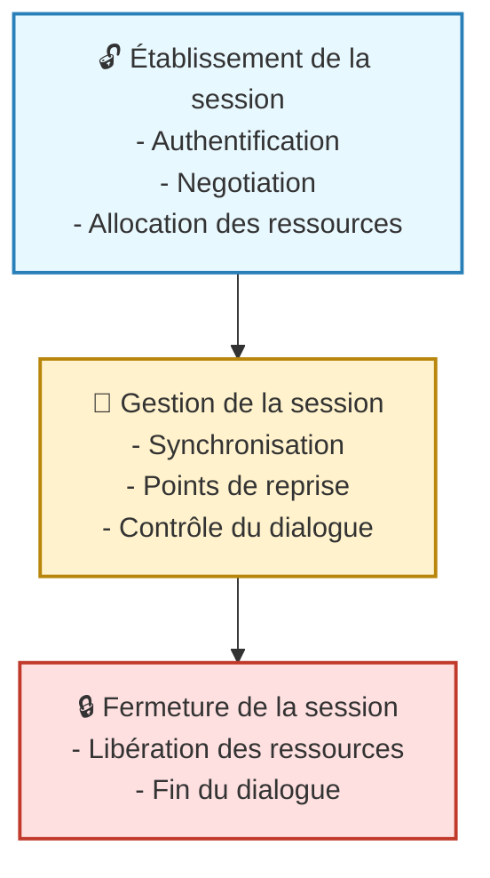

---
tags:
  - modele
  - couche/session
  - modele/osi
  - reseau
  - communication
aliases:
  - Couche de Session
  - Session Layer
  - SessionLayer
archetype: modele
source:
  -
cssclasses:
  - max
---

# Couche de Session (Session Layer)

## 🎯 Principe Fondamental
> La [[SessionLayer|Couche de Session]] est la 5ème couche du [[OpenSystemsInterconnectionModel|Modèle OSI]]. Son rôle principal est d'établir, de gérer, de synchroniser et de terminer les sessions de dialogue entre les applications des [[Host|hôtes]] communicants. Elle assure un échange de [[NetworkCommunication|communication réseau]] ordonné et coordonné, garantissant que les données sont envoyées et reçues de manière cohérente au sein d'une session logique.

## 🧩 Composants / Éléments Clés
*   **Contrôle de Dialogue**: Détermine qui émet et quand, gérant la direction du flux de données entre les deux parties de la session. Elle supporte différents modes de dialogue comme la [[FullDuplexCommunication|communication Full-Duplex]] (les deux peuvent envoyer et recevoir simultanément) ou la [[HalfDuplexCommunication|communication Half-Duplex]] (une seule peut envoyer à la fois).
*   **Synchronisation (Checkpointing)**: Insère des points de reprise (checkpoints) dans le flux de données. En cas de [[ServiceDisruption|panne]] ou d'interruption, la session peut être restaurée à partir du dernier point de synchronisation connu, évitant ainsi de redémarrer le dialogue depuis le début.
*   **Gestion de Session**: Établit, maintient et termine les sessions entre les applications des différents systèmes. Cela inclut la négociation des paramètres de session et la gestion des identifiants de session.

## 📜 Règles de Fonctionnement
> La [[SessionLayer|Couche de Session]] fournit les services nécessaires pour coordonner la communication et les échanges de dialogues, en gérant le déroulement logique des interactions.
*   **Établissement de la session**: Avant tout échange de données significatif, la couche établit une session, souvent après que la [[TransportLayer|Couche de Transport]] a établi une connexion.
*   **Gestion du dialogue**: Elle surveille la transmission des données, s'assurant que les parties respectent les règles de leur dialogue (ex: tour de parole dans un dialogue [[HalfDuplexCommunication|Half-Duplex]]).
*   **Récupération après erreur**: Grâce aux points de synchronisation, elle permet une [[ErrorDetectionAndCorrection|détection et correction d'erreurs]] au niveau de la session, facilitant la reprise du dialogue sans perte majeure de données.
*   **Terminaison de la session**: Elle clôture proprement la session une fois que les échanges sont terminés, libérant les ressources utilisées.

## 📊 Diagramme Conceptuel

---

---

## 💡 Applications Pratiques
*   **Appels de procédures distantes (RPC)**: La couche de session joue un rôle dans la gestion des interactions entre les processus d'un client et d'un [[Server|serveur]] distants.
*   **Systèmes de [[FileServer|fichiers]] réseau**: Des protocoles comme le NFS (Network File System) s'appuient sur des concepts de session pour maintenir l'état des fichiers ouverts ou des opérations en cours.
*   **Applications distribuées**: Dans les environnements où plusieurs applications ou services doivent collaborer sur des [[Computer|ordinateurs]] différents, la gestion de session assure la cohérence des interactions.
*   **[[OnlineServices|Services en ligne]]**: Les sessions utilisateur persistantes dans les applications web (ex: paniers d'achat, sessions bancaires) sont conceptuellement liées aux fonctions de cette couche.

## ✅ Avantages et Limites
*   **Avantages**:
    *   Assure une communication ordonnée et cohérente, même en cas d'interruptions temporaires, grâce aux fonctions de synchronisation.
    *   Permet la reprise des dialogues à partir de points de contrôle, améliorant la [[Reliability|fiabilité]] des échanges.
    *   Sépare la gestion de l'état du dialogue des détails de la [[DataTransmission|transmission de données]] et de la [[PresentationLayer|présentation]].
*   **Limites**:
    *   Dans la [[InternetProtocolSuite|pile de protocoles TCP/IP]], les fonctions de la [[SessionLayer|Couche de Session]] (ainsi que celles de la [[PresentationLayer|Couche de Présentation]]) sont souvent fusionnées avec la [[ApplicationLayer|Couche Application]] ou gérées directement par le [[TransmissionControlProtocol|protocole TCP]] au niveau de la [[TransportLayer|Couche de Transport]], ce qui rend son implémentation distincte moins courante en pratique.
    *   L'ajout d'une couche dédiée peut introduire une [[Complexity|complexité]] supplémentaire au [[ProtocolStack|modèle de protocole]].

## 🔗 Notes Connexes
*   **Modèle parent**: [[OpenSystemsInterconnectionModel|Modèle OSI]]
*   **Couche adjacente supérieure**: [[PresentationLayer|Couche de Présentation]]
*   **Couche adjacente inférieure**: [[TransportLayer|Couche de Transport]]
*   **Mode de dialogue**: [[FullDuplexCommunication|Communication Full-Duplex]]
*   **Contexte technique**: [[ProtocolStack|Pile de Protocoles]]