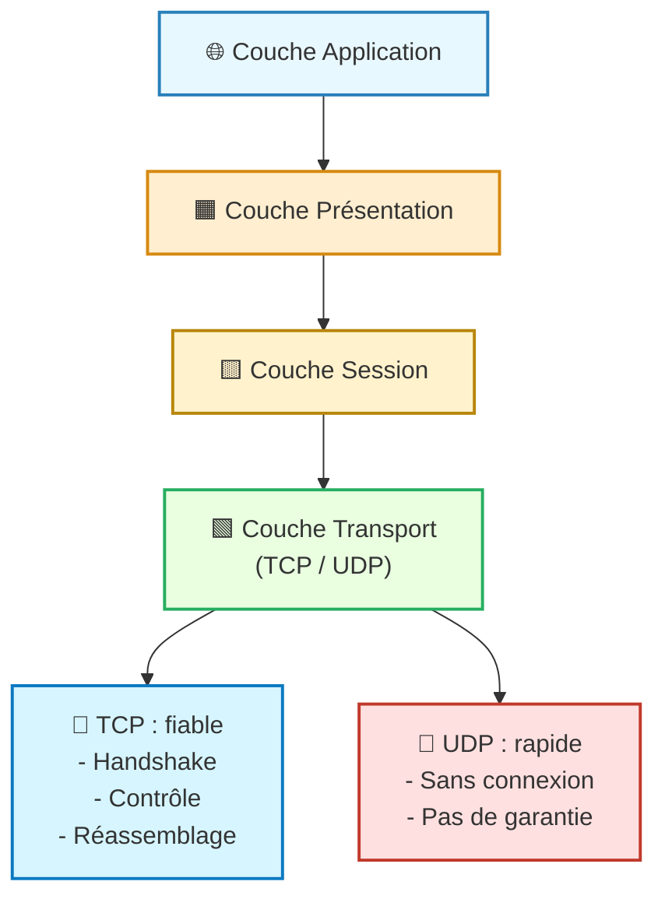
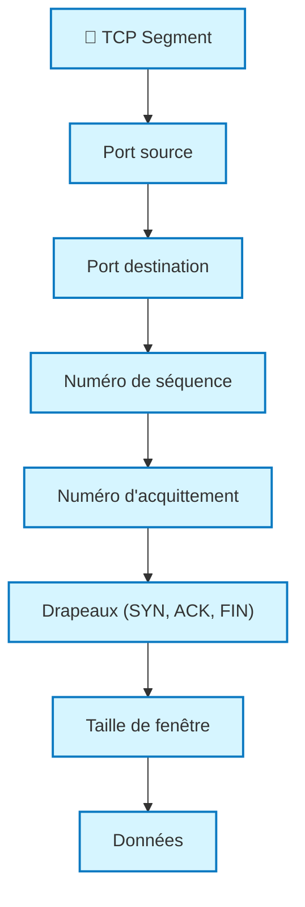
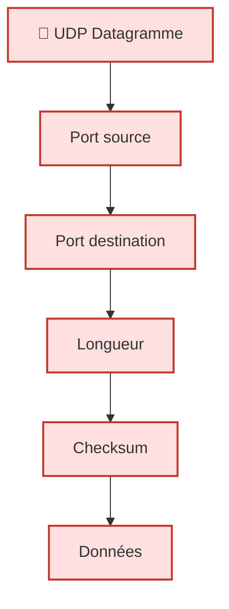

---
tags:
  - modele
  - couche/transport
  - modele/osi
  - modele/tcp-ip
  - protocole
  - reseau
aliases:
  - Couche de Transport
  - Transport Layer
  - Couche 4 OSI
archetype: modele
source:
  - 
cssclasses:
  - max
---

# Couche de Transport (Transport Layer)

## 🎯 Principe Fondamental
> La [[TransportLayer|couche de transport]] est responsable de la communication logique de bout en bout entre les processus s'exécutant sur différents [[Host|hôtes]]. Elle assure la livraison des données entre les applications, en segmentant et réassemblant les données des applications et en les multiplexant sur la [[NetworkLayer|couche réseau]].

## 🧩 Composants / Éléments Clés
*   **[[TransmissionControlProtocol|Protocole de Contrôle de Transmission (TCP)]]**: Un [[Protocol|protocole]] orienté connexion qui offre un service de livraison fiable et ordonné.
*   **[[UserDatagramProtocol|Protocole de Datagrammes Utilisateur (UDP)]]**: Un protocole sans connexion qui offre un service de livraison rapide, mais non fiable, sans garantie d'ordre ou de réception.
*   **[[PortNumber|Numéros de Port]]**: Utilisés pour identifier les applications ou les services spécifiques sur un [[Host|hôte]], permettant la multiplexage et le démultiplexage.

## 📜 Règles de Fonctionnement
*   **[[Segmentation|Segmentation]] et Réassemblage**: Les données des applications sont divisées en segments pour la transmission et réassemblées à destination.
*   **Multiplexage et Démultiplexage**: Permet à plusieurs applications de partager le même [[Network|réseau]] et de recevoir des données via des numéros de port uniques.
*   **[[FlowControl|Contrôle de Flux]] (TCP)**: Empêche un émetteur rapide de submerger un récepteur lent, utilisant des fenêtres glissantes.
*   **[[ErrorDetectionAndCorrection|Détection et Correction d'Erreurs]] (TCP)**: Utilise des [[Checksum|sommes de contrôle]] et des [[Acknowledgement|accusés de réception]] pour garantir l'[[Reliability|intégrité des données]] et la [[Retransmission|retransmission]] des segments perdus.
*   **Gestion de Connexion (TCP)**: Établit et termine une connexion fiable entre les [[Client|clients]] et les [[Server|serveurs]] via un "three-way handshake".

## 📊 Diagramme Conceptuel

---
## 🔵 **Structure TCP (fiable, orienté connexion)**

---
## 🔴 **Structure UDP (simple, rapide)**

---

## 💡 Applications Pratiques
*   **TCP**: Utilisé pour les applications nécessitant une grande [[Reliability|fiabilité]], telles que la navigation web (HTTP/HTTPS), le transfert de fichiers (FTP, [[SSHFileTransferProtocol|SFTP]]), le courrier électronique (SMTP, POP3, IMAP) et les connexions [[SecureShell|SSH]].
*   **UDP**: Préféré pour les applications sensibles à la [[Latency|latence]] où la perte de paquets est tolérable, comme la diffusion en continu (streaming vidéo/audio), la voix sur IP (VoIP), les jeux en ligne, et les requêtes [[DomainNameSystem|DNS]].

## ✅ Avantages et Limites
*   **Avantages**:
    *   Offre un choix entre des services fiables (TCP) et non fiables (UDP) adaptés aux besoins des applications.
    *   Permet le multiplexage de plusieurs applications sur une seule [[CommunicationChannel|connexion réseau]].
    *   Facilite la communication de bout en bout entre les processus.
*   **Limites**:
    *   **TCP**: Introduit une [[Overhead|charge supplémentaire]] significative due à la gestion de la fiabilité et du contrôle de flux.
    *   **UDP**: N'offre aucune garantie de livraison, d'ordre ou d'[[ErrorDetectionAndCorrection|absence d'erreurs]], ce qui peut nécessiter une gestion au niveau de l'application.

## 🔗 Notes Connexes
*   **Modèle parent**: [[OpenSystemsInterconnectionModel|Modèle OSI]]
*   **Couche inférieure**: [[NetworkLayer|Couche Réseau]]
*   **Couche supérieure**: [[SessionLayer|Couche de Session]]
*   **Protocole fiable**: [[TransmissionControlProtocol|TCP]]
*   **Protocole non fiable**: [[UserDatagramProtocol|UDP]]