---
tags:
  - modele
  - couche/transport
  - modele/osi
  - modele/tcp-ip
  - protocole
  - reseau
aliases:
  - Couche de Transport
  - Transport Layer
  - Couche 4 OSI
archetype: modele
source:
  - 
cssclasses:
  - max
---

# Couche de Transport (Transport Layer)

## 🎯 Principe Fondamental
> La couche de transport est responsable de la communication logique de bout en bout entre les processus s'exécutant sur différents hôtes. Elle assure la livraison des données entre les applications, en segmentant et réassemblant les données des applications et en les multiplexant sur la couche réseau.

## 🧩 Composants / Éléments Clés
*   **Protocole de Contrôle de Transmission (TCP)**: Un protocole orienté connexion qui offre un service de livraison fiable et ordonné.
*   **Protocole de Datagrammes Utilisateur (UDP)**: Un protocole sans connexion qui offre un service de livraison rapide, mais non fiable, sans garantie d'ordre ou de réception.
*   **Numéros de Port**: Utilisés pour identifier les applications ou les services spécifiques sur un hôte, permettant la multiplexage et le démultiplexage.

## 📜 Règles de Fonctionnement
*   **Segmentation et Réassemblage**: Les données des applications sont divisées en segments pour la transmission et réassemblées à destination.
*   **Multiplexage et Démultiplexage**: Permet à plusieurs applications de partager le même réseau et de recevoir des données via des numéros de port uniques.
*   **Contrôle de Flux (TCP)**: Empêche un émetteur rapide de submerger un récepteur lent, utilisant des fenêtres glissantes.
*   **Détection et Correction d'Erreurs (TCP)**: Utilise des sommes de contrôle et des accusés de réception pour garantir l'intégrité des données et la retransmission des segments perdus.
*   **Gestion de Connexion (TCP)**: Établit et termine une connexion fiable entre les clients et les serveurs via un "three-way handshake".

## 📊 Diagramme Conceptuel

```mermaid
graph TD
    classDef app fill:#e8f8ff,stroke:#2980b9,stroke-width:2px;
    classDef pres fill:#ffeecf,stroke:#d68910,stroke-width:2px;
    classDef session fill:#fff2cc,stroke:#b8860b,stroke-width:2px;
    classDef trans fill:#e9ffe0,stroke:#27ae60,stroke-width:2px;
    classDef tcp fill:#d6f5ff,stroke:#0b79c1,stroke-width:2px;
    classDef udp fill:#ffe0e0,stroke:#c0392b,stroke-width:2px;

    A["🌐 Couche Application"]:::app
    B["🟧 Couche Présentation"]:::pres
    C["🟨 Couche Session"]:::session
    D["🟩 Couche Transport<br/>(TCP / UDP)"]:::trans

    T1["🔵 TCP : fiable<br/>- Handshake<br/>- Contrôle<br/>- Réassemblage"]:::tcp
    T2["🔴 UDP : rapide<br/>- Sans connexion<br/>- Pas de garantie"]:::udp

    A --> B --> C --> D
    D --> T1
    D --> T2

```

---
## 🔵 **Structure TCP (fiable, orienté connexion)**

```mermaid
graph TD
    classDef head fill:#d6f5ff,stroke:#0b79c1,stroke-width:2px;

    S["🔵 TCP Segment"]:::head
    P1["Port source"]:::head
    P2["Port destination"]:::head
    SEQ["Numéro de séquence"]:::head
    ACK["Numéro d'acquittement"]:::head
    FL["Drapeaux (SYN, ACK, FIN)"]:::head
    WIN["Taille de fenêtre"]:::head
    DATA["Données"]:::head

    S --> P1 --> P2 --> SEQ --> ACK --> FL --> WIN --> DATA

```

---
## 🔴 **Structure UDP (simple, rapide)**

```mermaid
graph TD
    classDef head fill:#ffe0e0,stroke:#c0392b,stroke-width:2px;

    U["🔴 UDP Datagramme"]:::head
    UP1["Port source"]:::head
    UP2["Port destination"]:::head
    LEN["Longueur"]:::head
    CHK["Checksum"]:::head
    UDATA["Données"]:::head

    U --> UP1 --> UP2 --> LEN --> CHK --> UDATA

```

---

## 💡 Applications Pratiques
*   **TCP**: Utilisé pour les applications nécessitant une grande fiabilité, telles que la navigation web (HTTP/HTTPS), le transfert de fichiers (FTP, SFTP), le courrier électronique (SMTP, POP3, IMAP) et les connexions SSH.
*   **UDP**: Préféré pour les applications sensibles à la latence où la perte de paquets est tolérable, comme la diffusion en continu (streaming vidéo/audio), la voix sur IP (VoIP), les jeux en ligne, et les requêtes DNS.

## ✅ Avantages et Limites
*   **Avantages**:
    *   Offre un choix entre des services fiables (TCP) et non fiables (UDP) adaptés aux besoins des applications.
    *   Permet le multiplexage de plusieurs applications sur une seule connexion réseau.
    *   Facilite la communication de bout en bout entre les processus.
*   **Limites**:
    *   **TCP**: Introduit une charge supplémentaire significative due à la gestion de la fiabilité et du contrôle de flux.
    *   **UDP**: N'offre aucune garantie de livraison, d'ordre ou d'absence d'erreurs, ce qui peut nécessiter une gestion au niveau de l'application.

## 🔗 Notes Connexes
*   **Modèle parent**: Modèle OSI
*   **Couche inférieure**: Couche Réseau
*   **Couche supérieure**: Couche de Session
*   **Protocole fiable**: TCP
*   **Protocole non fiable**: UDP