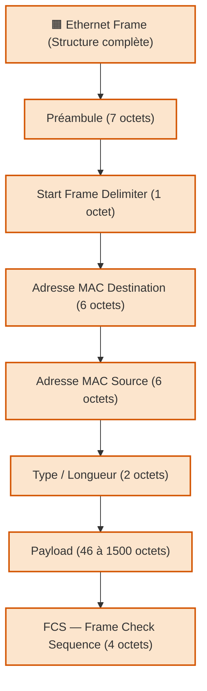

---
tags:
  - protocole
  - trame
  - trame/ethernet
  - ethernet
  - protocole/ethernet
  - reseau
  - couche/liaison/donnees
  - format-donnees
aliases:
  - Trame Ethernet
  - Ethernet Frame
  - Structure de trame Ethernet
archetype: protocole
rfc: IEEE 802.3
cssclasses:
  - max
---

# Trame Ethernet

## 🎯 Rôle et Couche OSI

La trame Ethernet est l'unité de transmission de base dans un réseau Ethernet. 
Elle encapsule les données de la couche supérieure (par exemple, un paquet IP) pour leur transport sur le support physique. 
Son rôle principal est d'assurer la livraison fiable des données entre les hôtes d'un même LAN.

Elle opère principalement à la couche Liaison de Données (couche 2) du modèle OSI, où elle gère l'accès au support et l'adressage physique via les adresses MAC.

## ⚙️ Fonctionnement

Une trame Ethernet est un bloc de données structuré qui contient les informations nécessaires pour la communication au niveau de la couche Liaison de Données. 

Sa structure standard, définie par l'IEEE 802.3, est la suivante :

1.  **Préambule** (7 octets) : Une séquence de 56 bits alternés (10101010...) utilisée pour la synchronisation du signal entre les dispositifs réseau.
2.  **Délimiteur de Début de Trame (SFD)** (1 octet) : Une séquence de 8 bits (10101011) qui signale la fin du préambule et le début réel de la trame.
3.  **Adresse MAC de Destination** (6 octets) : L'adresse MAC du dispositif récepteur prévu pour cette trame.
4.  **Adresse MAC Source** (6 octets) : L'adresse MAC du dispositif émetteur de la trame.
5.  **Type/Longueur** (2 octets) :
    *   Si la valeur est supérieure à 1536 (0x0600), elle indique le type du protocole encapsulé dans la section des données (ex: IPv4, IPv6, IPX).
    *   Si la valeur est inférieure ou égale à 1500, elle indique la longueur de la section de données dans la trame, suivant la norme IEEE 802.3 originale.
6.  **Données (Payload)** (46 à 1500 octets) : Contient les données réelles du protocole de couche supérieure, telles que les paquets IP, les segments TCP ou les datagrammes UDP. Une taille minimale de 46 octets est requise ; des octets de remplissage (padding) sont ajoutés si la charge utile est plus petite.
7.  **Séquence de Vérification de Trame (FCS)** (4 octets) : Une valeur de 32 bits générée par l'expéditeur via un algorithme de somme de contrôle (CRC-32), utilisée par le récepteur pour la détection d'erreurs pendant la transmission. Si le FCS calculé par le récepteur ne correspond pas à celui de la trame, la trame est considérée comme corrompue et généralement rejetée.

## 🛡️ Sécurité du Protocole
Le protocole Ethernet en lui-même n'intègre pas de mécanismes de sécurité robustes au niveau de la trame, ce qui rend les réseaux Ethernet vulnérables à certaines attaques :

*   **Usurpation d'adresse MAC** : Un attaquant peut modifier l'adresse MAC de son périphérique pour se faire passer pour un autre, potentiellement contourner les contrôles d'accès basés sur l'adresse MAC (ex: filtrage MAC).
*   **Empoisonnement ARP** : Affecte les tables ARP des hôtes et commutateurs, permettant à un attaquant d'intercepter le trafic destiné à d'autres hôtes sur le même segment réseau.
*   **Capture de paquets** : Sans chiffrement ou mesures de sécurité supplémentaires (comme les VLAN), le trafic sur un segment Ethernet partagé peut être facilement intercepté par un acteur de menace à l'aide d'outils comme Wireshark.
*   **Attaques de l'homme du milieu** : Peuvent être facilitées par les vulnérabilités de la couche liaison de données, permettant à l'attaquant de relayer et potentiellement modifier les trames entre deux parties communicantes.

Pour renforcer la sécurité des réseaux Ethernet, des contrôles supplémentaires sont nécessaires :
*   **IEEE8021X** : Permet l'authentification des utilisateurs et des appareils avant qu'ils n'obtiennent l'accès au réseau.
*   **VLANs** : Utilisés pour la segmentation du réseau, limitant ainsi le domaine de diffusion et le champ d'action d'éventuelles attaques au niveau de la couche liaison de données.
*   **Sécurité des ports** sur les commutateurs réseau : Permet de limiter le nombre d'adresses MAC autorisées par port, ou de lier des adresses MAC spécifiques à des ports, afin d'atténuer les usurpations MAC.

## 🔗 Notes Connexes
*   **Couche OSI**: Couche Liaison de Données
*   **Protocole associé**: Protocole Ethernet
*   **Composant clé**: Adresse MAC
*   **Unité de données encapsulée**: Paquet
*   **Outil d'analyse**: Wireshark