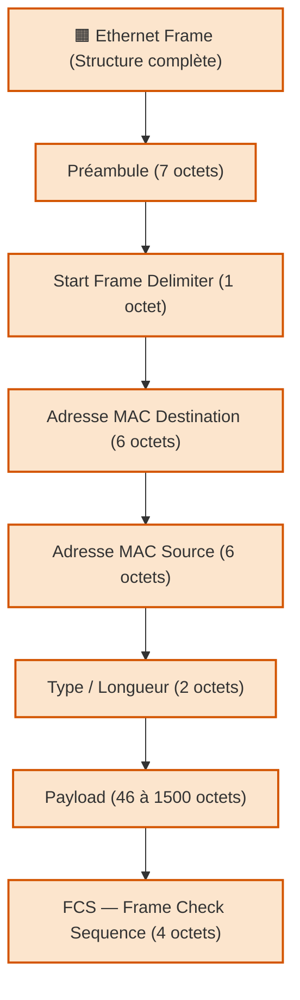

---
tags:
  - protocole
  - trame
  - trame/ethernet
  - ethernet
  - protocole/ethernet
  - reseau
  - couche/liaison/donnees
  - format-donnees
aliases:
  - Trame Ethernet
  - Ethernet Frame
  - Structure de trame Ethernet
archetype: protocole
rfc: IEEE 802.3
cssclasses:
  - max
---

# Trame Ethernet

## 🎯 Rôle et Couche OSI

La [[EthernetFrame|trame Ethernet]] est l'unité de transmission de base dans un réseau [[Ethernet|Ethernet]]. 
Elle encapsule les données de la couche supérieure (par exemple, un [[Packet|paquet]] [[InternetProtocol|IP]]) pour leur transport sur le support physique. 
Son rôle principal est d'assurer la livraison fiable des données entre les [[Host|hôtes]] d'un même [[LocalAreaNetwork|LAN]].

Elle opère principalement à la [[DataLinkLayer|couche Liaison de Données]] (couche 2) du [[OpenSystemsInterconnectionModel|modèle OSI]], où elle gère l'accès au support et l'adressage physique via les [[MediaAccessControlAddress|adresses MAC]].

## ⚙️ Fonctionnement

Une trame Ethernet est un bloc de données structuré qui contient les informations nécessaires pour la communication au niveau de la [[DataLinkLayer|couche Liaison de Données]]. 

Sa structure standard, définie par l'[[InstituteOfElectricalAndElectronicsEngineers|IEEE]] 802.3, est la suivante :

1.  **[[Preamble|Préambule]]** (7 octets) : Une séquence de 56 bits alternés (10101010...) utilisée pour la [[SignalTransmission|synchronisation]] du signal entre les [[NetworkDevice|dispositifs réseau]].
2.  **[[StartFrameDelimiter|Délimiteur de Début de Trame (SFD)]]** (1 octet) : Une séquence de 8 bits (10101011) qui signale la fin du [[Preamble|préambule]] et le début réel de la trame.
3.  **[[DestinationMacAddress|Adresse MAC de Destination]]** (6 octets) : L'[[MediaAccessControlAddress|adresse MAC]] du [[NetworkDevice|dispositif]] récepteur prévu pour cette trame.
4.  **[[SourceMacAddress|Adresse MAC Source]]** (6 octets) : L'[[MediaAccessControlAddress|adresse MAC]] du [[NetworkDevice|dispositif]] émetteur de la trame.
5.  **Type/Longueur** (2 octets) :
    *   Si la valeur est supérieure à 1536 (0x0600), elle indique le type du [[Protocol|protocole]] encapsulé dans la section des données (ex: [[InternetProtocolVersion4|IPv4]], [[InternetProtocolVersion6|IPv6]], [[InternetworkPacketExchange|IPX]]).
    *   Si la valeur est inférieure ou égale à 1500, elle indique la longueur de la section de données dans la trame, suivant la norme IEEE 802.3 originale.
6.  **Données ([[Payload]])** (46 à 1500 octets) : Contient les données réelles du [[Protocol|protocole]] de couche supérieure, telles que les [[InternetProtocol|paquets IP]], les segments [[TransmissionControlProtocol|TCP]] ou les datagrammes [[UserDatagramProtocol|UDP]]. Une taille minimale de 46 octets est requise ; des octets de remplissage (padding) sont ajoutés si la charge utile est plus petite.
7.  **[[FrameCheckSequence|Séquence de Vérification de Trame (FCS)]]** (4 octets) : Une valeur de 32 bits générée par l'expéditeur via un algorithme de [[Checksum|somme de contrôle]] (CRC-32), utilisée par le récepteur pour la [[ErrorDetectionAndCorrection|détection d'erreurs]] pendant la [[DataTransmission|transmission]]. Si le FCS calculé par le récepteur ne correspond pas à celui de la trame, la trame est considérée comme corrompue et généralement rejetée.

## 🛡️ Sécurité du Protocole
Le [[EthernetProtocol|protocole Ethernet]] en lui-même n'intègre pas de mécanismes de [[Security|sécurité]] robustes au niveau de la trame, ce qui rend les réseaux Ethernet vulnérables à certaines [[Attack|attaques]] :

*   **[[MACSpoofing|Usurpation d'adresse MAC]]** : Un [[ThreatActor|attaquant]] peut modifier l'[[MediaAccessControlAddress|adresse MAC]] de son [[NetworkDevice|périphérique]] pour se faire passer pour un autre, potentiellement contourner les contrôles d'[[AccessControl|accès]] basés sur l'[[MediaAccessControlAddress|adresse MAC]] (ex: [[MacAddressFiltering|filtrage MAC]]).
*   **[[AddressResolutionProtocolPoisoning|Empoisonnement ARP]]** : Affecte les tables [[AddressResolutionProtocol|ARP]] des [[Host|hôtes]] et [[NetworkSwitch|commutateurs]], permettant à un [[ThreatActor|attaquant]] d'intercepter le trafic destiné à d'autres [[Host|hôtes]] sur le même [[NetworkSegment|segment réseau]].
*   **[[PacketSniffing|Capture de paquets]]** : Sans [[Encryption|chiffrement]] ou mesures de [[NetworkSecurity|sécurité]] supplémentaires (comme les [[VirtualLocalAreaNetwork|VLAN]]), le trafic sur un [[NetworkSegment|segment Ethernet]] partagé peut être facilement intercepté par un [[ThreatActor|acteur de menace]] à l'aide d'outils comme [[Wireshark]].
*   **[[ManInTheMiddle|Attaques de l'homme du milieu]]** : Peuvent être facilitées par les vulnérabilités de la [[DataLinkLayer|couche liaison de données]], permettant à l'[[ThreatActor|attaquant]] de relayer et potentiellement modifier les trames entre deux parties communicantes.

Pour renforcer la [[NetworkSecurity|sécurité]] des réseaux Ethernet, des contrôles supplémentaires sont nécessaires :
*   **[[IEEE8021X]]** : Permet l'[[Authentication|authentification]] des [[User|utilisateurs]] et des [[NetworkDevice|appareils]] avant qu'ils n'obtiennent l'[[AccessControl|accès]] au [[Network|réseau]].
*   **[[VirtualLocalAreaNetwork|VLANs]]** : Utilisés pour la [[NetworkSegmentation|segmentation du réseau]], limitant ainsi le domaine de [[Broadcast|diffusion]] et le champ d'action d'éventuelles [[Attack|attaques]] au niveau de la [[DataLinkLayer|couche liaison de données]].
*   **[[PortSecurity|Sécurité des ports]]** sur les [[NetworkSwitch|commutateurs réseau]] : Permet de limiter le nombre d'[[MediaAccessControlAddress|adresses MAC]] autorisées par port, ou de lier des [[MediaAccessControlAddress|adresses MAC]] spécifiques à des ports, afin d'atténuer les [[MACSpoofing|usurpations MAC]].

## 🔗 Notes Connexes
*   **Couche OSI**: [[DataLinkLayer|Couche Liaison de Données]]
*   **Protocole associé**: [[EthernetProtocol|Protocole Ethernet]]
*   **Composant clé**: [[MediaAccessControlAddress|Adresse MAC]]
*   **Unité de données encapsulée**: [[Packet|Paquet]]
*   **Outil d'analyse**: [[Wireshark]]