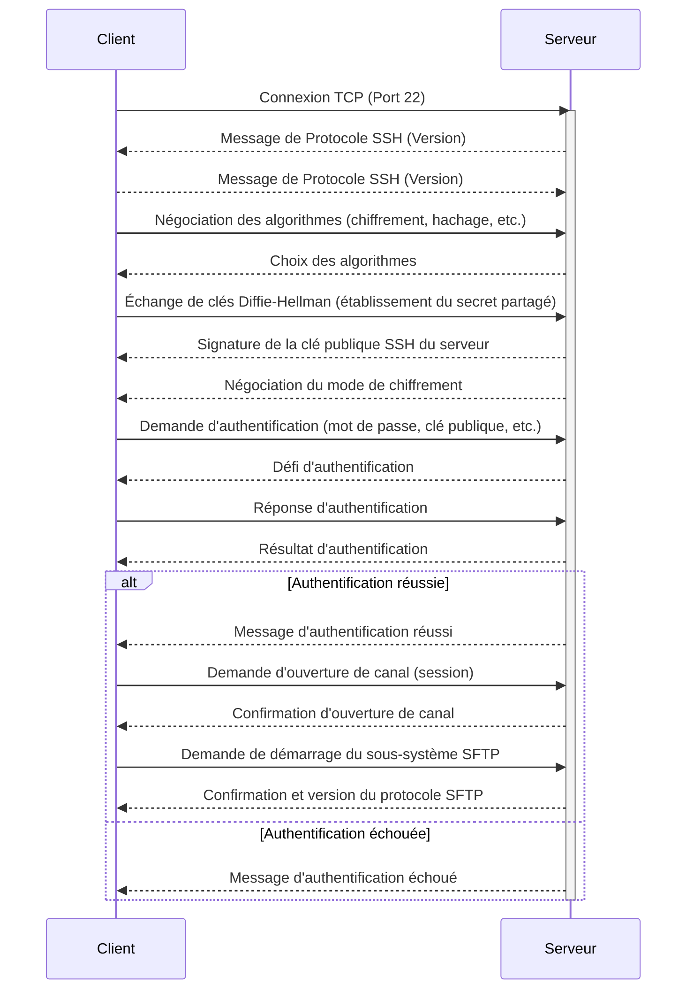

---
tags:
  - protocole
  - protocole/sftp
  - transfert-de-fichiers/securise
  - reseau/couche-application
  - port/tcp/22
aliases:
  - SFTP
  - SSH File Transfer Protocol
  - Secure File Transfer Protocol
  - Protocole de Transfert de Fichiers SSH
archetype: protocole
port_defaut: TCP/22
couche_osi: ApplicationLayer
rfc:
  - RFC 4251
  - RFC 4252
  - RFC 4253
  - RFC 4254
type: Application
standard: IETF
securite: Élevée
cssclasses:
  - max
---

# Protocole de Transfert de Fichiers SSH (SFTP)

> [!info] Carte d'Identité
> * **Couche OSI** : [[ApplicationLayer|Couche Application]] (Modèle TCP/IP)
> * **Port par défaut** : `TCP/22`
> * **Transport** : [[TransmissionControlProtocol|TCP]]

## 📝 Résumé
Le [[SSHFileTransferProtocol|Protocole de Transfert de Fichiers SSH]] (SFTP) est un [[NetworkProtocol|protocole réseau]] qui offre des capacités de [[FileTransfer|transfert]], d'accès et de [[DataManagement|gestion de fichiers]] fiables et sécurisées. Conçu pour fonctionner sur une connexion de données [[SecureShell|SSH]] établie, il fournit une couche de [[Cryptography|cryptographie]] et d'[[Authentication|authentification]] robuste, le rendant supérieur au [[FileTransferProtocol|FTP]] non chiffré pour les transferts sécurisés. Il opère principalement à la Couche Application du [[InternetProtocolSuite|modèle TCP/IP]], s'appuyant sur les services sécurisés de SSH, qui utilise lui-même le TCP à la [[TransportLayer|couche transport]].

## 📜 Historique
SFTP n'est pas un [[RequestForComments|RFC]] standard à part entière au même titre que FTP ou [[HypertextTransferProtocol|HTTP]], mais plutôt une partie du protocole [[SecureShell|SSH-2]]. Il a été développé comme une extension du SSH pour fournir des fonctionnalités de [[FileTransfer|transfert de fichiers]] sécurisées. Les spécifications de SSH, qui incluent les fondations de SFTP, sont définies dans plusieurs RFC de l'IETF, notamment les RFC 4251, RFC 4252, RFC 4253, et RFC 4254.

## 🌐 Rôle et Couche OSI/TCP-IP
Le [[SSHFileTransferProtocol|Protocole de Transfert de Fichiers SSH]] (SFTP) est un [[NetworkProtocol|protocole réseau]] qui fournit des capacités de [[FileTransfer|transfert]], d'accès et de [[DataManagement|gestion de fichiers]] fiables et sécurisées. Il est conçu pour fonctionner sur une connexion de données [[SecureShell|SSH]] établie, offrant ainsi une couche de [[Cryptography|cryptographie]] et d'[[Authentication|authentification]] robuste.

SFTP opère principalement à la [[ApplicationLayer|couche application]] du [[InternetProtocolSuite|modèle TCP/IP]], en s'appuyant sur les services sécurisés de SSH qui, lui-même, utilise le TCP à la [[TransportLayer|couche transport]].

## ⚙️ Fonctionnement Technique
1.  **Établissement de la connexion SSH**: Un [[Client|client]] SFTP initie une connexion à un [[Server|serveur]] SFTP. Cette connexion est d'abord une session [[SecureShell|SSH]], où le Client et le Serveur effectuent l'[[Authentication|authentification]] et établissent un [[CommunicationChannel|canal de communication]] sécurisé et chiffré.
2.  **Initialisation du sous-système SFTP**: Une fois la session SSH établie, le Client demande au Serveur de démarrer le sous-système SFTP. Le Serveur répond en envoyant une confirmation et en indiquant la version du protocole SFTP à utiliser.
3.  **Opérations de fichiers**: Le Client SFTP envoie ensuite des requêtes au Serveur via le canal SSH chiffré pour effectuer diverses opérations de [[FileTransfer|fichiers]]. Celles-ci incluent:
    *   Lister le contenu des répertoires.
    *   Télécharger des fichiers du Serveur vers le Client.
    *   Uploader des fichiers du Client vers le Serveur.
    *   Créer, supprimer et renommer des fichiers et des répertoires.
    *   Modifier les permissions des fichiers.
4.  **Transfert de données**: Toutes les [[Data|données]] et commandes sont encapsulées et chiffrées par SSH, garantissant la [[Confidentiality|confidentialité]] et l'[[Integrity|intégrité]] pendant le [[DataTransmission|transfert]].
*   **Ports par défaut**: SFTP utilise le même [[PortNumber|port]] par défaut que SSH, soit `TCP/22`.

## ⚙️ Fonctionnement (Handshake)
Le processus de "handshake" pour SFTP est intrinsèquement lié à celui de [[SecureShell|SSH]].



## 📦 Structure du Paquet (Header)
Les paquets SFTP sont des messages binaires encapsulés dans le canal [[SecureShell|SSH]]. Il n'y a pas un "en-tête SFTP" distinct au même niveau que TCP ou IP. Au lieu de cela, chaque message SFTP a une structure de base:

| Champ | Taille | Description |
|---|---|---|
| **Length** | 32 bits | Longueur du paquet en octets (excluant ce champ) |
| **Type** | 8 bits | Type du message SFTP (ex: `SSH_FXP_INIT`, `SSH_FXP_OPEN`, `SSH_FXP_READ`, `SSH_FXP_CLOSE`) |
| **Request-ID** | 32 bits | Identifiant de la requête pour faire correspondre les requêtes aux réponses |
| **Data** | Variable | Contenu spécifique au type de message (ex: nom de fichier, données à transférer, attributs) |

> [!info] Note
> Cette structure est celle des messages SFTP eux-mêmes, qui sont ensuite chiffrés et transportés via la couche SSH, qui elle-même s'appuie sur TCP.

## 🦈 Analyse Wireshark
> [!tip] Filtres Utiles
> ```
> # Filtrer par protocole SSH (SFTP est encapsulé dans SSH)
> ssh
> ssh.sftp
>
> # Filtrer une erreur spécifique (si le sous-système SFTP génère des erreurs)
> ssh.sftp.status == SSH_FX_FAILURE
> ```

## 🛡️ Aspects de Sécurité
> [!danger] Vulnérabilités Connues
> *   **Dépendance SSH**: Étant donné que SFTP s'exécute sur [[SecureShell|SSH]], sa sécurité dépend fortement de la robustesse de l'implémentation et de la [[NetworkConfiguration|configuration]] de SSH. Les vulnérabilités seraient plutôt liées à SSH lui-même (par exemple, des failles dans les algorithmes de [[Cryptography|cryptographie]], des clés [[PrivateKey|privées]] compromises, des [[StrongPasswordPolicy|politiques de mot de passe]] faibles permettant des [[BruteForceAttack|attaques par force brute]] ou du [[CredentialStuffing|bourrage d'identifiants]]).
> *   **Contrôles d'Accès**: Une mauvaise gestion des [[AccessControl|contrôles d'accès]] sur le [[FileServer|serveur de fichiers]] peut permettre un [[UnauthorizedAccess|accès non autorisé]] même si la connexion est sécurisée.

> [!check] Mesures de Sécurité
> *   **Chiffrement**: SFTP utilise le [[Encryption|chiffrement]] fourni par [[SecureShell|SSH]], assurant la [[Confidentiality|confidentialité]] des [[Data|données]] en [[DataTransmission|transit]].
> *   **Authentification**: Forte [[Authentication|authentification]] utilisateur et serveur via SSH (mots de passe, clés publiques, Kerberos).
> *   **Intégrité**: Les mécanismes d'[[Integrity|intégrité]] de SSH protègent contre l'[[Tampering|altération des données]].
> *   **Versions sécurisées**: SFTP est lui-même une méthode de [[FileTransfer|transfert de fichiers]] sécurisée. Il est la version sécurisée du protocole [[FileTransferProtocol|FTP]] non chiffré. Il n'y a pas de "version sécurisée" de SFTP en tant que telle, mais plutôt des [[NetworkConfiguration|configurations]] SSH plus robustes et des pratiques de [[SecurityPolicy|politiques de sécurité]] strictes pour son utilisation.

## 💡 Cas d'Usage et Applications
SFTP est largement utilisé pour le [[FileTransfer|transfert de fichiers sécurisé]] et la [[DataManagement|gestion de données]] à distance dans divers scénarios :
*   **Administration de serveurs**: Les [[SystemAdministrator|administrateurs système]] l'utilisent pour gérer des fichiers sur des [[Server|serveurs]] distants de manière sécurisée.
*   **Déploiement d'applications**: [[FileTransfer|Transfert de codes sources]] et de binaires vers des Serveurs de production.
*   **Sauvegardes sécurisées**: Transfert de [[Backup|sauvegardes]] de [[Data|données]] vers un [[SecureStorage|stockage sécurisé]] ou un site de [[BackupAndRecovery|récupération après sinistre]].
*   **Transfert de données sensibles**: Échange de [[SensitiveData|données sensibles]] entre [[Organisation|organisations]] ou services.

## 🆚 Comparaison avec des Protocoles Similaires
*   **[[FileTransferProtocol|FTP]]**: L'FTP est un [[Protocol|protocole]] non chiffré, ce qui signifie que les [[Credential|identifiants]] de [[Login|connexion]] et les [[FileTransfer|données]] sont transférés en [[Cleartext|texte clair]], le rendant vulnérable au [[PacketSniffing|sniffing]]. SFTP, en revanche, offre [[Encryption|chiffrement]] et [[Authentication|authentification]] via [[SecureShell|SSH]].
*   **[[FileTransferProtocolSecure|FTPS]]**: FTPS est FTP sécurisé par [[TransportLayerSecurity|TLS]] (ou [[SecureSocketLayer|SSL]]). Il offre un chiffrement comparable à SFTP, mais nécessite généralement des ports de données séparés ou un mode passif plus complexe. Sa mise en œuvre peut être plus complexe avec les [[Firewall|pare-feu]].
*   **SCP (Secure Copy Protocol)**: SCP est également basé sur [[SecureShell|SSH]] et est plus simple que SFTP. Il est principalement conçu pour le [[FileTransfer|transfert de fichiers]] et ne prend pas en charge des opérations de [[DataManagement|gestion de fichiers]] plus complexes (listage de répertoires, suppression, renommage) aussi facilement que SFTP. SCP est plus rapide pour les transferts de fichiers simples mais moins flexible.

## troubleshoot Résolution de Problèmes
*   **Problèmes de connexion SSH**: Vérifier la [[Connectivity|connectivité réseau]], les règles de [[Firewall|pare-feu]] bloquant le [[PortNumber|port 22]], et les [[NetworkConfiguration|configurations]] du [[SecureShell|serveur SSH]] (`sshd_config`).
*   **Erreurs d'authentification**: S'assurer que les [[Credential|identifiants]] (mot de passe ou clé SSH) sont corrects et que l'[[User|utilisateur]] a les permissions nécessaires. Vérifier les [[Log|journaux]] du serveur SSH pour des messages d'erreur.
*   **Problèmes de permissions de fichiers**: Les erreurs de lecture/écriture indiquent souvent des problèmes de permissions sur le [[FileServer|système de fichiers]] côté [[Server|serveur]]. Vérifier les permissions UNIX/Linux des répertoires et fichiers.
*   **Version du protocole SFTP**: Certains [[Client|clients]] et [[Server|serveurs]] peuvent avoir des incompatibilités de version SFTP. Essayer de forcer une version spécifique si l'[[Tool|outil]] Client le permet.

## Ressources
*   [[RequestForComments|RFC 4251]]: The Secure Shell (SSH) Protocol Architecture.
*   RFC 4253: The Secure Shell (SSH) Transport Layer Protocol.
*   [[Wireshark|Outil pour l'analyser (ex: Wireshark)]]


