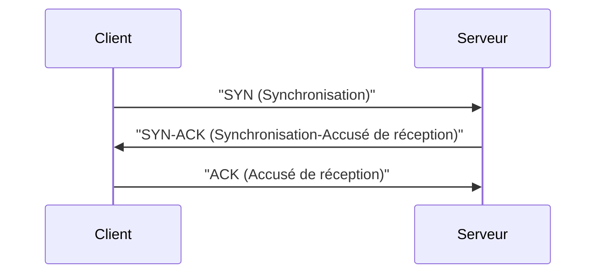

---
tags:
  - protocole
  - protocole/tcp/segment
  - modèle-osi/couche-4
  - protocole/udp
  - réseau/couche-transport
aliases:
  - Segment de transport
  - Transport Segment
archetype: protocole
port_defaut: N/A
couche_osi: Couche 4
rfc:
  - N/A
cssclasses:
  - max
---

# Segment de Transport

> [!info] Carte d'Identité
> * **Couche OSI** : Couche 4
> * **Port par défaut** : N/A
> * **[[Transport.md|Transport]]** : [[TransmissionControlProtocol.md|TCP]] / [[UserDatagramProtocol.md|UDP]]

Un [[SegmentTransport.md|segment de transport]] est l'unité de [[Data.md|données]] au niveau de la [[TransportLayer.md|couche transport]] du [[ReferenceModel.md|modèle de référence]] [[OpenSystemsInterconnectionModel.md|OSI]] ou de la [[InternetProtocolSuite.md|suite de protocoles TCP/IP]]. Il encapsule les données de l'[[SoftwareApplication.md|application]] pour les préparer à la [[DataTransmission.md|transmission de données]] sur le [[Network.md|réseau]]. Chaque [[NetworkProtocol.md|protocole réseau]] de la couche transport, comme TCP ou UDP, définit son propre format de [[Segment.md|segment]].

## ⚙️ Fonctionnement

Le fonctionnement des segments dépend du protocole de transport utilisé.

### TCP (Transmission Control Protocol)
Le protocole TCP (Transmission Control Protocol) est un protocole orienté connexion qui assure la fiabilité et l'ordre de livraison des segments. Avant d'échanger des données, TCP établit une connexion logique via un processus de "three-way handshake" :


Une fois la connexion établie, les données sont divisées en segments, numérotés et envoyés. TCP utilise des [[Acknowledgement.md|accusés de réception]] pour confirmer la bonne réception des segments et retransmet ceux qui sont perdus ou corrompus.

### UDP (User Datagram Protocol)
Le protocole UDP (User Datagram Protocol) est un protocole sans connexion et non fiable. Il n'établit pas de connexion préalable et n'offre aucune garantie de livraison, d'ordre ou d'[[Integrity.md|intégrité]] des données. Les données sont simplement encapsulées dans des segments (appelés [[Packet.md|datagrammes]] UDP) et envoyées. Il est utilisé pour les applications où la vitesse est plus critique que la fiabilité, comme le streaming vidéo ou les jeux en ligne.

## 📦 Structure du Segment ([[Header.md|Header]])

La structure du header d'un segment varie entre TCP et UDP.

### Header TCP
| Champ | Taille | Description |
|---|---|---|
| **Source Port** | 16 bits | Numéro de port de l'application émettrice. |
| **Destination Port** | 16 bits | Numéro de port de l'application destinataire. |
| **Sequence Number** | 32 bits | Numéro de séquence du premier octet de données du segment. Utilisé pour l'ordonnancement. |
| **Acknowledgement Number** | 32 bits | Numéro de séquence du prochain octet attendu par l'émetteur. |
| **Data Offset (Header Length)** | 4 bits | Longueur du header TCP en mots de 32 bits. |
| **Reserved** | 6 bits | Réservé pour usage futur, doit être zéro. |
| **Flags** | 6 bits | URG, ACK, PSH, RST, SYN, FIN (utilisés pour contrôler la connexion et le flux). |
| **Window Size** | 16 bits | Taille de la fenêtre de réception, utilisée pour le contrôle de flux. |
| **Checksum** | 16 bits | Somme de contrôle pour la détection d'erreurs dans le header et les données. |
| **Urgent Pointer** | 16 bits | Indique l'offset des données urgentes dans le segment. |
| **Options** | Variable | Champs optionnels pour des fonctionnalités supplémentaires. |
| **Padding** | Variable | Remplissage pour que le header soit un multiple de 32 bits. |

### Header UDP
| Champ | Taille | Description |
|---|---|---|
| **Source Port** | 16 bits | Numéro de port de l'application émettrice. |
| **Destination Port** | 16 bits | Numéro de port de l'application destinataire. |
| **Length** | 16 bits | Longueur totale du datagramme UDP (header + données). |
| **Checksum** | 16 bits | Somme de contrôle facultative pour la détection d'erreurs dans le header et les données. |

## 🦈 Analyse [[Wireshark.md|Wireshark]]
> [!tip] Filtres Utiles
> ```
> # Filtrer par protocole (TCP ou UDP)
> tcp
> udp
>
> # Filtrer par numéro de port
> tcp.port == 80
> udp.port == 53
>
> # Filtrer les paquets SYN (pour TCP)
> tcp.flags.syn == 1
>
> # Filtrer les paquets SYN-ACK (pour TCP)
> tcp.flags.syn == 1 and tcp.flags.ack == 1
> ```

## 🛡️ [[Security.md|Sécurité]]
> [!danger] [[Vulnerability.md|Vulnérabilités]] Connues
> *   [[PacketSniffing.md|Sniffing]] : Si les segments ne sont pas [[Encryption.md|chiffrés]] (comme avec [[HypertextTransferProtocol.md|HTTP]] sur TCP ou la plupart des communications UDP), les données peuvent être interceptées et lues en [[Cleartext.md|texte clair]] par des [[ThreatActor.md|attaquants]] utilisant des analyseurs de protocole ou d'autres [[Tool.md|outils]] de capture de paquets.
> *   [[Spoofing.md|Spoofing]] : Les numéros de [[PortNumber.md|port]] source et destination dans les segments TCP et UDP peuvent être falsifiés. Le [[InternetProtocol.md|protocole IP]] étant basé sur l'[[AddressingInformation.md|adressage]] et non l'[[Authentication.md|authentification]], un attaquant peut envoyer des segments avec de fausses adresses source, ce qui peut être utilisé dans des [[DenialOfService.md|attaques par déni de service]] ou pour contourner des [[Firewall.md|pare-feu]].
> *   Hijacking de [[SessionLayer.md|session]] (TCP) : Une fois une session TCP établie, un attaquant peut tenter de s'insérer dans la [[Communication.md|communication]] en devinant les numéros de séquence et d'accusé de réception corrects, prenant ainsi le contrôle de la session.
> *   Déni de Service (DoS) / [[DistributedDenialOfService.md|DDoS]] : L'envoi massif de segments [[SYNFlood.md|SYN Flood]] non finalisés (SYN Flood) peut saturer les [[Resource.md|ressources]] d'un [[Server.md|serveur]], l'empêchant de répondre aux requêtes légitimes. Les attaques UDP Flood exploitent la nature sans connexion d'UDP pour submerger une [[System.md|cible]] avec un grand volume de [[NetworkTraffic.md|trafic]].

