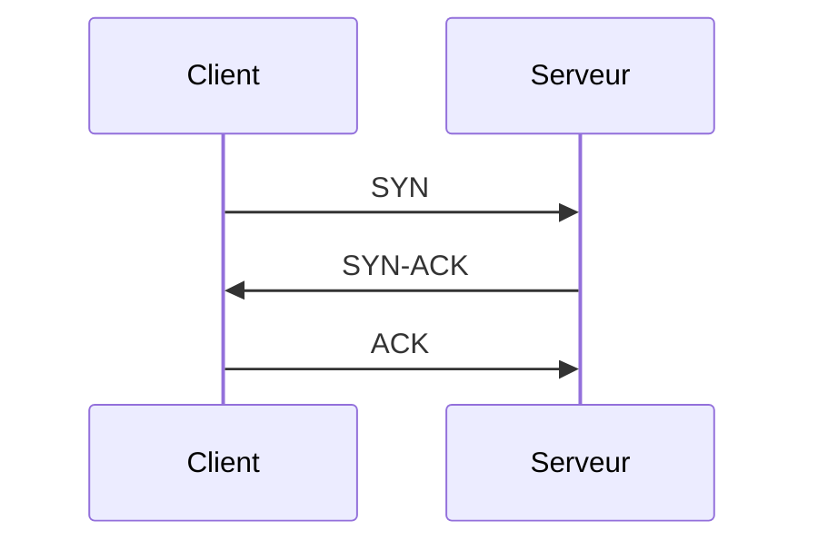

---
tags:
  - protocole
  - protocole/tcp
aliases:
  - Protocole de Contrôle de Transmission
  - TCP
  - Transmission Control Protocol
  - protocole TCP
archetype: protocole
port_defaut: TCP/20, TCP/21, TCP/23, TCP/25, TCP/80, TCP/443
couche_osi: TransportLayer
rfc: RFC 793
cssclasses:
  - max
---

# Protocole de Contrôle de Transmission (TCP)

> [!info] Carte d'Identité
> * **Couche OSI** : [[TransportLayer|Couche de Transport]]
> * **Port par défaut** : `TCP/20, TCP/21, TCP/23, TCP/25, TCP/80, TCP/443`
> * **Transport** : [[TransmissionControlProtocol|TCP]] / `N/A`

## 🎯 Rôle et Couche OSI
Le [[TransmissionControlProtocol|Protocole de Contrôle de Transmission (TCP)]] est un [[NetworkProtocol|protocole]] de communication fiable, orienté connexion, qui opère au niveau de la [[TransportLayer|couche Transport]] du [[InternetProtocolSuite|modèle TCP/IP]]. Son rôle principal est d'assurer la livraison ordonnée et sans erreur des données entre les [[SoftwareApplication|applications]] sur un réseau.

## ⚙️ Fonctionnement
1.  **Établissement de Connexion (Three-Way Handshake)**: Avant tout [[DataTransmission|transfert de données]], le Protocole de Contrôle de Transmission (TCP) utilise une [[ThreeWayHandshake|poignée de main en trois étapes]] (SYN, SYN-ACK, ACK) pour établir une connexion logique fiable entre deux hôtes.
2.  **Fiabilité et Ordre**: Il assure la livraison complète et dans le bon ordre des données en attribuant un numéro de séquence à chaque segment et en nécessitant un [[Acknowledgement|acquittement (ACK)]] pour la réception réussie. Si un acquittement n'est pas reçu, le segment est [[Retransmission|retransmis]].
3.  **Contrôle de Flux (Flow Control)**: Le Protocole de Contrôle de Transmission (TCP) empêche un expéditeur d'envoyer des données plus rapidement que le récepteur ne peut les traiter en utilisant des [[FlowControl|fenêtres glissantes]], évitant ainsi la saturation du [[Buffer|tampon]] du récepteur.
4.  **Contrôle de Congestion (Congestion Control)**: Ajuste dynamiquement le débit de transmission des données pour éviter la [[NetworkCongestion|congestion du réseau]], en utilisant des algorithmes tels que Slow Start et Congestion Avoidance.
5.  **Gestion des Segments**: Les données d'applications sont divisées en [[Packet|segments TCP]], qui sont ensuite encapsulés dans des [[InternetProtocol|paquets IP]] pour le routage à travers le réseau.
* **Ports par défaut**:
  *   TCP/20, TCP/21 ([[FileTransferProtocol|FTP]])
  *   TCP/23 (Telnet)
  *   TCP/25 (SMTP)
  *   TCP/80 ([[HypertextTransferProtocol|HTTP]])
  *   TCP/443 ([[HypertextTransferProtocolSecure|HTTPS]])

### 🤝 Three-Way Handshake



## 📦 Structure du Paquet (Header)
| Champ | Taille | Description |
|---|---|---|
| **Source Port** | 16 bits | Numéro de port de l'application expéditrice. |
| **Destination Port** | 16 bits | Numéro de port de l'application réceptrice. |
| **Sequence Number** | 32 bits | Numéro de séquence du premier octet de données dans ce segment. |
| **Acknowledgement Number** | 32 bits | Numéro de séquence du prochain octet attendu par l'expéditeur. |
| **Data Offset** | 4 bits | Longueur de l'en-tête TCP en mots de 32 bits. |
| **Reserved** | 6 bits | Réservé pour usage futur, doit être zéro. |
| **Flags (C, E, U, A, P, R, S, F)** | 8 bits | Contient les drapeaux de contrôle (ACK, SYN, FIN, RST, etc.). |
| **Window Size** | 16 bits | Taille de la fenêtre de réception (pour le contrôle de flux). |
| **Checksum** | 16 bits | Somme de contrôle pour l'intégrité de l'en-tête et des données. |
| **Urgent Pointer** | 16 bits | Indique un pointeur de données urgentes si le drapeau URG est défini. |
| **Options** | Variable | Options TCP (taille maximale de segment, fenêtre d'échelle, etc.). |
| **Padding** | Variable | Remplit l'en-tête pour qu'il soit un multiple de 32 bits. |
| **Data** | Variable | Les données de l'application encapsulées. |

## 🦈 Analyse Wireshark
> [!tip] Filtres Utiles
> ```
> # Filtrer par protocole
> tcp
>
> # Filtrer une erreur spécifique
> tcp.flags.reset == 1
> ```

## 🛡️ Sécurité
> [!danger] Vulnérabilités Connues
> *   **[[DenialOfService|Attaques par Déni de Service]]** (ex: SYN Flood, qui épuise les ressources du serveur en maintenant des connexions semi-ouvertes).
> *   **[[ManInTheMiddle|Attaques de l'Homme du Milieu]]** (MITM), en particulier lorsque le trafic n'est pas chiffré.
> *   Détournement de session (Session Hijacking) via la prédiction ou l'interception des numéros de séquence.

> [!info] Versions Sécurisées
> La [[Security|sécurité]] du Protocole de Contrôle de Transmission (TCP) est principalement renforcée par des protocoles de couches supérieures, notamment [[TransportLayerSecurity|Transport Layer Security (TLS)]] et son prédécesseur [[SecureSocketLayer|Secure Socket Layer (SSL)]]. Ces protocoles sont utilisés par des services comme HTTPS, FTPS et SSH pour le chiffrement et l'[[Authentication|authentification]].

## 🔗 Notes Connexes
*   [[InternetProtocol|Protocole Internet (IP)]]
*   [[UserDatagramProtocol|Protocole de Datagrammes Utilisateur (UDP)]]
*   [[InternetProtocolSuite|Suite de Protocoles Internet (TCP/IP)]]
*   [[ThreeWayHandshake|Poignée de main en trois étapes]]
*   [[Wireshark|Wireshark]]
---
