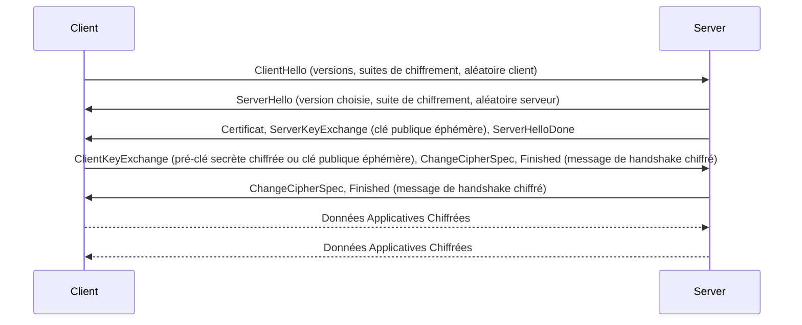

---
tags:
  - protocole
  - protocole/securite/tls
  - cryptographie/chiffrement-asymetrique
  - authentification/certificat-numerique
  - reseau/couche-transport/https
aliases:
  - Sécurité de la Couche de Transport
  - TLS
  - Transport Layer Security
archetype: protocole
port_defaut: TCP/UDP 443
couche_osi: Transport Layer
rfc:
  - RFC 5246
  - RFC 8446
cssclasses:
  - max
---

# Transport Layer Security (TLS)

> [!info] Carte d'Identité
> * **Couche OSI** : [[TransportLayer|Couche de Transport]]
> * **Port par défaut** : `TCP/UDP 443`
> * **Transport** : [[TransmissionControlProtocol|TCP]]

## 🎯 Rôle et Couche OSI
Le [[TransportLayerSecurity|Transport Layer Security (TLS)]] est un [[NetworkProtocol|protocole réseau]] cryptographique essentiel conçu pour sécuriser les [[NetworkCommunication|communications réseau]] sur Internet. Il établit un canal de communication sécurisé qui garantit la confidentialité, l'[[Integrity|intégrité]] des données et l'[[Authentication|authentification]] des entités communicantes. Il opère principalement au-dessus de la [[TransportLayer|couche de Transport]] du [[InternetProtocolSuite|modèle TCP/IP]] et du modèle OSI, agissant comme une surcouche de sécurité pour des [[ApplicationLayer|protocoles de la couche Application]] tels que [[HypertextTransferProtocol|HTTP]].

## ⚙️ Fonctionnement (Handshake TLS)
Le fonctionnement du TLS repose sur une série d'étapes, notamment la poignée de main TLS (Handshake TLS), pour établir une session sécurisée :

1.  **Négociation du Handshake**: Le [[ClientServerArchitecture|client]] et le [[Server|serveur]] échangent des messages (ClientHello, ServerHello) pour négocier les paramètres de la connexion sécurisée, incluant la version de TLS à utiliser, les suites de chiffrement supportées, et des nombres aléatoires.
2.  **Authentification du Serveur**: Le serveur envoie son [[DigitalCertificate|certificat numérique]] (contenant sa [[PublicKey|clé publique]]) au client. Le client vérifie la validité de ce certificat auprès d'une autorité de certification de confiance afin d'authentifier le serveur et de prévenir les [[ManInTheMiddle|attaques de l'homme du milieu]]. L'authentification mutuelle du client est optionnelle et moins fréquente.
3.  **Échange de Clés**: Les parties utilisent un algorithme d'échange de clés (ex: Diffie-Hellman) pour établir une clé de session symétrique unique et secrète, qui sera utilisée pour le [[DataEncryption|chiffrement]] des données de la session. Cet échange se fait de manière sécurisée grâce à la [[Cryptography|cryptographie]] asymétrique.
4.  **Chiffrement des Données**: Une fois la clé de session établie, toutes les [[DataTransmission|données échangées]] entre le client et le serveur sont chiffrées symétriquement et accompagnées d'un code d'authentification de message (MAC) pour garantir leur confidentialité et leur intégrité durant le transit.



## 📦 Structure du Paquet (Header)
Le TLS opère en tant que couche d'enregistrement qui fragmente les données de l'[[ApplicationLayer|couche Application]] en blocs gérables, les chiffre et les transmet via le [[TransmissionControlProtocol|TCP]]. Il n'a pas un en-tête unique au sens des couches inférieures mais une série d'enregistrements avec des types (handshake, alert, change cipher spec, application data), des versions et des longueurs.

| Champ | Taille | Description |
|---|---|---|
| **Type d'enregistrement** | 1 octet | Indique le type de message TLS (Handshake, Alert, ChangeCipherSpec, Application Data). |
| **Version majeure** | 1 octet | Version majeure du protocole TLS (ex: 3 pour TLS 1.2, 3 pour TLS 1.3). |
| **Version mineure** | 1 octet | Version mineure du protocole TLS (ex: 3 pour TLS 1.2, 4 pour TLS 1.3). |
| **Longueur** | 2 octets | Longueur du contenu chiffré de l'enregistrement. |
| **Données chiffrées** | Variable | Le contenu réel, chiffré, qui peut inclure des messages de handshake, des alertes ou des données applicatives. |

## 🦈 Analyse Wireshark
> [!tip] Filtres Utiles
> ```
> # Filtrer par protocole
> tls
>
> # Filtrer les messages de handshake TLS
> tls.handshake.type
>
> # Filtrer une erreur spécifique
> tls.alert_message.level == 2 # Niveau d'alerte fatal
> ```

## 🛡️ Sécurité
*   **Vulnérabilités connues**:
    *   Attaques de l'homme du milieu (lorsque l'authentification est contournée ou le certificat compromis)
    *   Attaques par rétrogradation de protocole (forcer la connexion à utiliser des versions de TLS ou [[SecureSocketLayer|SSL]] plus anciennes et moins sécurisées)
    *   Utilisation de suites de chiffrement faibles ou obsolètes
    *   [[SecurityVulnerabilities|Vulnérabilités logicielles]] dans les implémentations de TLS (ex: Heartbleed pour OpenSSL dans le passé, [[Exploitation|zero-days]])
*   **Versions sécurisées**:
    *   TLS est le successeur de SSL (versions 1.0, 2.0, 3.0), toutes les versions de SSL étant considérées comme obsolètes et insécurisées.
    *   TLS 1.2 et TLS 1.3 sont les versions actuellement recommandées. TLS 1.3, en particulier, apporte des améliorations significatives en termes de performance et de sécurité en simplifiant le processus de handshake et en éliminant les fonctionnalités cryptographiques obsolètes.

## 🔗 Notes Connexes
*   [[HypertextTransferProtocolSecure|HTTPS]]
*   [[DigitalCertificate|Certificat Numérique]]