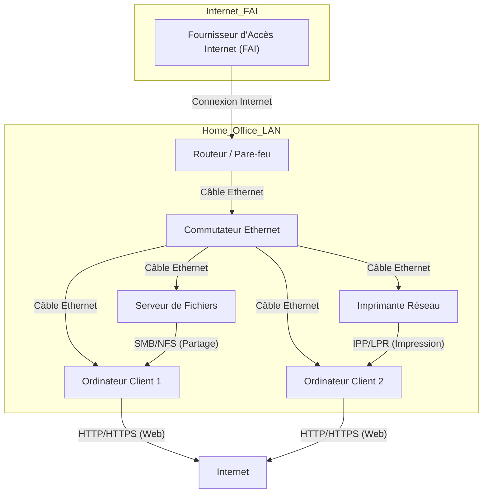

---
tags:
  - architecture
  - reseau
  - reseau/informatique
aliases:
  - Architecture Réseau Simple
  - Réseau Local de Base
  - Architecture de Référence Introduction Réseau
archetype: architecture
type:
  - Réseau / Système
cssclasses:
  - max
---

# Architecture : Réseau Local Simple

> [!abstract] Vue d'ensemble
> Architecture d'un réseau local (LAN) simple, conçue pour servir de modèle d'introduction aux concepts fondamentaux des [[ComputerNetwork|Réseaux Informatiques]]. Elle illustre les composants de base et les flux de communication essentiels dans un environnement domestique ou de petite entreprise.

## 🗺️ Diagramme Topologique

## 🚦 Matrice des Flux
| Source | Destination | Port/Protocole | Description | Action |
|---|---|---|---|---|
| **Client DHCP** | **Serveur DHCP** | UDP/67, 68 | Obtention d'adresse IP | ✅ Autoriser |
| **PC Client** | **Internet** | TCP/80, 443 | Navigation Web | ✅ Autoriser (sortie) |
| **PC Client** | **Serveur de Fichiers** | SMB, NFS | Accès aux fichiers partagés | ✅ Autoriser |
| **PC Client** | **Imprimante Réseau** | IPP, LPR | Impression de documents | ✅ Autoriser |
| **Internet** | **Réseau Interne** | Tout | Trafic entrant non sollicité | ❌ Bloquer par Pare-feu |

## 🏰 Zones de Sécurité & Segmentation
*   **Zone Internet** : Représente le réseau externe et non sécurisé, source de menaces potentielles.
*   **Zone Réseau Local (LAN)** : Conçue pour la communication interne et sécurisée des dispositifs de l'organisation ou du domicile. Elle est protégée du réseau externe par le [[Firewall|pare-feu]] du [[Router|routeur]].

## 🛡️ Mesures de Sécurité Clés
> [!shield] Défense en Profondeur
> 1.  **[[Firewall|Pare-feu]] Périmétrique** : Intégré au [[Router|routeur]] pour filtrer et contrôler le trafic entre le [[LocalAreaNetwork|LAN]] et [[Internet|Internet]], agissant comme [[DefaultGateway|passerelle par défaut]].
> 2.  **[[Antivirus|Logiciel Antivirus]] / [[EndpointProtectionPlatform|EPP]]** : Installé sur les [[EndDevices|terminaux]] (PC, Serveur) pour la détection et la suppression des [[Malware|logiciels malveillants]].
> 3.  **[[Password|Mots de passe]] forts** : Exigés pour tous les accès aux dispositifs réseau, aux [[OperatingSystem|systèmes d'exploitation]] et aux services, complétés par de la [[MultiFactorAuthentication|MFA]] si possible.
> 4.  **[[PatchManagement|Gestion des Patchs]]** : Application régulière des mises à jour de sécurité pour les systèmes d'exploitation, les applications et le [[Firmware|micrologiciel]] des [[NetworkDevice|périphériques réseau]].
> 5.  **[[NetworkConfiguration|Configuration Sécurisée]]** : Désactivation des services et ports inutiles sur les [[NetworkDevice|périphériques réseau]] et les [[EndDevices|terminaux]].

## 🔗 Notes Connexes
*   [[ComputerNetwork|Réseaux Informatiques]]
*   [[LocalAreaNetwork|Réseau Local]]
*   [[Router|Routeur]]
*   [[Firewall|Pare-feu]]
*   [[NetworkSecurity|Sécurité Réseau]]
*   [[DefaultGateway|Passerelle par défaut]]
*   [[DynamicHostConfigurationProtocol|Protocole DHCP]]