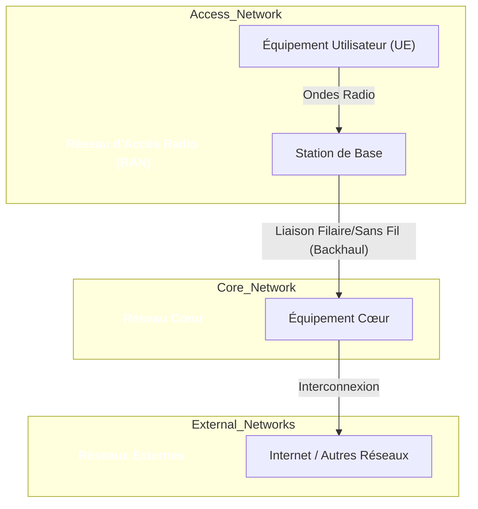

---
tags:
  - architecture
  - réseau/cellulaire
aliases:
  - Réseau Cellulaire
  - Réseaux Cellulaires
  - Cellular Network
  - Mobile Network
archetype: architecture
type: Réseau
cssclasses:
  - max
---

# Architecture : Réseau Cellulaire

> [!abstract] Vue d'ensemble
> Un [[CellularNetworkArchitecture|réseau cellulaire]] est une [[WirelessNetwork|infrastructure sans fil]] qui divise une zone géographique en "cellules", chacune desservie par une station de base. Il permet la [[NetworkCommunication|communication]] entre les appareils mobiles et l'[[Internet|internet]] ou d'autres [[Network|réseaux]], facilitant la mobilité des utilisateurs.

## 🗺️ Diagramme Topologique

## 🚦 Matrice des Flux
| Source | Destination | Port/Protocole | Description | Action |
|---|---|---|---|---|
| **UE** | **Station de Base** | Ondes Radio | Données, Voix, Signalisation | ✅ Autoriser |
| **Station de Base** | **Équipement Cœur** | Filaire/Sans Fil | Données, Voix, Signalisation | ✅ Autoriser |
| **Équipement Cœur** | **Internet** | TCP/UDP/IP | Connexion aux réseaux externes | ✅ Autoriser |

## 🏰 Zones de Sécurité & Segmentation
*   **Réseau d'Accès Radio (RAN)** : Zone ouverte aux terminaux mobiles. Focalisation sur la [[WirelessNetworkSecurity|sécurité sans fil]] et l'[[Authentication|authentification]] des utilisateurs.
*   **Réseau Cœur** : Zone hautement sécurisée gérant l'identité utilisateur, la mobilité, la facturation et la connectivité aux réseaux externes.
*   **Zone d'Interconnexion** : Points de liaison avec d'autres réseaux (Internet, autres opérateurs), nécessitant des [[Firewall|pare-feu]] et [[IntrusionPreventionSystem|systèmes de prévention d'intrusion]].

## 🛡️ Mesures de Sécurité Clés
> [!shield] Défense en Profondeur
> 1.  **Authentification Forte** : Mutual authentication entre UE et réseau via [[DigitalCertificate|certificats]] et cartes SIM.
> 2.  **Chiffrement des Communications** : [[Encryption|Chiffrement]] du trafic sur l'interface radio et souvent jusqu'au réseau cœur.
> 3.  **Isolation et Segmentation** : Utilisation de [[NetworkSegmentation|segmentation réseau]] (ex: [[VirtualLocalAreaNetwork|VLAN]]) et Network Slicing (5G) pour isoler les services.
> 4.  **Protection Périmétrique** : Pare-feu et [[IntrusionDetectionSystem|systèmes de détection d'intrusion]] aux frontières du réseau cœur.
