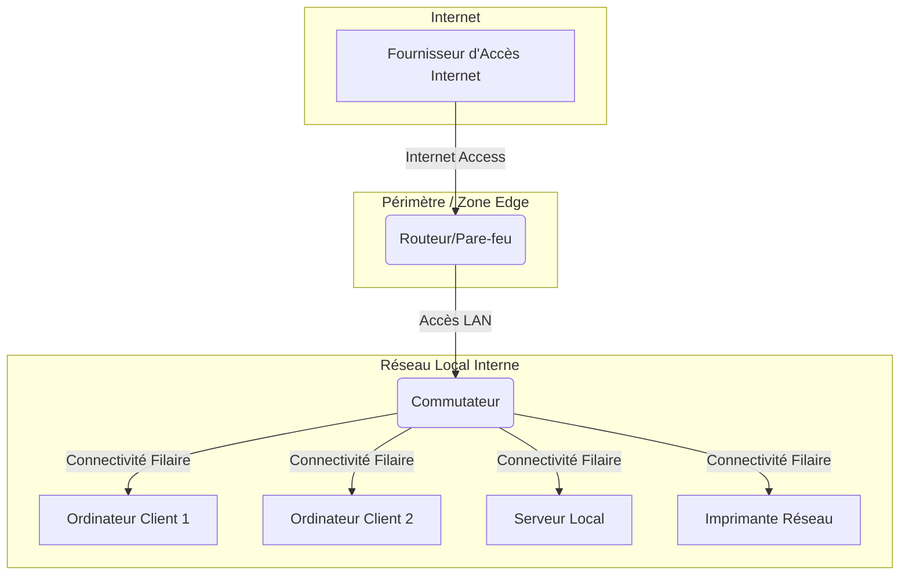

---
tags:
  - architecture
  - infra
  - infrastructure-reseau
  - reseau/informatique
  - topologie/reseau
  - segmentation/reseau
  - conception/reseau
aliases:
  - Architecture Réseau Informatique Générique
  - Modèle de Réseau Informatique
  - Basic Network Architecture
archetype: architecture
type: [Réseau]
cssclasses:
  - max
---

# Architecture : Réseau Informatique Générique

> [!abstract] Vue d'ensemble
> Cette architecture décrit un modèle de [[Network|réseau informatique]] typique et fondamental. Elle illustre les composants essentiels, leurs interconnexions et les zones fonctionnelles courantes, applicable aux environnements domestiques ou de petite [[Enterprise|entreprise]]. Elle sert de base pour comprendre la [[NetworkTopology|topologie réseau]] et la [[NetworkCommunication|communication réseau]].

## 🗺️ Diagramme Topologique

## 🚦 Matrice des Flux
| Source | Destination | Port/Protocole | Description | Action |
|---|---|---|---|---|
| **Internet** | **Périmètre** (Routeur/Pare-feu) | TCP/HTTP(S), UDP/DNS | Trafic Web et Services Internet | ✅ Autoriser (filtré) |
| **Périmètre** (Routeur/Pare-feu) | **LAN** | Tout (routage) | Trafic routé vers le réseau local | ✅ Autoriser (NAT, filtré) |
| **LAN** (Clients/Serveur) | **Périmètre** (Routeur/Pare-feu) | Tout (routage) | Trafic sortant vers Internet | ✅ Autoriser |
| **LAN** (PC1/PC2) | **LAN** (Serveur) | TCP/SMB, RDP, HTTP | Accès aux ressources du serveur | ✅ Autoriser |
| **LAN** (PC1/PC2) | **LAN** (Imprimante Réseau) | TCP/9100 | Impression de documents | ✅ Autoriser |

## 🏰 Zones de Sécurité & Segmentation
*   **Zone Publique (Internet)** : Représente le [[PublicNetwork|réseau public]] non fiable, source et destination de tout trafic externe.
*   **Zone Périmétrique (Routeur/Pare-feu)** : Agit comme une [[Gateway|passerelle]] et première ligne de [[DefenseInDepth|défense]], contrôlant et filtrant les [[NetworkTrafficAnalysis|flux de trafic]] entre l'[[Internet|Internet]] et le [[InternalNetwork|réseau interne]]. Elle intègre souvent des fonctions de [[Firewall|pare-feu]] et de [[NetworkAddressTranslation|NAT]].
*   **Zone Privée (Réseau Local - LAN)** : Le [[LocalAreaNetwork|réseau local]] de confiance, où se trouvent les [[EndDevices|dispositifs terminaux]] (ordinateurs, [[Server|serveurs]], [[NetworkPrinter|imprimantes]]) et où la [[NetworkSegmentation|segmentation réseau]] peut être appliquée (par exemple, via [[LocalAreaNetwork|VLANs]]) pour isoler différents types de [[Resource|ressources]] ou départements.

## 🛡️ Mesures de Sécurité Clés
> [!shield] Défense en Profondeur
> 1.  **Périmétrique** : Un [[Router|routeur]] intégrant des fonctions de [[Firewall|pare-feu]] pour l'inspection de paquets, le [[RateLimiting|contrôle de débit]] et le [[NetworkAddressTranslation|NAT]]. Cela protège les [[PrivateIPAddress|adresses IP privées]] internes.
> 2.  **Réseau** : Utilisation d'un [[NetworkSwitch|Commutateur réseau]] pour la connectivité [[LocalAreaNetwork|LAN]]. La [[NetworkSegmentation|segmentation réseau]] est possible via des [[LocalAreaNetwork|VLANs]] pour isoler le trafic (ex: [[GuestAccess|accès invité]] vs. interne). Les [[MacAddressFiltering|filtres MAC]] peuvent restreindre l'accès au [[Network|réseau]].
> 3.  **Endpoint** : Déploiement d'[[Antivirus|antivirus]] et de solutions [[EndpointProtectionPlatform|EPP]] / [[EndpointDetectionAndResponse|EDR]] sur tous les [[EndDevices|terminaux]] et [[Server|serveurs]]. Une politique de [[PatchManagement|gestion des mises à jour]] régulière et une [[SecurityAwareness|sensibilisation à la sécurité]] des utilisateurs sont cruciales pour éviter l'[[HumanError|erreur humaine]].

## 🔗 Notes Connexes
*   **Composant clé** : [[Router|Routeur]]
*   **Standard de base** : [[EthernetProtocol|Protocole Ethernet]]
*   **Gestion d'adresses** : [[DynamicHostConfigurationProtocol|DHCP]]
*   **Concept de sécurité** : [[NetworkSecurity|Sécurité Réseau]]
*   **Adressement réseau** : [[InternetProtocolVersion4|IPv4]]
*   **Autre perspective** : [[NetworkTopology|Topologie Réseau]]