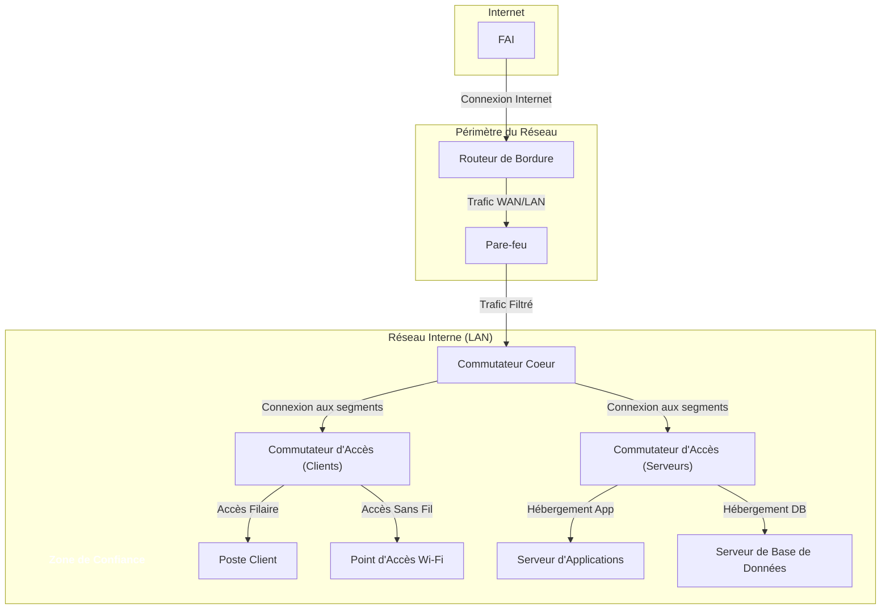

---
tags:
  - architecture
  - réseau/privé
  - architecture/réseau
  - adressage-ip/privé
aliases:
  - Réseau Privé
  - Architecture de Réseau Privé
archetype: architecture
type:
  - Réseau
  - Système
cssclasses:
  - max
---

# Architecture : Private Network

> [!abstract] Vue d'ensemble
> Un [[PrivateNetwork|réseau privé]] est une [[Network|infrastructure réseau]] isolée et dédiée à une [[Enterprise|entreprise]] ou un [[HomeNetwork|domicile]], utilisant des [[PrivateIPAddress|adresses IP privées]]. Son [[HierarchicalNetworkDesign|architecture]] vise à assurer la [[Confidentiality|confidentialité]], l'[[Integrity|intégrité]] et la [[Availability|disponibilité]] des [[Data|données]] et des [[Resource|ressources]] internes. Il est généralement segmenté et protégé par des [[Firewall|pare-feu]] pour contrôler l'accès depuis et vers l'[[Internet]].

## 🗺️ Diagramme Topologique

## 🚦 Matrice des Flux
| Source | Destination | Port/Protocole | Description | Action |
|---|---|---|---|---|
| **Internet** | **Pare-feu** | TCP/80, 443 | Trafic web entrant (filtré) | ✅ Autoriser (filtré) |
| **Pare-feu** | **Couche Cœur** | Tout | Trafic interne autorisé | ✅ Autoriser |
| **Clients** | **Serveurs** | Spécifique applicatif | Accès aux applications internes | ✅ Autoriser |
| **Serveur d'Applications** | **Serveur de Base de Données** | TCP/3306, 1433 | Accès base de données | ✅ Autoriser |
| **LAN (Interne)** | **Internet** | Tout | Trafic sortant | ✅ Autoriser (avec NAT) |

## 🏰 Zones de Sécurité & Segmentation
*   **Zone de Périmètre** : Point d'entrée/sortie du [[PrivateNetwork|réseau privé]], comprenant le [[Router|routeur]] de bordure et le [[Firewall|pare-feu]]. Il gère la [[NetworkAddressTranslation|traduction d'adresses réseau]] et le filtrage initial du trafic.
*   **Zone Interne (LAN)** : Cœur du [[LocalAreaNetwork|réseau local]], où résident les [[Client|postes clients]] et les [[Server|serveurs]] d'applications et de données. Elle est typiquement segmentée en [[NetworkSegment|sous-réseaux]] ou [[VirtualLocalAreaNetwork|VLANs]] pour des raisons de performance et de [[NetworkSecurity|sécurité réseau]].
*   **Zone d'Administration (optionnelle)** : Un [[NetworkSegment|segment réseau]] ou [[VirtualLocalAreaNetwork|VLAN]] dédié aux [[SystemAdministrator|administrateurs système]] et à la gestion des [[NetworkDevice|équipements réseau]].

## 🛡️ Mesures de Sécurité Clés
> [!shield] Défense en Profondeur
> 1.  **Contrôles d'Accès** : Utilisation de [[Firewall|pare-feu]] pour filtrer le trafic et de [[AccessControlList|listes de contrôle d'accès (ACL)]] sur les [[NetworkSwitch|commutateurs]] et [[Router|routeurs]].
> 2.  **[[NetworkSegmentation|Segmentation Réseau]]** : Division du [[PrivateNetwork|réseau privé]] en [[VirtualLocalAreaNetwork|VLANs]] ou [[NetworkSegment|sous-réseaux]] logiques pour isoler les différents types de trafic et [[Resource|ressources]].
> 3.  **[[MultiFactorAuthentication|Authentification Multi-Facteurs (MFA)]]** : Exigée pour l'accès aux [[Resource|ressources]] sensibles et aux [[NetworkDevice|équipements réseau]].
> 4.  **[[EndpointSecurity|Sécurité des Terminaux]]** : Déploiement de [[Antivirus|logiciels antivirus]], [[EndpointDetectionAndResponse|EDR]] et [[PatchManagement|gestion des correctifs]] sur tous les [[EndDevices|terminaux]] et [[Server|serveurs]].
> 5.  **[[NetworkMonitoring|Surveillance Réseau]]** : Utilisation de [[IntrusionDetectionSystem|IDS]] / [[IntrusionPreventionSystem|IPS]] et de [[SecurityInformationAndEventManagement|SIEM]] pour détecter et répondre aux [[DigitalAttack|attaques numériques]].

## 🔗 Notes Connexes
*   [[InternalNetwork]]
*   [[NetworkSecurity]]
*   [[IPAddressing]]
*   [[LocalAreaNetwork]]