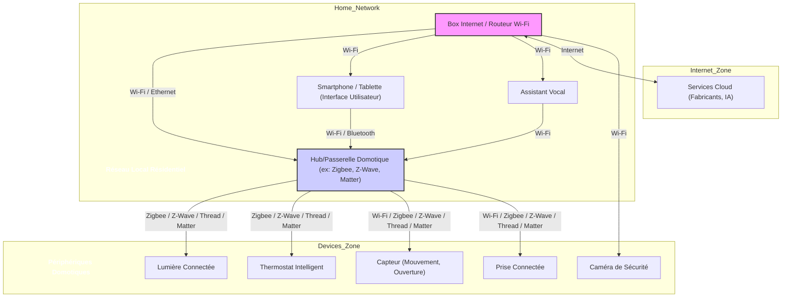

---
aliases:
  - Domotique
  - Home Automation
  - Maison Intelligente
  - Smart Home
archetype: architecture
type:
  - Réseau
  - Système
cssclasses:
  - max
tags:
  - domotique
  - iot
  - iot/objets-connectes
  - architecture/reseau
  - reseau/topologie
  - diagramme-topologique
  - segmentation/reseau
  - reseau/vlan
  - securite/reseau
  - cloud
  - protocole
  - wifi
  - protocole/ethernet
  - connectivite/bluetooth
  - protocole/https
  - protocole/zigbee
  - protocole/z-wave
  - protocole/thread
  - protocole/matter
  - matrice-flux
  - securite
  - defense/defense-en-profondeur
  - authentification/multi-facteur
  - maintenance/mise-a-jour
  - firmware
  - vulnerabilite
  - materiel/reseau
  - reseau/local
  - internet
  - ia/assistant-vocal
  - appareil/smartphone
  - appareil/tablette
---

# Architecture : Système Domotique

> [!abstract] Vue d'ensemble
> La **domotique** désigne l'ensemble des techniques et technologies permettant de centraliser et d'automatiser le contrôle des systèmes d'une habitation (éclairage, chauffage, sécurité, ouvrants, etc.) afin d'améliorer le confort, la sécurité, la gestion de l'énergie et la communication. Elle repose sur des architectures variées, des protocoles de communication spécifiques et intègre divers composants matériels et logiciels pour créer un environnement intelligent et réactif.

## 🗺️ Diagramme Topologique

La domotique peut adopter différentes architectures. Voici un exemple illustrant une approche hybride, combinant un hub centralisé avec des périphériques distribués, communiquant via différents protocoles.

## 🏰 Zones de Sécurité & Segmentation

Dans un système domotique, la segmentation n'est pas toujours aussi formelle que dans un réseau d'entreprise, mais elle peut être envisagée pour améliorer la sécurité et la performance.
*   **Zone Périphériques IoT** : Comprend tous les appareils connectés (lumières, capteurs, thermostats, prises, etc.). Idéalement, cette zone serait isolée sur un VLAN spécifique pour limiter la propagation en cas de compromission d'un appareil.
*   **Zone Centrale de Contrôle** : Inclut le hub domotique, les passerelles et éventuellement des serveurs locaux. Cette zone devrait avoir un accès contrôlé aux périphériques IoT et un accès sécurisé à internet.
*   **Zone d'Accès Utilisateur** : Représentée par les smartphones, tablettes et assistants vocaux qui interagissent avec le système. L'accès à cette zone doit être authentifié et sécurisé, souvent via le réseau Wi-Fi domestique.
*   **Zone Cloud** : Les services cloud des fabricants ou des plateformes domotiques (Google Home, Amazon Alexa, Apple HomeKit) qui permettent le contrôle à distance et l'intégration avec d'autres services. La communication doit être chiffrée.

## 🚦 Matrice des Flux

| Source | Destination | Port/Protocole | Description | Action |
|---|---|---|---|---|
| **Périphériques IoT** | **Hub Domotique** | Zigbee, Z-Wave, Thread, Matter, Wi-Fi | Communication pour le contrôle et la télémétrie | ✅ Autoriser |
| **Hub Domotique** | **Internet** (Cloud Services) | TCP/443 (HTTPS) | Accès aux services cloud et mises à jour | ✅ Autoriser |
| **Smartphone** | **Hub Domotique** | Wi-Fi, Bluetooth | Contrôle local du système domotique | ✅ Autoriser |
| **Smartphone** | **Internet** (Cloud Services) | TCP/443 (HTTPS) | Contrôle à distance via services cloud | ✅ Autoriser |
| **Assistant Vocal** | **Hub Domotique** | Wi-Fi | Contrôle vocal du système domotique | ✅ Autoriser |
| **Périphériques IoT** | **Internet** (Direct) | TCP/443 (HTTPS) | Certains appareils peuvent communiquer directement avec le cloud | ✅ Autoriser (si nécessaire, avec précautions) |

## 🛡️ Mesures de Sécurité Clés
> [!shield] Défense en Profondeur
> 1.  **Authentification Forte** : Utilisation de mots de passe complexes et uniques pour les comptes domotiques et les accès aux appareils. L'authentification à deux facteurs (2FA) est fortement recommandée.
> 2.  **Mises à Jour Régulières** : Maintenir le micrologiciel (firmware) des hubs, passerelles et périphériques à jour pour corriger les vulnérabilités connues.
> 3.  **Segmentation Réseau (VLAN)** : Isoler les appareils IoT sur un réseau Wi-Fi ou un VLAN séparé du réseau principal pour limiter les risques en cas de compromission.
> 4.  **Chiffrement des Communications** : S'assurer que les communications entre les appareils, le hub et les services cloud sont chiffrées (ex: TLS/SSL pour les communications IP, chiffrement intégré aux protocoles comme Zigbee ou Z-Wave).
> 5.  **Audit des Permissions** : Vérifier régulièrement les permissions accordées aux applications et aux appareils domotiques.
> 6.  **Sécurisation du Routeur** : Changer les identifiants par défaut du routeur Wi-Fi, désactiver le WPS si non utilisé et utiliser un chiffrement WPA3 ou WPA2 fort pour le réseau Wi-Fi.

## 💡 Concept de la Domotique

La **domotique** est l'intégration de technologies dans l'habitat pour automatiser et gérer les fonctions liées au confort (éclairage, chauffage, climatisation), à la sécurité (alarmes, vidéosurveillance), à la communication (interphonie, réseau) et à la gestion de l'énergie. L'objectif est de simplifier la vie des habitants, d'optimiser la consommation d'énergie et d'accroître la sécurité. Elle se manifeste par des scénarios prédéfinis (ex: éclairage qui s'allume au coucher du soleil) ou par un contrôle manuel via des interfaces utilisateur (smartphones, assistants vocaux).

## 🏗️ Architectures Typiques

La domotique s'appuie principalement sur deux types d'architectures, souvent combinées dans des systèmes modernes :
*   **Architecture Centralisée** :
    *   **Description** : Un contrôleur unique, souvent appelé *hub* ou *passerelle*, est le cerveau du système. Tous les périphériques communiquent avec ce hub, qui est responsable de l'exécution des scénarios, de la gestion des données et de l'interface avec l'utilisateur ou les services cloud.
    *   **Avantages** : Facilité de gestion, un point de contrôle unique, potentiellement plus simple à configurer pour les utilisateurs novices.
    *   **Inconvénients** : Point de défaillance unique (si le hub tombe en panne, tout le système est affecté), dépendance à la fiabilité du hub.
    *   **Exemples** : Centrales domotiques propriétaires (ex: box domotique), passerelles Zigbee/Z-Wave connectées au réseau.
*   **Architecture Distribuée (ou Décentralisée)** :
    *   **Description** : Les périphériques intelligents communiquent directement entre eux (peer-to-peer) sans passer par un contrôleur central ou s'appuient sur un réseau maillé où chaque nœud peut relayer l'information. La logique est embarquée dans les appareils eux-mêmes ou distribuée à travers le réseau.
    *   **Avantages** : Résilience accrue (pas de point de défaillance unique), évolutivité, potentiellement plus rapide pour certaines actions locales.
    *   **Inconvénients** : Complexité de configuration et de gestion accrue, interopérabilité potentiellement plus difficile entre appareils de fabricants différents.
    *   **Exemples** : Systèmes basés sur des protocoles maillés comme *Zigbee*, *Z-Wave* ou *Thread*, où chaque appareil peut faire office de répéteur.

Les systèmes modernes adoptent souvent une **approche hybride**, où un hub central gère la communication avec une grande partie des appareils, tout en permettant à certains appareils de communiquer directement ou via un réseau maillé pour optimiser la résilience et la portée. Le hub sert alors de passerelle entre les différents protocoles et le réseau IP domestique ou les services cloud.

## 📡 Principaux Protocoles Utilisés

De nombreux protocoles sont utilisés en domotique, chacun avec ses spécificités :
*   **Wi-Fi (IEEE 802.11)** :
    *   **Description** : Standard largement répandu pour les réseaux locaux sans fil.
    *   **Avantages** : Débit élevé, portée relativement grande, infrastructure souvent déjà présente.
    *   **Inconvénients** : Consommation d'énergie relativement élevée pour les petits capteurs sur batterie, peut être sujet à la congestion sur les réseaux denses.
    *   **Usage** : Caméras IP, assistants vocaux, prises connectées, hubs domotiques.
*   **Zigbee** :
    *   **Description** : Protocole sans fil basé sur la norme IEEE 802.15.4, conçu pour les réseaux maillés à faible consommation et faible débit.
    *   **Avantages** : Très faible consommation d'énergie, auto-réparation du réseau maillé, bonne portée grâce aux répéteurs.
    *   **Inconvénients** : Nécessite un hub Zigbee, portée initiale limitée, potentiel d'interférence avec le Wi-Fi (bande 2.4 GHz).
    *   **Usage** : Éclairage connecté, capteurs de mouvement, thermostats, serrures.
*   **Z-Wave** :
    *   **Description** : Protocole sans fil propriétaire fonctionnant sur des fréquences différentes du Wi-Fi (ex: 868 MHz en Europe), utilisant également un réseau maillé.
    *   **Avantages** : Moins sujet aux interférences Wi-Fi, faible consommation d'énergie, bonne portée, rétrocompatibilité.
    *   **Inconvénients** : Nécessite un hub Z-Wave, débit plus faible que le Wi-Fi.
    *   **Usage** : Contrôle d'éclairage, thermostats, capteurs, serrures, volets roulants.
*   **Bluetooth (BLE - Bluetooth Low Energy)** :
    *   **Description** : Version à faible consommation du Bluetooth, idéale pour des communications à courte portée.
    *   **Avantages** : Très faible consommation d'énergie, souvent intégré aux smartphones.
    *   **Inconvénients** : Portée limitée, moins adapté aux grands réseaux maillés sans répéteurs spécifiques.
    *   **Usage** : Ampoules connectées individuelles, capteurs de proximité, périphériques de santé.
*   **Thread** :
    *   **Description** : Protocole réseau IP basé sur la norme IEEE 802.15.4, conçu pour les appareils IoT à faible consommation, formant un réseau maillé.
    *   **Avantages** : Basé sur IP (simplifie l'intégration), faible consommation, auto-réparation du réseau maillé.
    *   **Inconvénients** : Relativement récent, nécessite une passerelle Thread.
    *   **Usage** : De plus en plus utilisé pour les appareils compatibles *Matter*.
*   **Matter** :
    *   **Description** : Standard d'application universel soutenu par un large consortium, fonctionnant sur Ethernet, Wi-Fi, Thread et Bluetooth LE. Il vise à simplifier l'interopérabilité entre les appareils domotiques de différents fabricants.
    *   **Avantages** : Interopérabilité étendue, basé sur IP, sécurité intégrée.
    *   **Inconvénients** : Standard en cours de déploiement.
    *   **Usage** : Futur standard pour une large gamme d'appareils domotiques, visant à remplacer la fragmentation actuelle.

D'autres protocoles peuvent inclure LoRaWAN pour les communications à très longue portée et faible débit, ou des protocoles propriétaires moins courants.

## 🔑 Composants Clés d'un Système Domotique

Un système domotique typique est composé de plusieurs éléments fondamentaux :
1.  **Le Hub/Contrôleur/Passerelle** : Cerveau du système, il connecte et gère les différents appareils, interprète les commandes et exécute les scénarios. Il peut être une box domotique dédiée, un mini-ordinateur (ex: Raspberry Pi) ou même intégré à une box internet.
2.  **Les Périphériques (ou Actuateurs)** : Ce sont les éléments qui exécutent les actions.
    *   *Éclairage* : Ampoules connectées, interrupteurs intelligents, rubans LED.
    *   *Chauffage et Climatisation* : Thermostats connectés, têtes thermostatiques.
    *   *Ouverture et Fermeture* : Volets roulants connectés, motorisations de portail, serrures intelligentes.
    *   *Gestion de l'Énergie* : Prises connectées, modules de mesure de consommation.
3.  **Les Capteurs** : Ils collectent des informations sur l'environnement.
    *   *Sécurité* : Capteurs de mouvement, capteurs d'ouverture de porte/fenêtre, détecteurs de fumée/monoxyde de carbone.
    *   *Environnement* : Capteurs de température, d'humidité, de luminosité, de qualité de l'air.
    *   *Présence* : Capteurs de présence ou de détection humaine.
4.  **L'Interface Utilisateur** : Permet aux habitants d'interagir avec le système.
    *   *Applications mobiles* : Sur smartphones et tablettes.
    *   *Assistants vocaux* : Google Assistant, Amazon Alexa, Apple Siri.
    *   *Écrans tactiles muraux* : Panneaux de contrôle dédiés.
    *   *Interrupteurs connectés* : Pour un contrôle manuel direct.
5.  **Le Réseau de Communication** : L'infrastructure permettant aux composants de dialoguer (Wi-Fi, Ethernet, Zigbee, Z-Wave, Thread, Bluetooth).
6.  **Les Services Cloud** : Souvent utilisés pour le contrôle à distance, l'intégration avec d'autres services (météo, calendriers), le stockage des données et les mises à jour logicielles.