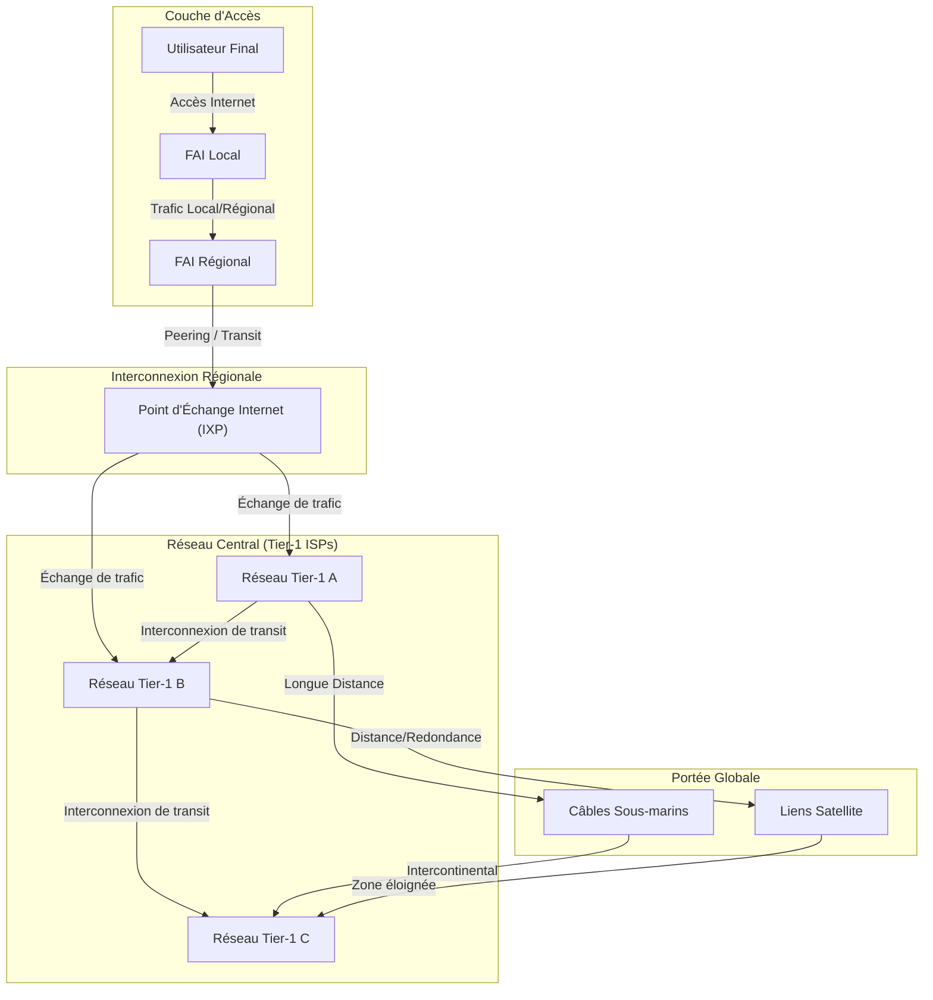

---
aliases:
  - Internet Backbone
  - Dorsale Internet
  - Réseau Dorsal Internet
  - Global Internet Network
archetype: architecture
type:
  - Réseau
cssclasses:
  - max
tags:
  - architecture/reseau
  - reseau/internet
  - infrastructure/reseau
  - materiel/cable/fibre-optique
  - interconnexion-reseau
  - internet/fai
  - reseau/ixp
  - protocole/bgp
  - routage
  - diagramme-topologique
  - matrice-flux
  - segmentation/reseau
  - defense/defense-en-profondeur
  - securite/routage
  - securite/routage/rpki
  - securite/routage/bgp-hijacking
  - resilience
  - systeme/redondance
  - ddos
  - securite/surete-physique
  - surveillance
  - reponse-incident
  - reseau/global
---

# Architecture : Internet Backbone

> [!abstract] Vue d'ensemble
> L'**Internet Backbone**, ou **Dorsale Internet**, est l'infrastructure de réseau de données de base qui transporte la majeure partie du trafic Internet à travers le monde. Il est composé de grands réseaux interconnectés, gérés par des fournisseurs de services Internet de niveau 1 (Tier-1 ISPs) et d'autres grands opérateurs, utilisant des lignes de communication à haute capacité, telles que les câbles à fibres optiques terrestres et sous-marins. Ce réseau dorsal assure la connectivité globale et la transmission rapide des données entre les continents et les grandes régions géographiques.

## 🗺️ Diagramme Topologique

## 🚦 Matrice des Flux
| Source | Destination | Port/Protocole | Description | Action |
|---|---|---|---|---|
| **FAI Local** | **FAI Régional / IXP** | BGP (TCP/179) | Échange de routes et de trafic local | ✅ Autoriser |
| **FAI Régional** | **IXP / Réseau Tier-1** | BGP (TCP/179) | Transit et peering pour le trafic national/international | ✅ Autoriser |
| **IXP** | **Réseaux Tier-1** | BGP (TCP/179) | Échange direct de trafic sans frais de transit | ✅ Autoriser |
| **Réseaux Tier-1** | **Réseaux Tier-1 (via câbles sous-marins/satellites)** | Divers (Optique, IP) | Transport de données intercontinental à haute capacité | ✅ Autoriser |
| **Réseaux Tier-1** | **Tous les réseaux connectés** | ICMP, SNMP | Surveillance, diagnostic et gestion du réseau | ⚠️ Filtrer / Limiter |

## 🏰 Zones de Sécurité & Segmentation

*   **Réseaux Tier-1 (Core Global)** : Représentent le cœur de la Dorsale Internet. Ces opérateurs possèdent des réseaux étendus qui couvrent de vastes zones géographiques et s'interconnectent directement entre eux sans acheter de services de transit. Ils sont responsables du routage global et de la stabilité du réseau mondial.
*   **Points d'Échange Internet (IXP)** : Ces installations physiques permettent à divers FAI et réseaux de peering de s'interconnecter directement et d'échanger du trafic Internet. Ils servent de points de segmentation logiques où le trafic local et régional est échangé, réduisant ainsi la dépendance vis-à-vis des réseaux Tier-1 pour le trafic de proximité.
*   **Réseaux Régionaux et d'Accès** : Constituent la périphérie de la Dorsale, connectant les utilisateurs finaux et les entreprises via des FAI locaux et régionaux. Ces réseaux s'appuient sur les IXP et les réseaux Tier-1 pour acheminer le trafic au-delà de leur zone de couverture immédiate.

## 🛡️ Mesures de Sécurité Clés

> [!shield] Défense en Profondeur
> 1.  **Sécurité du Routage (BGP)** : Utilisation de mécanismes tels que le *RPKI (Resource Public Key Infrastructure)* et le filtrage des routes pour prévenir les détournements de route (BGP hijacking) et assurer l'intégrité de la table de routage globale.
> 2.  **Résilience et Redondance Physique** : Déploiement de multiples chemins de câbles à fibres optiques, y compris des câbles sous-marins diversifiés et des liaisons terrestres redondantes, pour assurer la continuité du service en cas de défaillance d'un lien.
> 3.  **Protection contre les Attaques DDoS** : Mise en œuvre de centres de *scrubbing* et de techniques de filtrage du trafic distribuées pour absorber et atténuer les attaques par déni de service distribué ciblant l'infrastructure dorsale ou les services qu'elle transporte.
> 4.  **Sécurité des Installations** : Protection physique stricte des points d'atterrissage des câbles sous-marins, des IXP et des centres de données abritant l'équipement du backbone, incluant contrôle d'accès, surveillance et systèmes d'alarme.
> 5.  **Surveillance et Réponse aux Incidents** : Opérations réseau 24h/24 et 7j/7 avec des systèmes de surveillance sophistiqués pour détecter les anomalies et les menaces, et des équipes de réponse rapide aux incidents pour minimiser l'impact des pannes ou des attaques.

### Composants Physiques et Logiques Détaillés

L'Internet Backbone est une architecture complexe mêlant infrastructure physique et protocoles logiciels.

#### Composants Physiques
*   **Câbles à fibres optiques** : Ils sont la colonne vertébrale physique du Backbone.
    *   **Câbles Sous-marins** : Réseaux de câbles à fibres optiques posés au fond des océans et des mers, transportant la quasi-totalité du trafic Internet intercontinental à des vitesses de téraoctets par seconde. Des exemples notables incluent le MAREA, le Se-Me-We et le câble Grace Hopper. Ces câbles sont essentiels pour relier les continents et sont protégés par des gaines robustes contre les dommages environnementaux et humains.
    *   **Câbles Terrestres** : Réseaux de fibres optiques déployés sur terre, suivant souvent des infrastructures existantes (voies ferrées, autoroutes) pour connecter les grandes villes, les centres de données et les IXP au sein des continents.
*   **Points d'Échange Internet (IXP)** : Ce sont des infrastructures physiques où les différents FAI, réseaux de diffusion de contenu (CDN) et autres acteurs du réseau se connectent pour échanger du trafic entre leurs réseaux respectifs, réduisant ainsi les coûts de transit et la latence. Ils sont équipés de routeurs et de commutateurs haute performance.
*   **Centres de Données (Data Centers)** : Abritent les serveurs, le matériel réseau et les équipements de communication essentiels à l'hébergement de contenu et au fonctionnement des services en ligne. Les grands opérateurs du backbone possèdent de nombreux centres de données interconnectés.
*   **Stations Terrestres Satellite** : Bien que moins dominants que la fibre optique pour le backbone principal, les satellites sont utilisés pour fournir une connectivité aux régions éloignées ou pour la redondance, en particulier pour les liaisons transcontinentales de secours.

#### Composants Logiques
*   **Protocoles de Routage** :
    *   **Border Gateway Protocol ([[BGPProtocol|BGP]])** : Le protocole de routage externe standard de l'Internet, utilisé par les réseaux autonomes (AS) pour échanger des informations de routage et déterminer les meilleurs chemins pour acheminer le trafic. C'est le cœur logique du routage du backbone.
    *   **Protocoles de Routage Internes (IGP)** : Tels que OSPF (Open Shortest Path First) ou IS-IS (Intermediate System to Intermediate System), utilisés au sein des réseaux autonomes des opérateurs du backbone pour gérer le routage interne et la distribution des informations de routage locales.
*   **Adresses IP (IPv4 et IPv6)** : Les systèmes d'adressage qui permettent d'identifier de manière unique chaque appareil connecté à Internet et d'acheminer les paquets de données vers leur destination.
*   **Système de Noms de Domaine (DNS)** : Le service qui traduit les noms de domaine lisibles par l'homme (ex: google.com) en adresses IP numériques, essentiel pour la navigation sur le web et l'accès aux ressources en ligne.
*   **Protocoles de Transport (TCP/IP)** : L'ensemble de protocoles qui constitue la base de la communication sur Internet, gérant la segmentation, la transmission et la réassemblage des données.

### Rôle de l'Internet Backbone

Le rôle de l'Internet Backbone est fondamental et multifacette :
*   **Transport de Données à Grande Échelle** : Il assure le transport d'énormes volumes de données à travers des distances géographiques considérables, permettant la communication et l'échange d'informations à l'échelle mondiale.
*   **Interconnexion des Réseaux** : Il relie des milliers de réseaux plus petits (FAI locaux, réseaux d'entreprise, centres de données) entre eux, formant un maillage global qui constitue l'Internet.
*   **Garantie de la Connectivité Globale** : En fournissant des chemins redondants et à haute capacité, il garantit que les utilisateurs peuvent accéder aux ressources Internet partout dans le monde, même en cas de défaillance d'un segment du réseau.
*   **Moteur de l'Économie Numérique** : Il est la fondation sur laquelle reposent le commerce électronique, les services cloud, la communication en ligne, le streaming vidéo et toutes les applications modernes basées sur Internet.
*   **Innovation et Évolution** : Son évolution constante, avec l'augmentation des capacités, la réduction de la latence et l'adoption de nouvelles technologies (comme la photonique cohérente), permet le développement de nouvelles applications et services toujours plus exigeants en bande passante.