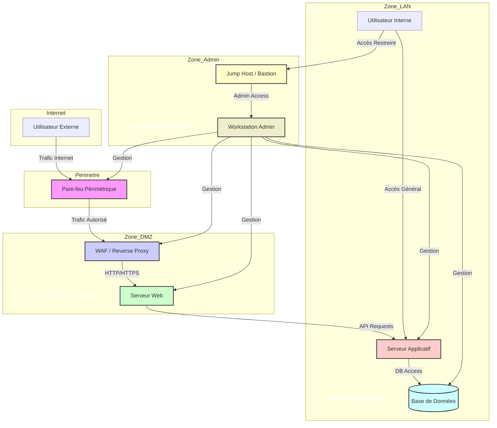

---
aliases:
  - Segmentation Réseau
  - Network Segmentation
  - Segment Réseau
archetype: architecture
type:
  - Réseau
  - Système
  - Cloud
cssclasses:
  - max
tags:
  - architecture/reseau
  - reseau/segmentation
  - dmz
  - reseau/lan
  - pare-feu
  - perimeter-security
  - securite/reseau
  - segmentation/physique
  - segmentation/logique
  - waf
  - jump-host
  - bastion
  - matrice-flux
  - diagramme-topologique
  - performance
  - gestion/securite
---

# Architecture : Segmentation Réseau

> [!abstract] Vue d'ensemble
> La **segmentation réseau** est une architecture qui divise un réseau informatique en sections ou sous-réseaux plus petits, chacun opérant comme un mini-réseau en soi. Elle vise à isoler différentes parties du réseau pour améliorer la sécurité, les performances et la gestion. Ce processus réduit la surface d'attaque et empêche la propagation latérale des menaces en cas de compromission d'un segment.

## 🗺️ Diagramme Topologique

## 🚦 Matrice des Flux
| Source | Destination | Port/Protocole | Description | Action |
|---|---|---|---|---|
| **Internet** | **Périmètre** (FW_Ext) | TCP/80, 443 | Trafic Web public | ✅ Autoriser |
| **Périmètre** (FW_Ext) | **DMZ** (WAF) | TCP/80, 443 | Trafic vers le WAF | ✅ Autoriser |
| **DMZ** (WAF) | **DMZ** (Web) | TCP/80 | WAF vers Serveur Web | ✅ Autoriser |
| **DMZ** (Web) | **LAN** (App) | TCP/8080 (ex) | Web vers API applicative | ✅ Autoriser |
| **LAN** (App) | **LAN** (DB) | TCP/3306 (ex) | Application vers Base de données | ✅ Autoriser |
| **LAN** (User_Int) | **LAN** (App) | Tout | Accès utilisateurs internes aux applications | ✅ Autoriser |
| **LAN** (User_Int) | **DMZ** | Tout | Tentative d'accès direct | ❌ Bloquer |
| **LAN** (User_Int) | **Admin** (JumpHost) | TCP/22, 3389 | Accès restreint au Jump Host | ✅ Autoriser |
| **Admin** (JumpHost) | **DMZ/LAN** (Gestion) | SSH, RDP, HTTPS | Gestion des infrastructures | ✅ Autoriser |
| **Tout segment** | **Autre segment** | Tout | Trafic non explicitement autorisé | ❌ Bloquer par défaut |

## 🏰 Zones de Sécurité & Segmentation
La segmentation réseau consiste à diviser un réseau en sous-réseaux plus petits afin d'améliorer la sécurité et les performances.

*   **Définition d'un segment réseau**: Un segment réseau est une portion logique ou physique d'un réseau informatique où les appareils peuvent communiquer entre eux sans passer par un routeur ou un pare-feu. Pour que des appareils situés sur des segments différents puissent échanger, le trafic doit passer par un point de démarcation externe (généralement un routeur ou un pare-feu) où des règles de flux peuvent être appliquées.

*   **Objectifs de la segmentation**:
    *   **Sécurité renforcée**: Limiter la propagation des attaques (mouvement latéral), contenir les failles de sécurité à un seul segment, et protéger les données sensibles en isolant les systèmes critiques.
    *   **Amélioration des performances**: Réduire la congestion du réseau en limitant le trafic à l'intérieur des segments, optimisant ainsi les flux de données nécessaires.
    *   **Gestion simplifiée**: Faciliter la surveillance du réseau, la détection des problèmes, les audits de conformité (ex: PCI DSS, RGPD) et l'application de politiques de sécurité granulaires.

*   **Méthodes d'implémentation**:
    *   **Segmentation Physique**: Cette méthode décompose les réseaux en sections physiques distinctes à l'aide de matériel dédié comme des routeurs, des commutateurs et des pare-feu. Chaque segment dispose de connexions Internet et de câbles distincts. Elle est considérée comme plus sûre mais souvent plus coûteuse et moins évolutive.
    *   **Segmentation Logique (Virtuelle)**: Méthode plus populaire qui divise le réseau en sections plus petites à l'aide de logiciels. Elle est généralement mise en œuvre via des **Réseaux Locaux Virtuels (VLAN)** et des **sous-réseaux (Subnets)**. Les VLANs séparent le trafic au niveau du commutateur, tandis que les sous-réseaux agissent au niveau de l'adresse IP et du routeur. La microsegmentation est une forme plus granulaire de segmentation logique, isolant des charges de travail individuelles.
    *   **Combinaison**: Les organisations utilisent souvent une combinaison des deux pour obtenir un équilibre entre sécurité, flexibilité et coût.

*   **Importance des règles de flux inter-segments**:
    *   Les règles de flux (généralement implémentées par des pare-feu ou des Listes de Contrôle d'Accès - ACLs) sont cruciales pour réguler la communication entre les segments. Elles définissent précisément quel type de trafic est autorisé entre les différentes zones.
    *   En l'absence de ces règles strictes, la segmentation perdrait une grande partie de son intérêt sécuritaire, car un attaquant pourrait facilement passer d'un segment à l'autre. Le principe du *moindre privilège* doit être appliqué, n'accordant l'accès qu'en cas de nécessité avérée.

## 🛡️ Mesures de Sécurité Clés
> [!shield] Défense en Profondeur
> 1.  **Périmétrique**: Utilisation de **Pare-feu Next-Generation (NGFW)** en bordure de réseau pour inspecter et filtrer le trafic entrant et sortant.
> 2.  **Réseau Interne**:
    *   **VLANs isolés**: Séparation logique du trafic pour les départements, fonctions (ex: développement, production), ou types d'appareils (ex: IoT, invités).
    *   **Listes de Contrôle d'Accès (ACLs)**: Règles strictes configurées sur les routeurs et commutateurs pour contrôler le flux entre les VLANs et sous-réseaux.
    *   **Pare-feu de segmentation interne**: Déploiement de pare-feu entre les segments pour inspecter le trafic est-ouest (latéral) et renforcer la détection des menaces internes.
> 3.  **Politique Zero Trust**: La segmentation est une étape fondamentale vers une architecture Zero Trust, où aucun utilisateur ou appareil n'est considéré comme digne de confiance par défaut, quel que soit son emplacement.
> 4.  **Surveillance et Audit**: Surveillance continue des flux inter-segments pour détecter les anomalies et effectuer des audits réguliers des vulnérabilités et des permissions.

## 🔗 Notes Connexes
*   **Composant clé**: Firewall
*   **Concept de sécurité**: Zero Trust Architecture
*   **Technique de virtualisation**: VLAN