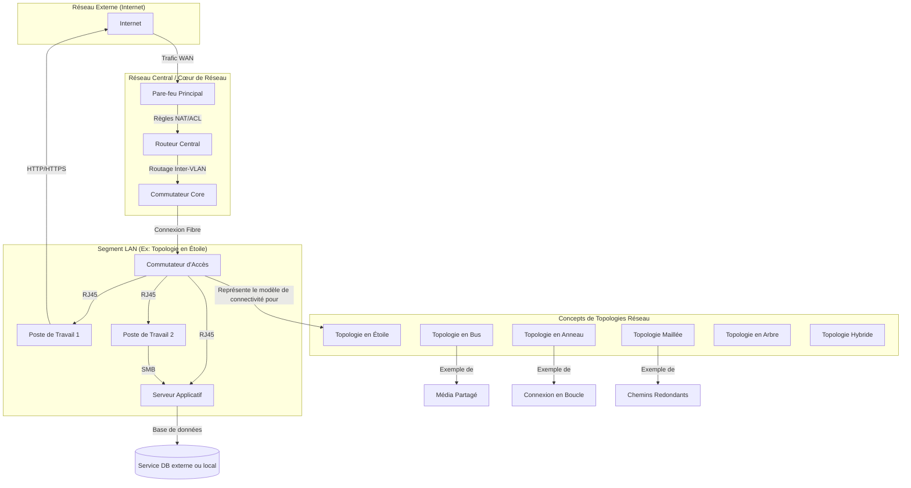

---
aliases:
  - Topologies Réseau
  - Network Topologies
  - Star Topology
  - Bus Topology
  - Ring Topology
  - Mesh Topology
  - Tree Topology
  - Hybrid Topology
  - Network Architecture
archetype: architecture
type:
  - Réseau
  - Système
  - Cloud
cssclasses:
  - max
tags:
  - architecture
  - architecture/reseau
  - reseau/topologie
  - reseau/topologie/etoile
  - reseau/topologie/bus
  - reseau/topologie/anneau
  - reseau/topologie/maillee
  - reseau/topologie/arbre
  - reseau/topologie/hybride
  - diagramme-topologique
  - matrice-flux
  - segmentation
  - segmentation/logique
  - segmentation/physique
  - dmz
  - reseau/securite
  - pare-feu
  - reseau/vlan
  - listes-controle-acces
  - outil/edr
  - resilience
  - defense
  - defense/defense-en-profondeur
  - routage-reseau
  - nat
---

# Architecture : Network Topologies

> [!abstract] Vue d'ensemble
> Ce document décrit les **topologies réseau** courantes, qui définissent la structure physique ou logique d'un réseau et la manière dont les nœuds sont connectés. Il explore leurs caractéristiques, leurs avantages et leurs inconvénients pour aider à comprendre leur impact sur la performance, la fiabilité et la sécurité des systèmes d'information.

## 🗺️ Diagramme Topologique

## 🚦 Matrice des Flux
Cette matrice des flux illustre des exemples de communications au sein d'un réseau utilisant principalement une topologie en étoile pour les segments locaux.

| Source | Destination | Port/Protocole | Description | Action |
|---|---|---|---|---|
| **PC1 (LAN)** | **Internet** | TCP/80, 443 | Navigation Web, Accès Cloud | ✅ Autoriser via Pare-feu |
| **PC2 (LAN)** | **Server (LAN)** | TCP/445 (SMB) | Partage de fichiers, Accès applications | ✅ Autoriser (Inter-VLAN si segmenté) |
| **Server (LAN)** | **DB Service** | TCP/3306, 1433 | Requêtes base de données | ✅ Autoriser (Vers DB locale ou distante) |
| **Internet** | **LAN (Serveur)** | TCP/80, 443 | Accès public aux services hébergés | ✅ Autoriser via WAF/Reverse Proxy |
| **LAN** | **LAN** | Tout | Trafic interne général | ⚠️ Filtrer par VLAN/ACL |

## 🏰 Zones de Sécurité & Segmentation
La façon dont un réseau est physiquement ou logiquement structuré par une topologie a un impact direct sur la segmentation et la définition des zones de sécurité :
*   **Zone Publique (DMZ)** : Généralement implémentée avec une topologie en étoile ou maillée pour les serveurs exposés à Internet, permettant un contrôle granulaire des flux via des pare-feu et des reverse proxies. Chaque serveur est un "rayon" de l'étoile ou un nœud dans une maille partielle.
*   **Zone Privée (LAN/Corporate)** : Souvent organisée en topologie en étoile avec des commutateurs centraux. La segmentation logique (VLANs) est alors superposée à cette topologie physique pour créer des sous-réseaux isolés (ex: services, utilisateurs, invités).
*   **Zone d'Administration** : Peut être un VLAN dédié au sein de la zone privée, accédé via une topologie en étoile vers un commutateur d'administration séparé, ou via un jump server. Une topologie en anneau ou maillée est rarement utilisée ici pour la simplicité de gestion.

## 🛡️ Mesures de Sécurité Clés
> [!shield] Défense en Profondeur
> La topologie choisie influence fortement la mise en œuvre des mesures de sécurité.
> 1.  **Périmétrique** : Un **pare-feu Next-Generation** est essentiel à la bordure du réseau, quel que soit la topologie interne, pour filtrer le trafic entrant et sortant. Pour les topologies en étoile ou en arbre, le routeur/pare-feu central agit comme point de contrôle.
> 2.  **Réseau** : La **segmentation du réseau** via des **VLANs** et des **ACLs** (Access Control Lists) est cruciale, surtout dans les topologies en étoile où un switch central distribue le trafic. Chaque type de topologie présente des défis et des opportunités spécifiques pour l'implémentation de ces contrôles.
> 3.  **Endpoint** : L'utilisation de **solutions EDR** (Endpoint Detection and Response) ou antivirus sur chaque poste et serveur est une couche de sécurité complémentaire, indépendante de la topologie mais indispensable à la robustesse globale.
> 4.  **Résilience** : Les topologies maillées et en anneau offrent une **redondance intrinsèque** qui améliore la résilience en cas de défaillance d'un nœud ou d'une liaison.

## 🌐 Types de Topologies Réseau

### Topologie en Étoile (Star Topology)
La topologie en étoile est la plus courante dans les réseaux locaux modernes. Chaque nœud (ordinateur, imprimante, serveur) est connecté individuellement à un dispositif central, tel qu'un **concentrateur (hub)**, un **commutateur (switch)** ou un **routeur**.

*   **Caractéristiques** :
    *   Connexion point à point entre chaque nœud et le dispositif central.
    *   Le dispositif central gère le flux de données.
    *   Facile à installer et à gérer.
*   **Avantages** :
    *   **Fiabilité** : La défaillance d'un nœud individuel n'affecte pas le reste du réseau.
    *   **Isolation des pannes** : Facilite l'identification et l'isolement des problèmes.
    *   **Performance** : Moins de collisions et un meilleur débit qu'une topologie en bus, car chaque connexion est directe au hub/switch.
    *   **Évolutivité** : Facile d'ajouter de nouveaux nœuds sans perturber le réseau existant.
*   **Inconvénients** :
    *   **Point de défaillance unique** : Si le dispositif central tombe en panne, tout le réseau s'arrête.
    *   **Coût** : Nécessite plus de câblage que la topologie en bus et le coût du dispositif central peut être élevé.

### Topologie en Bus (Bus Topology)
Dans une topologie en bus, tous les nœuds sont connectés à un **câble central unique**, appelé bus ou *backbone*. Les données sont diffusées sur ce câble, et chaque nœud écoute le trafic pour récupérer les paquets qui lui sont destinés.

*   **Caractéristiques** :
    *   Utilise un seul câble pour toutes les transmissions de données.
    *   Des terminateurs sont nécessaires aux extrémités du câble pour absorber le signal et éviter les rebonds.
    *   Simple et économique à mettre en œuvre pour de petits réseaux.
*   **Avantages** :
    *   **Coût** : Moins de câblage requis, ce qui réduit les coûts d'installation.
    *   **Simplicité** : Facile à installer pour de petits réseaux.
    *   **Extension facile** : Il est relativement facile d'ajouter de nouvelles stations en les connectant au bus.
*   **Inconvénients** :
    *   **Point de défaillance unique** : Une rupture dans le câble central rend le réseau entier inopérant.
    *   **Dépannage difficile** : L'identification des pannes est complexe car un problème sur n'importe quel point du bus peut affecter tout le réseau.
    *   **Performance** : Forte probabilité de collisions de données avec l'augmentation du nombre de nœuds, ce qui réduit la performance.
    *   **Sécurité** : Moins sécurisé car toutes les données sont diffusées sur le bus et peuvent être interceptées.

### Topologie en Anneau (Ring Topology)
Dans une topologie en anneau, chaque nœud est connecté à deux autres nœuds, formant un cercle fermé. Les données circulent dans une direction unique (unidirectionnel) ou parfois dans les deux sens (bidirectionnel) autour de l'anneau.

*   **Caractéristiques** :
    *   Chaque nœud est directement connecté à ses deux voisins.
    *   Les données passent d'un nœud à l'autre jusqu'à atteindre leur destination.
    *   Souvent utilisée dans les réseaux Token Ring.
*   **Avantages** :
    *   **Performances stables** : Le trafic est géré de manière ordonnée, ce qui garantit une performance relativement constante même avec un trafic élevé.
    *   **Pas de collisions** : Les données ne se heurtent pas car elles voyagent dans une direction spécifique.
    *   **Moins de câblage** : Chaque nœud nécessite une connexion à seulement deux autres nœuds.
*   **Inconvénients** :
    *   **Point de défaillance unique** : La défaillance d'un seul nœud ou d'un câble peut interrompre tout le réseau.
    *   **Coût et complexité** : L'ajout ou le retrait d'un nœud peut être difficile et coûteux car cela nécessite de briser temporairement l'anneau.
    *   **Latence** : Les données peuvent traverser plusieurs nœuds avant d'atteindre leur destination, augmentant la latence.

### Topologie Maillée (Mesh Topology)
La topologie maillée est la plus complexe, mais aussi la plus robuste. Chaque nœud est connecté à plusieurs autres nœuds, et dans une topologie maillée **complète**, chaque nœud est connecté directement à tous les autres nœuds du réseau.

*   **Caractéristiques** :
    *   Plusieurs chemins redondants pour le transfert de données.
    *   Haut degré de tolérance aux pannes.
    *   Peut être complète (full mesh) ou partielle (partial mesh).
*   **Avantages** :
    *   **Haute fiabilité et tolérance aux pannes** : Si un chemin tombe en panne, les données peuvent emprunter un autre chemin.
    *   **Haute disponibilité** : Idéal pour les applications critiques qui ne peuvent pas tolérer de temps d'arrêt.
    *   **Sécurité** : Les chemins dédiés réduisent le risque d'interception de données par des nœuds non autorisés.
    *   **Charge équilibrée** : Le trafic peut être réparti sur plusieurs chemins.
*   **Inconvénients** :
    *   **Coût très élevé** : Nécessite une quantité considérable de câblage et un grand nombre de ports d'interface sur chaque nœud.
    *   **Complexité d'installation et de gestion** : La mise en place et la maintenance sont très complexes.
    *   **Évolutivité difficile** : L'ajout de nouveaux nœuds implique de nouvelles connexions à de nombreux autres nœuds existants.

### Topologie en Arbre (Tree Topology)
La topologie en arbre est une combinaison de la topologie en bus et en étoile. Elle se compose de plusieurs topologies en étoile connectées à un bus central (le "tronc"). Les nœuds sont connectés à des concentrateurs/commutateurs, qui sont eux-mêmes connectés à un câble dorsal commun.

*   **Caractéristiques** :
    *   Hiérarchique, avec un nœud racine et des branches descendantes.
    *   Utilise un bus central pour relier les hubs/switches des segments en étoile.
*   **Avantages** :
    *   **Évolutivité** : Facile d'ajouter de nouveaux segments en étoile.
    *   **Facilité de gestion** : Permet une gestion centralisée par segment.
    *   **Isolation des pannes** : La défaillance d'un segment en étoile n'affecte pas les autres segments.
*   **Inconvénients** :
    *   **Point de défaillance unique** : La panne du câble bus central peut paralyser tout le réseau.
    *   **Coût** : Nécessite beaucoup de câblage et de matériel réseau (hubs/switches).

### Topologie Hybride (Hybrid Topology)
Une topologie hybride combine deux ou plusieurs topologies de base (étoile, bus, anneau, maille) en une seule architecture de réseau. Elle est très courante dans les grands réseaux.

*   **Caractéristiques** :
    *   Mélange différentes topologies pour répondre à des besoins spécifiques.
    *   La structure finale dépend de la combinaison des topologies utilisées.
*   **Avantages** :
    *   **Flexibilité** : Peut être conçue pour s'adapter à des exigences spécifiques en matière de performance, de coût et de fiabilité.
    *   **Évolutivité** : Facile à étendre en ajoutant de nouveaux segments avec la topologie la plus appropriée.
    *   **Fiabilité** : Peut intégrer la redondance là où c'est nécessaire.
*   **Inconvénients** :
    *   **Coût** : Peut être plus coûteuse en raison de la complexité du matériel et de la conception.
    *   **Complexité** : La conception, l'installation et la maintenance sont plus difficiles que pour une seule topologie.
    *   **Dépannage** : L'identification des pannes peut être complexe en raison de la diversité des structures.