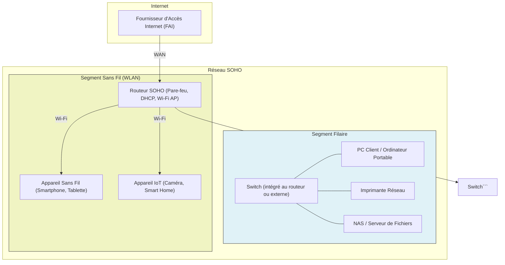

---

aliases:
  - Réseau SOHO
  - Small Office Home Office Network
  - SOHO
archetype: architecture
type:
  - Réseau
cssclasses:
  - max
tags:
  - architecture
  - architecture/reseau
  - soho
  - reseau/types-de-reseaux
  - reseau/lan
  - reseau/wlan
  - materiel/routeur
  - materiel/switch
  - reseau/sans-fil/wi-fi
  - pare-feu
  - dmz
  - securite/reseau
  - reseau/segmentation
  - hardware/firmware
  - politique-mot-de-passe
  - cryptographie/chiffrement
  - protection/antivirus
  - maintenance/mise-a-jour
  - backup
  - phishing
  - protocole/dhcp
  - reseau/vlan
  - reseau/sans-fil/wpa2
  - reseau/sans-fil/wpa3
  - reseau/invite
  - perimeter-security
  - defense
  - gestion_des_risques
  - sensibilisation/utilisateur
  - iot
  - application/internet-objets
  - stockage/donnees
  - materiel/ordinateur
---

# Architecture : Réseau SOHO (Small Office/Home Office)

> [!abstract] Vue d'ensemble
> L'architecture d'un réseau *Small Office/Home Office* (SOHO) désigne la configuration réseau typique des petites entreprises et des bureaux à domicile. Elle est conçue pour être simple, économique et facile à gérer, tout en fournissant une connectivité essentielle à Internet et entre les appareils locaux. Cette architecture implique généralement une connexion unique à Internet, un *routeur* multifonction, des *commutateurs* (souvent intégrés), des points d'accès *Wi-Fi* et divers périphériques connectés tels que des ordinateurs, des imprimantes et des périphériques de stockage.

## 🗺️ Diagramme Topologique

## 🚦 Matrice des Flux
| Source | Destination | Port/Protocole | Description | Action |
|---|---|---|---|---|
| **Périphérique Local** | **Internet** | TCP/80, 443, etc. | Navigation Web, Email | ✅ Autoriser (NAT) |
| **Internet** | **Périphérique Local** | TCP/80, 443, etc. | Réponse aux requêtes sortantes | ✅ Autoriser (NAT) |
| **Périphérique Local** | **Périphérique Local** | Divers | Partage de fichiers, impression | ✅ Autoriser |
| **Internet** | **Périphérique Local** | Divers | Accès entrant direct non sollicité | ❌ Bloquer par défaut |

## 🏰 Zones de Sécurité & Segmentation
*   **Zone Internet (WAN)** : Représente la connexion externe fournie par le FAI. C'est la limite du réseau SOHO où le *routeur* assure la fonction de passerelle et de *pare-feu*.
*   **Zone LAN (Réseau Local)** : C'est le cœur du réseau SOHO, où tous les appareils câblés (ordinateurs, imprimantes, NAS) sont connectés via des *commutateurs* (souvent intégrés au routeur).
*   **Zone WLAN (Réseau Sans Fil)** : Cette zone est créée par le point d'accès *Wi-Fi* du routeur. Elle permet aux appareils sans fil de se connecter au réseau local et à Internet. Une bonne pratique est d'isoler les appareils IoT sur un *VLAN* séparé ou un réseau *Wi-Fi* invité pour des raisons de sécurité.
*   **Zone DMZ (Optionnelle)** : Bien que rare dans les SOHO, une DMZ peut être mise en place pour héberger un serveur accessible depuis Internet (ex: serveur web, VPN), en l'isolant du reste du réseau interne.

## 🛡️ Mesures de Sécurité Clés
> [!shield] Défense en Profondeur
> 1.  **Périmétrique** : Le *routeur SOHO* sert de *pare-feu* principal, bloquant le trafic non sollicité de l'Internet. Il est crucial de maintenir son *firmware* à jour. L'utilisation d'un *pare-feu* réseau dédié peut renforcer cette défense.
> 2.  **Réseau** :
    *   **Mots de passe forts** : Changer les mots de passe par défaut des routeurs, points d'accès Wi-Fi et autres appareils réseau.
    *   **Chiffrement Wi-Fi** : Utiliser *WPA3* ou *WPA2* avec un mot de passe fort pour sécuriser le réseau sans fil. Désactiver les réseaux ouverts ou non sécurisés.
    *   **Réseau invité** : Fournir un réseau *Wi-Fi* invité séparé et isolé pour les visiteurs afin de protéger le réseau principal.
    *   **Segmentation** : Si possible, utiliser des *VLANs* pour isoler les appareils *IoT* ou les invités du réseau principal.
> 3.  **Endpoint** :
    *   **Antivirus/Antimalware** : Installer et maintenir à jour des solutions *antivirus* sur tous les ordinateurs.
    *   **Mises à jour logicielles** : Appliquer régulièrement les mises à jour des systèmes d'exploitation et des applications pour corriger les vulnérabilités.
    *   **Sauvegardes régulières** : Mettre en place des sauvegardes automatiques des données importantes.
> 4.  **Sensibilisation** : Former les utilisateurs aux bonnes pratiques de sécurité, comme la détection du *hameçonnage* et l'utilisation de mots de passe uniques et complexes.

## ➕ Avantages et Inconvénients
### Avantages
*   **Coût-efficacité** : Généralement moins cher à mettre en place et à entretenir par rapport aux réseaux d'entreprise.
*   **Simplicité** : Facile à configurer et à gérer, souvent avec des interfaces utilisateur intuitives.
*   **Flexibilité** : Permet une connectivité rapide pour les nouveaux appareils et supporte le travail à distance.

### Inconvénients
*   **Évolutivité limitée** : Peut devenir difficile à gérer et à étendre à mesure que le nombre d'utilisateurs et d'appareils augmente.
*   **Sécurité** : Souvent moins robuste que les architectures d'entreprise, nécessitant une attention particulière aux bonnes pratiques de sécurité. Les *routeurs SOHO* sont des cibles fréquentes d'attaques en raison de *firmwares* parfois obsolètes ou de configurations par défaut faibles.
*   **Performances** : Peut souffrir de goulots d'étranglement avec un trafic réseau intense ou un grand nombre d'appareils.

## 🔗 Notes Connexes
*   *Sécurité des Réseaux Sans Fil*
*   *Firewalling*
*   *Network Address Translation (NAT)*