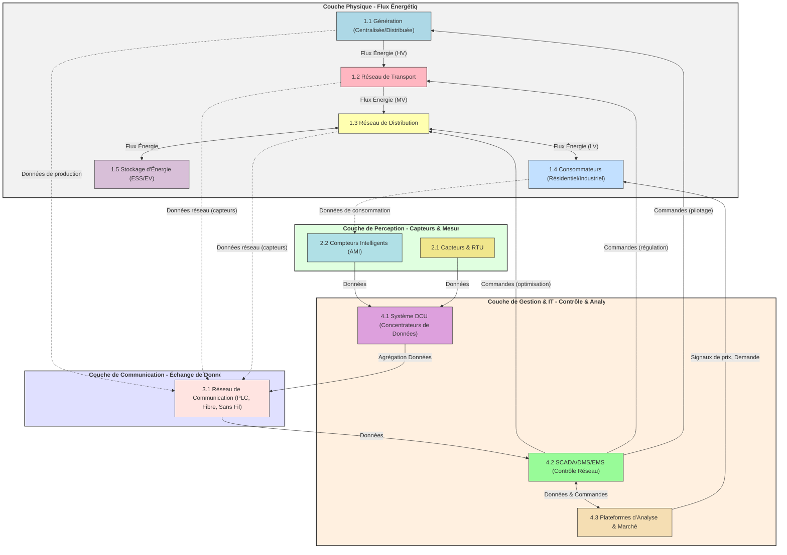

---
aliases:
  - Réseau Électrique Intelligent
  - Smart Grid
  - RÉI
  - Intelligent Grid
archetype: architecture
type:
  - Réseau
  - Système
cssclasses:
  - max
tags:
  - architecture
  - architecture/reseau
  - smart-grid
  - iot
  - technologie/tic
  - scada
  - energie
  - energie/efficacite
  - fiabilite
  - resilience
  - capteur
  - materiel/compteur-intelligent
  - infrastructure/critique
  - diagramme-topologique
---

# Architecture : Réseau Électrique Intelligent (Smart Grid)

> [!abstract] Vue d'ensemble
> Un **Réseau Électrique Intelligent**, ou *Smart Grid*, est une infrastructure électrique avancée qui intègre les technologies numériques de l'information et de la communication (TIC) au réseau électrique traditionnel. Son objectif est de surveiller, d'analyser, de contrôler et d'optimiser la production, le transport, la distribution et la consommation d'électricité en temps réel, permettant ainsi un **flux bidirectionnel** d'énergie et de données entre tous les acteurs du réseau. Cette transformation vise à améliorer l'efficacité énergétique, la fiabilité, la résilience et l'intégration des sources d'énergie renouvelables.

## 🗺️ Diagramme Topologique

## 🚦 Matrice des Flux

| Source | Destination | Port/Protocole | Description | Action |
|---|---|---|---|---|
| **Génération (Prod_Gen)** | **Transport (Trans_Net)** | Électricité (HV) | Acheminement de l'énergie produite. | ✅ Autoriser |
| **Génération (Prod_Gen)** | **Communication (Comm_Net)** | Divers (Wired/Wireless) | Données de production, état des installations. | ✅ Collecter |
| **Transport (Trans_Net)** | **Distribution (Dist_Net)** | Électricité (MV) | Réduction de tension et acheminement vers les zones de distribution. | ✅ Autoriser |
| **Transport (Trans_Net)** | **Communication (Comm_Net)** | Divers (Wired/Wireless) | Données de flux, état du réseau, incidents. | ✅ Collecter |
| **Distribution (Dist_Net)** | **Consommateurs (Consommateurs)** | Électricité (LV) | Alimentation des utilisateurs finaux. | ✅ Autoriser |
| **Distribution (Dist_Net)** | **Stockage (Stockage)** | Électricité (LV/MV) | Chargement/Déchargement des systèmes de stockage. | ✅ Optimiser |
| **Consommateurs (Consommateurs)** | **Compteurs Intelligents (Smart_Meters)** | Données | Mesures de consommation en temps réel. | ✅ Envoyer |
| **Compteurs Intelligents (Smart_Meters)** | **Système DCU (DCU_Sys)** | PLC, Zigbee, Wi-Fi, Cellulaire | Collecte de données de consommation agrégées. | ✅ Transmettre |
| **Capteurs (Capteurs)** | **Système DCU (DCU_Sys)** | Divers (Wired/Wireless) | Données environnementales, état des équipements réseau. | ✅ Transmettre |
| **Système DCU (DCU_Sys)** | **Communication (Comm_Net)** | Fibre Optique, Cellulaire | Agrégation et transmission des données au centre de contrôle. | ✅ Transmettre |
| **Communication (Comm_Net)** | **SCADA/DMS/EMS (SCADA_DMS_EMS)** | Réseau IP sécurisé | Données de l'ensemble du réseau (production, consommation, état). | ✅ Recevoir |
| **SCADA/DMS/EMS (SCADA_DMS_EMS)** | **Distribution (Dist_Net)** | Réseau IP sécurisé | Commandes d'optimisation (répartition de charge, gestion des pannes). | ✅ Envoyer |
| **SCADA/DMS/EMS (SCADA_DMS_EMS)** | **Génération (Prod_Gen)** | Réseau IP sécurisé | Commandes de pilotage (ajustement de production). | ✅ Envoyer |
| **SCADA/DMS/EMS (SCADA_DMS_EMS)** | **Analyse & Marché (Analyse_Plate)** | Réseau IP sécurisé | Données pour l'analyse prédictive, la facturation, les marchés de l'énergie. | ✅ Échanger |
| **Analyse & Marché (Analyse_Plate)** | **Consommateurs (Consommateurs)** | Web/Mobile (APIs) | Signaux de prix, informations sur la consommation, demandes d'effacement. | ✅ Diffuser |
| **Stockage (Stockage)** | **Distribution (Dist_Net)** | Électricité (LV/MV) | Injection d'énergie dans le réseau si nécessaire. | ✅ Injecter |

## 🏰 Zones de Sécurité & Segmentation
L'architecture d'un Smart Grid nécessite une segmentation rigoureuse pour isoler les différentes fonctions et réduire la surface d'attaque. Les principales zones identifiées sont :

*   **Zone de Production et de Transport (OT - Operational Technology)** : Englobe les centrales électriques (traditionnelles et renouvelables), les transformateurs et les lignes de transport haute tension. Cette zone est critique car elle gère la production et l'acheminement massif de l'énergie. La segmentation ici se fait par des équipements dédiés et des protocoles de communication sécurisés.
*   **Zone de Distribution (OT - Operational Technology)** : Comprend les sous-stations de transformation, les contrôleurs de réseau de distribution (RTU/IEDs), les unités de concentration de données (DCU) et les lignes moyenne/basse tension. C'est le cœur de la gestion locale des flux d'énergie et l'intégration des sources décentralisées.
*   **Zone Clientèle/Domestique (HAN - Home Area Network)** : Intègre les compteurs intelligents (AMI) chez les consommateurs résidentiels, les systèmes de gestion de l'énergie domestique, les appareils intelligents et les bornes de recharge pour véhicules électriques. C'est une zone à forte interaction avec l'utilisateur et caractérisée par une grande diversité d'équipements.
*   **Zone de Contrôle et d'Opérations (IT - Information Technology)** : Centralise les systèmes SCADA (Supervisory Control and Data Acquisition), DMS (Distribution Management System), EMS (Energy Management System), les centres d'opérations réseau, les serveurs d'analyse de données et les plateformes de marché. Cette zone est cruciale pour la prise de décision en temps réel et la gestion globale du réseau.
*   **Zone de Services Tiers et Cloud (IT/OT Hybride)** : Inclut les fournisseurs de services énergétiques, les plateformes d'analyse de données externes, les applications mobiles pour les consommateurs et les interfaces avec les marchés de l'énergie. Cette zone représente un point d'interaction externe nécessitant des mesures de sécurité robustes pour protéger l'intégrité du réseau.

Chaque zone est isolée logiquement (VLANs, firewalls) et parfois physiquement, avec des contrôles d'accès stricts et des protocoles de communication spécifiques pour limiter la propagation d'incidents.

## 🛡️ Mesures de Sécurité Clés
> [!shield] Défense en Profondeur
> La sécurité d'un Smart Grid est primordiale en raison de son rôle critique. Une approche de défense en profondeur est essentielle :
> 1.  **Sécurité Périmétrique** : Déploiement de **firewalls de nouvelle génération** et de systèmes de détection/prévention d'intrusion (IDS/IPS) aux frontières entre les zones IT et OT, ainsi qu'avec les réseaux externes.
> 2.  **Segmentation Réseau** : Utilisation de **VLANs** et de réseaux virtuels privés (VPN) pour isoler les communications sensibles, garantissant que les systèmes critiques ne sont pas directement accessibles depuis des zones moins sécurisées.
> 3.  **Chiffrement des Communications** : Toutes les communications de données critiques, en particulier entre les compteurs intelligents, les concentrateurs et les centres de contrôle, doivent être **chiffrées** pour prévenir l'interception et l'altération des informations.
> 4.  **Authentification Forte et Gestion des Accès** : Implémentation de mécanismes d'authentification multi-facteurs pour l'accès aux systèmes de contrôle et une gestion stricte des autorisations basées sur le principe du moindre privilège.
> 5.  **Sécurité des Terminaux (Endpoints)** : Durcissement des compteurs intelligents, des capteurs et des RTU, y compris des mises à jour logicielles régulières et la détection d'altération physique. Déploiement de solutions EDR (Endpoint Detection and Response) sur les serveurs et postes de travail critiques.
> 6.  **Surveillance et Détection des Incidents** : Mise en place de systèmes de gestion des informations et des événements de sécurité (SIEM) pour collecter, corréler et analyser les journaux de sécurité en temps réel, permettant une détection rapide des menaces.
> 7.  **Résilience et Plan de Reprise d'Activité (PRA)** : Conception de l'architecture avec des mécanismes de redondance et de basculement pour assurer la continuité de service en cas de cyberattaque ou de défaillance matérielle. Élaboration de plans de reprise après sinistre pour minimiser les temps d'arrêt.
> 8.  **Audit et Conformité** : Réalisation régulière d'audits de sécurité et de tests d'intrusion pour identifier les vulnérabilités et garantir la conformité aux réglementations de sécurité spécifiques aux infrastructures critiques.