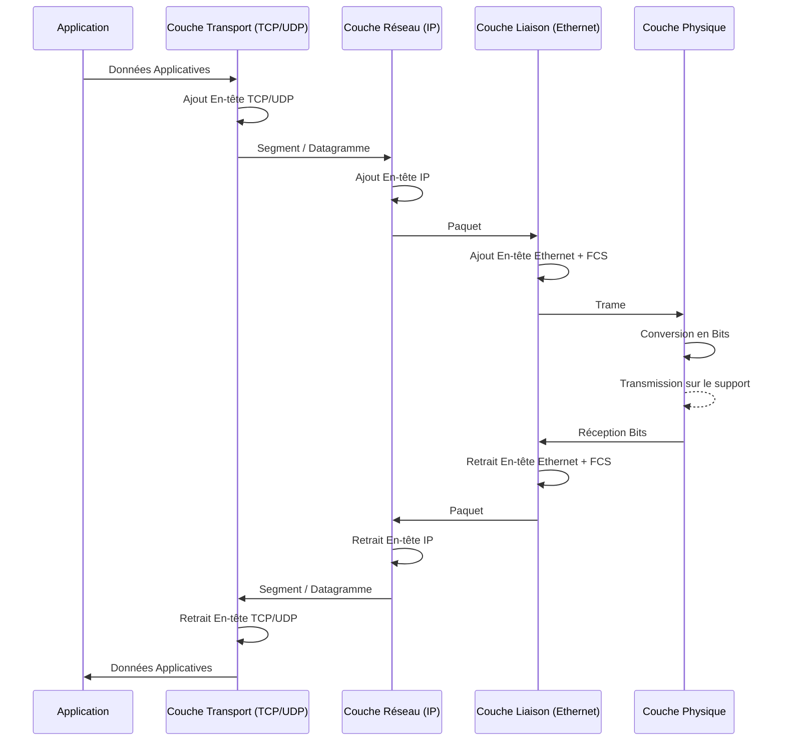

---
aliases:
  - "Encapsulation des données d'application"
  - "Application Data Encapsulation"
  - "Encapsulation réseau"
  - "Décapsulation réseau"
archetype: concept-reseau
couche_osi:
  - "Couche 7 - Application"
  - "Couche 6 - Présentation"
  - "Couche 5 - Session"
  - "Couche 4 - Transport"
  - "Couche 3 - Réseau"
  - "Couche 2 - Liaison"
  - "Couche 1 - Physique"
technologie:
  - Réseaux TCP/IP
cssclasses:
  - max
tags:
  - concept/definition
  - encapsulation
  - decapsulation
  - mecanisme/encapsulation
  - modele-osi
  - modele-tcp-ip
  - protocole/pdu
  - protocole/pdu/bits
  - protocole/pdu/datagramme
  - protocole/pdu/paquet
  - protocole/pdu/segment
  - protocole/pdu/trame
  - reseau/communication
  - controle-flux
  - controle-erreur
  - routage
  - reseau/adressage/ip
  - reseau/adressage/mac
  - chiffrement
  - compression
---

# Application Data Encapsulation

> [!abstract] Définition
> L'*encapsulation des données d'application* est le processus par lequel les données générées par une application sont préparées pour la transmission à travers un réseau. Cela implique l'ajout d'informations de contrôle (en-têtes et parfois pieds de page) à chaque couche du modèle OSI ou TCP/IP, transformant ainsi les données en unités de données protocolaires ([[ProtocolDataUnit|PDU]]) successives jusqu'à ce qu'elles soient prêtes à être transmises sous forme de bits physiques. Inversement, la *décapsulation* est le processus de retrait de ces informations de contrôle par le destinataire, permettant aux données d'atteindre l'application cible dans leur format original.

## ⚙️ Mécanisme & Fonctionnement
L'encapsulation et la décapsulation sont des processus fondamentaux qui permettent la communication entre différents systèmes via un réseau, en suivant les principes du modèle OSI (Open Systems Interconnection) ou TCP/IP.

### Processus d'Encapsulation
Lorsqu'une application envoie des données, celles-ci traversent une série de couches protocolaires, chacune ajoutant ses propres informations de contrôle (en-têtes et parfois pieds de page) afin d'assurer la livraison correcte et ordonnée.

*   **Couche 7 - Application** : Les données brutes de l'application (par exemple, un e-mail, une page web) sont générées. C'est le message original.
    *   *Unité de données (PDU)* : Données (ou Message).
*   **Couche 6 - Présentation & Couche 5 - Session** : Ces couches peuvent ajouter leurs propres en-têtes si des services spécifiques (comme le chiffrement, la compression, ou la gestion de session) sont utilisés, bien que dans de nombreux réseaux modernes (comme TCP/IP), ces fonctions soient souvent intégrées aux couches application ou transport. Les données sont généralement passées "telles quelles" ou légèrement modifiées (ex: chiffrement/compression).
    *   *Unité de données (PDU)* : Données.
*   **Couche 4 - Transport** : La couche Transport reçoit les données et les segmente si nécessaire. Elle ajoute un *en-tête de transport* (par exemple, l'en-tête TCP ou UDP). Cet en-tête contient des informations essentielles comme les numéros de port source et destination (pour identifier les applications), les numéros de séquence (pour l'ordre des segments), et les sommes de contrôle (pour la détection d'erreurs).
    *   *Unité de données (PDU)* : Segment (TCP) ou Datagramme (UDP).
    *   *Rôle de l'en-tête* : Adressage des applications (ports), contrôle de flux, contrôle d'erreur (checksum), retransmission (TCP), établissement/fermeture de connexion (TCP).
*   **Couche 3 - Réseau** : Le segment ou datagramme de la couche Transport est reçu. La couche Réseau ajoute un *en-tête de réseau* (par exemple, l'en-tête IP). Cet en-tête inclut les adresses IP source et destination, permettant le routage des données à travers des réseaux interconnectés.
    *   *Unité de données (PDU)* : Paquet.
    *   *Rôle de l'en-tête* : Adressage logique (IP), routage inter-réseaux, durée de vie du paquet (TTL), fragmentation.
*   **Couche 2 - Liaison de Données** : Le paquet IP est reçu. La couche Liaison de Données ajoute un *en-tête de liaison de données* (par exemple, l'en-tête Ethernet) et un *pied de page de liaison de données* (par exemple, le Frame Check Sequence ou FCS). L'en-tête contient les adresses MAC source et destination (pour la communication au sein d'un même segment de réseau). Le pied de page FCS est utilisé pour la détection d'erreurs au niveau de la trame.
    *   *Unité de données (PDU)* : Trame.
    *   *Rôle de l'en-tête* : Adressage physique (MAC), délimitation de trame.
    *   *Rôle du pied de page* : Détection d'erreurs (checksum de la trame).
*   **Couche 1 - Physique** : La trame est convertie en un flux de bits électriques, optiques ou radiofréquences et transmise sur le support physique (câble, fibre optique, air).
    *   *Unité de données (PDU)* : Bits.

### Processus de Décapsulation
À l'arrivée au destinataire, le processus est inversé :
1.  **Couche 1 - Physique** : Les bits sont reçus du support physique et reconstitués en trame.
2.  **Couche 2 - Liaison de Données** : La couche Liaison de Données vérifie le FCS pour les erreurs, puis retire l'en-tête et le pied de page de liaison de données, exposant le paquet IP.
3.  **Couche 3 - Réseau** : La couche Réseau examine l'en-tête IP pour déterminer si le paquet lui est destiné (ou s'il doit être routé). L'en-tête IP est retiré, exposant le segment ou datagramme de transport.
4.  **Couche 4 - Transport** : La couche Transport lit l'en-tête de transport (TCP/UDP) pour identifier l'application destinataire via le numéro de port, réassemble les segments si nécessaire et gère le contrôle d'erreur/flux. L'en-tête de transport est retiré, exposant les données de l'application.
5.  **Couche 5 - Session & Couche 6 - Présentation** : Ces couches traitent les données si des services spécifiques ont été utilisés lors de l'encapsulation (ex: décompression, déchiffrement).
6.  **Couche 7 - Application** : Les données originales sont finalement livrées à l'application destinataire.

## 💡 Cas d'Usage Typique
L'encapsulation est le mécanisme fondamental qui permet la communication sur les réseaux modernes.
1.  **Communication client-serveur** : Lorsqu'un client web demande une page à un serveur, les données de la requête HTTP sont encapsulées à travers les couches TCP/IP (HTTP -> TCP -> IP -> Ethernet) pour être transmises. Le serveur décapsule ces données pour traiter la requête, puis encapsule sa réponse pour la renvoyer au client.
2.  **Routage et Commutation** : L'encapsulation et la décapsulation par couche permettent aux routeurs de prendre des décisions de routage basées sur les adresses IP (couche 3) et aux commutateurs de transférer les trames basées sur les adresses MAC (couche 2). Chaque équipement réseau ne traite que les informations nécessaires à sa couche respective.
3.  **Tunneling VPN** : Dans un VPN, un protocole d'encapsulation (comme IPsec ou OpenVPN) ajoute une couche supplémentaire d'en-têtes à un paquet existant, créant un "tunnel" sécurisé à travers un réseau non sécurisé (comme Internet). Les données originales sont *encapsulées dans une nouvelle encapsulation*.

## ⚠️ Limitations & Problèmes
> [!warning] Points d'attention
> *   **Performance** : L'ajout d'en-têtes à chaque couche augmente la taille des données transmises ("overhead"). Cela peut réduire le débit utile (payload) et augmenter la charge de traitement CPU pour l'encapsulation et la décapsulation, surtout pour les petits paquets ou les connexions à haut débit.
> *   **Fragmentation** : Si la taille totale d'une PDU dépasse l'unité de transmission maximale (MTU) d'un lien réseau (par exemple, une trame Ethernet a une MTU typique de 1500 octets), le paquet doit être fragmenté en plusieurs fragments plus petits, augmentant la complexité et potentiellement la latence et les chances de perte de paquets.
> *   **Sécurité** : Bien que l'encapsulation soit un processus standard, elle peut être exploitée. Par exemple, des attaques par "tunneling" peuvent dissimuler du trafic malveillant dans des protocoles légitimes. Une mauvaise configuration des règles de filtrage peut permettre à des paquets mal formés ou intentionnellement mal encapsulés de contourner les contrôles de sécurité.