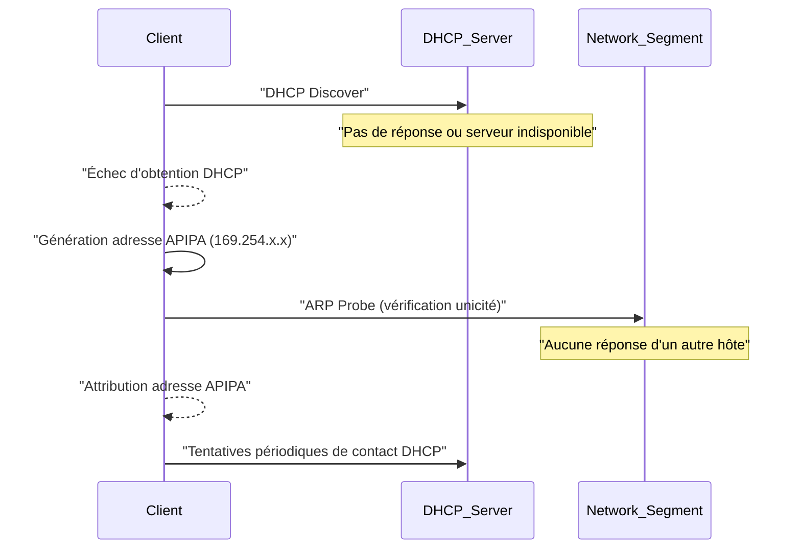

---
aliases:
  - APIPA
  - Automatic Private IP Addressing
  - Adressage IP Privé Automatique
archetype: concept-reseau
couche_osi:
  - "Couche 3 - Réseau"
technologie:
  - APIPA
cssclasses:
  - max
tags:
  - apipa
  - reseau/adressage/ip
  - protocole/dhcp
  - protocole/arp
  - systeme-exploitation
  - connectivite
  - depannage
  - mode-fonctionnement/ad-hoc
  - reseau/limitation
  - conflit-adresses
  - reseau/local
---

# Automatic Private IP Addressing (APIPA)

> [!abstract] Définition
> L'**Automatic Private IP Addressing (APIPA)** est une fonctionnalité des systèmes d'exploitation (notamment Windows) qui permet à un appareil de s'auto-attribuer une adresse IP et un masque de sous-réseau dans une plage spécifique, lorsqu'il ne parvient pas à obtenir une configuration IP d'un serveur DHCP. Ce mécanisme assure une connectivité IP basique et locale.

## ⚙️ Mécanisme & Fonctionnement
Lorsqu'un hôte est configuré pour obtenir une adresse IP via DHCP mais ne reçoit pas de réponse d'un serveur DHCP (par exemple, si le serveur est indisponible ou s'il n'y a pas de serveur DHCP sur le réseau), il initie le processus APIPA. Il sélectionne une adresse IP aléatoire dans la plage **169.254.0.0/16** (de 169.254.1.0 à 169.254.254.255) avec un masque de sous-réseau de 255.255.0.0. Avant de finaliser l'attribution, l'appareil effectue des requêtes ARP (Address Resolution Protocol) pour s'assurer que l'adresse choisie n'est pas déjà utilisée sur le segment de réseau local. Si un conflit est détecté, il choisit une nouvelle adresse et répète le processus. L'appareil continue ensuite à rechercher périodiquement un serveur DHCP.

### Encapsulation / Traitement
*   **Entrée** : Tentative du client d'obtenir une adresse IP via le protocole DHCP (paquet DHCP Discover).
*   **Action** :
    1.  Le client échoue à recevoir une offre DHCP après plusieurs tentatives.
    2.  Le système d'exploitation active APIPA et génère une adresse IP aléatoire dans la plage **169.254.0.0/16**.
    3.  L'appareil envoie des requêtes ARP (ARP Probes) sur le réseau local pour vérifier l'unicité de l'adresse IP choisie.
    4.  Si l'adresse est unique, elle est assignée à l'interface réseau. Si un conflit est détecté, une nouvelle adresse est générée et le processus de vérification est répété.
    5.  Le client continue à envoyer des paquets DHCP Discover périodiquement pour détecter la réapparition ou la disponibilité d'un serveur DHCP.
*   **Sortie** : Une adresse IP auto-assignée (169.254.x.x) et un masque de sous-réseau (255.255.0.0), permettant une communication locale.

## 💡 Cas d'Usage Typique
Pourquoi l'utilise-t-on ?
1.  **Réseaux Ad-Hoc ou Petits Bureaux Sans DHCP** : Permet aux ordinateurs et périphériques de communiquer entre eux sur un réseau local simple qui ne dispose pas de serveur DHCP pour la distribution automatique d'adresses IP.
2.  **Connectivité Temporaire et Dépannage** : Lorsqu'un serveur DHCP tombe en panne ou n'est pas accessible, APIPA permet aux appareils de maintenir une connectivité locale minimale, ce qui peut être utile pour le dépannage. Un appareil affichant une adresse APIPA est un indicateur clair qu'il n'a pas pu joindre un serveur DHCP.
3.  **Isolation de Réseau** : Dans des scénarios spécifiques où une connectivité strictement locale est requise sans accès à des ressources externes (Internet, autres sous-réseaux), APIPA peut être une solution simple.

## ⚠️ Limitations & Problèmes
> [!warning] Points d'attention
> *   **Performance** : Le processus de détection d'adresse (ARP Probes) peut introduire un léger délai avant que l'appareil n'obtienne une adresse IP fonctionnelle. La découverte périodique du DHCP génère un trafic minimal mais constant.
> *   **Sécurité** : APIPA en soi n'introduit pas de vulnérabilité directe. Cependant, un appareil obtenant une adresse APIPA peut masquer un problème réseau sous-jacent (panne DHCP, câble débranché, mauvaise configuration VLAN) qui, s'il n'est pas résolu, pourrait avoir des implications en matière de sécurité ou de disponibilité.
> *   **Absence de Passerelle et DNS** : APIPA fournit uniquement une adresse IP et un masque de sous-réseau. Il ne configure pas la passerelle par défaut ni les serveveurs DNS. Par conséquent, les appareils utilisant APIPA ne peuvent communiquer qu'avec d'autres appareils sur le même segment de réseau local et ne peuvent pas accéder à Internet ou à d'autres sous-réseaux.
> *   **Portée Limitée** : La communication est strictement confinée au *broadcast domain* local. Les appareils avec des adresses APIPA ne peuvent pas router le trafic vers d'autres sous-réseaux ou l'extérieur du réseau local.
> *   **Conflits d'Adresses** : Bien que le processus APIPA intègre une détection de conflits, il reste possible que, dans des cas rares ou des configurations spécifiques, des conflits puissent survenir, perturbant la connectivité.