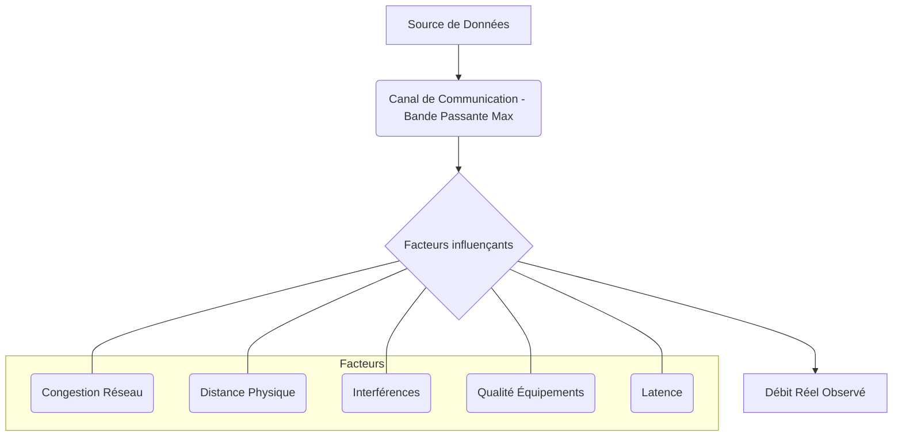

---
aliases:
  - Bande passante
  - Bandwidth
  - Débit binaire
  - Capacité de réseau
archetype: concept-reseau
couche_osi:
  - "Couche 1 - Physique"
  - "Couche 2 - Liaison"
technologie:
  - Fibre Optique
  - ADSL
  - Wi-Fi
cssclasses:
  - max
tags:
  - bande-passante
  - reseau
  - debit
  - communication/reseau
  - reseau/performance
  - unite-mesure
  - reseau/latence
  - reseau/congestion
  - connectivite
  - cloud
  - teletravail
  - materiel/reseau
  - reseau/sans-fil/wi-fi
  - infrastructure/reseau/fibre-optique
  - reseau/wan
---

# Bandwidth (Bande Passante)

> [!abstract] Définition
> La **bande passante** (ou *bandwidth*) représente la capacité maximale théorique d'un lien de communication, qu'il soit filaire ou sans fil, à transmettre des données sur un réseau pendant une période donnée. Elle quantifie le volume d'informations qui peut être acheminé par seconde et est un facteur déterminant de la vitesse et de la qualité du réseau.

## ⚙️ Mécanisme & Fonctionnement
La bande passante n'est pas une mesure de la vitesse du réseau, mais plutôt de sa capacité de transmission. On peut l'imaginer comme la largeur d'une route : plus il y a de voies (bande passante élevée), plus de véhicules (données) peuvent circuler simultanément, mais la vitesse réelle dépendra aussi d'autres facteurs comme la congestion.

### Unités de Mesure
La bande passante est traditionnellement exprimée en *bits par seconde (bps)*. Cependant, avec l'évolution des technologies et l'augmentation des débits, elle est désormais plus couramment mesurée en:
*   **Kilobits par seconde (Kbps ou kbit/s)** : 1 000 bits par seconde.
*   **Mégabits par seconde (Mbps ou Mbit/s)** : 1 million de bits par seconde.
*   **Gigabits par seconde (Gbps ou Gbit/s)** : 1 milliard de bits par seconde.
Il est important de distinguer les *bits* (b) des *octets* (B), où 1 octet = 8 bits. Ainsi, 10 Mo/s (mégaoctets par seconde) équivalent à 80 Mb/s.

### Débit Théorique vs. Débit Réel
La bande passante représente la capacité *maximale théorique*. Le **débit** (ou *throughput*) est la quantité réelle de données effectivement transmises avec succès dans un laps de temps spécifique. Le débit est presque toujours inférieur à la bande passante en raison de divers facteurs.

Le calcul du débit utile (réel) peut se faire en divisant la taille du fichier transféré par la durée du transfert. Des outils en ligne (speedtests) permettent de mesurer le débit descendant (download), le débit ascendant (upload) et le ping (latence).

### Facteurs Influant sur la Bande Passante et le Débit Réel
Plusieurs éléments peuvent affecter la bande passante disponible et le débit réel d'un réseau:
*   **Capacité des équipements réseau** : Routeurs, commutateurs, câbles et autres matériels réseau ont des limites de capacité.
*   **Type de connexion** : La fibre optique offre généralement une bande passante supérieure à l'ADSL ou au Wi-Fi.
*   **Congestion du réseau** : Un trafic élevé dû à un grand nombre d'utilisateurs ou d'appareils connectés simultanément réduit la bande passante disponible pour chacun.
*   **Distance** : Plus la distance entre l'appareil et la source de données (ex: routeur, nœud de raccordement) est grande, plus la bande passante peut être réduite.
*   **Interférences** : Les signaux Wi-Fi peuvent être perturbés par d'autres appareils sans fil, obstacles physiques (murs) ou les réseaux Wi-Fi voisins.
*   **Qualité des équipements** : Des appareils vieillissants ou de mauvaise qualité peuvent limiter les performances.
*   **Latence** : Les retards dans le réseau peuvent empêcher les données d'exploiter pleinement la bande passante disponible, réduisant ainsi le débit.
*   **Limitations par les FAI** : Les fournisseurs d'accès à Internet peuvent appliquer des limitations pour gérer la saturation du réseau ou si certaines activités gourmandes en bande passante sont détectées.

## 💡 Cas d'Usage Typique
La bande passante est essentielle pour de nombreuses activités réseau et applications d'entreprise :
1.  **Performance Réseau Globale** : Une bande passante adéquate garantit un accès rapide aux contenus, réduit les temps de chargement et améliore l'expérience utilisateur, impactant directement la productivité.
2.  **Applications Gourmandes en Données** : Nécessaire pour le *streaming* vidéo en haute définition (HD ou 4K), les jeux en ligne, les appels vidéo (VoIP) et le téléchargement de fichiers volumineux.
3.  **Télétravail et Cloud Computing** : Indispensable pour l'accès fluide aux applications hébergées dans le *cloud*, les visioconférences et le traitement de grandes quantités de données par plusieurs utilisateurs simultanément.
4.  **Connectivité des Data Centers et WAN** : Les liaisons d'entreprise (WAN, DIA) requièrent souvent une bande passante symétrique et élevée pour gérer le trafic important et assurer la continuité des services.

## ⚠️ Limitations & Problèmes
> [!warning] Points d'attention
> *   **Performance** : Une bande passante insuffisante entraîne des ralentissements, des latences, des interruptions de service et une mauvaise qualité pour les applications critiques. Elle peut créer des "goulots d'étranglement" qui limitent la performance globale du réseau.
> *   **Sécurité** : La surveillance de la bande passante est cruciale pour la sécurité. Des pics de trafic anormaux peuvent indiquer des attaques de type *Distributed Denial of Service (DDoS)* qui visent à saturer le réseau. Une consommation excessive par des applications non autorisées (partage de fichiers, streaming illégal) ou des logiciels malveillants peut également être détectée par la surveillance de la bande passante, aidant à identifier les anomalies de sécurité.

## 🔗 Notes Connexes
*   **Protocole lié** : TCP/IP
*   **Matériel** : Router, Switch, Câble Ethernet, Fibre Optique, Point d'accès Wi-Fi
*   **Concepts liés** : Latence, Débit, Qualité de Service (QoS)