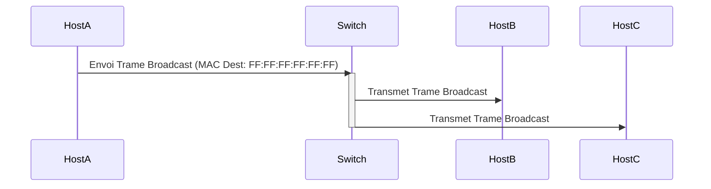

---
aliases:
  - Communication Broadcast
  - Broadcast Communication
  - Broadcast
archetype: concept-reseau
couche_osi:
  - "Couche 2 - Liaison"
  - "Couche 3 - Réseau"
technologie:
  - Ethernet
  - IP
cssclasses:
  - max
tags:
  - communication
  - communication/reseau
  - reseau/broadcast
  - reseau/domaine-de-diffusion
  - modele-osi/couche-2
  - modele-osi/couche-3
  - adresse-mac
  - adresse-ip
  - switch
  - routeur
  - protocole/arp
  - protocole/dhcp
  - protocole/wake-on-lan
  - reseau/tempete-de-diffusion
  - securite
  - attaque/deni-de-service
  - spoofing
  - mitm
  - reseau/trame
  - reseau/paquet
---

# Broadcast Communication

> [!abstract] Définition
> La communication *broadcast* est une méthode de transmission de données où un message unique est envoyé d'un expéditeur à **tous les destinataires possibles** au sein d'un segment de réseau (domaine de diffusion) simultanément. Contrairement à la communication *unicast* (un-à-un) ou *multicast* (un-à-plusieurs-sélectionnés), le broadcast assure que chaque nœud du domaine de diffusion reçoit le message.

## ⚙️ Mécanisme & Fonctionnement
Le principe du *broadcast* repose sur l'utilisation d'une adresse de destination spéciale qui indique que le message est destiné à tous les dispositifs du domaine de diffusion. Ce mécanisme est fondamental pour la découverte de services et la configuration des dispositifs sur un réseau local (LAN).

### Encapsulation / Traitement
*   **Entrée** : Un dispositif envoie une trame (Layer 2) ou un paquet (Layer 3) avec une adresse de destination *broadcast*.
    *   **Layer 2 (Liaison de données)** : L'adresse MAC de destination est `FF:FF:FF:FF:FF:FF` (adresse MAC de diffusion Ethernet).
    *   **Layer 3 (Réseau)** : L'adresse IP de destination est `255.255.255.255` pour une diffusion limitée (ne traverse pas les routeurs) ou l'adresse de diffusion spécifique au sous-réseau (par exemple, `192.168.1.255` pour un réseau `192.168.1.0/24`) pour une diffusion dirigée.
*   **Action** :
    *   **Au niveau Layer 2 (Switch)** : Lorsqu'un commutateur reçoit une trame avec une adresse MAC de diffusion, il la réplique et la transmet sur tous ses ports, à l'exception du port d'où elle provient, au sein du même domaine de diffusion (VLAN).
    *   **Au niveau Layer 3 (Routeur)** : Les routeurs agissent comme des frontières de domaine de diffusion et ne transmettent généralement pas les paquets de diffusion Layer 2 ou les diffusions limitées Layer 3 par défaut. Une diffusion dirigée de sous-réseau peut être configurée pour traverser un routeur, mais cela est souvent considéré comme un risque de sécurité.
*   **Sortie** : Le message est reçu et traité par tous les dispositifs au sein du domaine de diffusion. Chaque dispositif doit examiner le message pour déterminer s'il lui est pertinent.

## 💡 Cas d'Usage Typique
La communication *broadcast* est essentielle pour de nombreux protocoles et fonctions réseau :
1.  **Résolution d'adresses (ARP - Address Resolution Protocol)** : Lorsqu'un hôte connaît une adresse IP mais a besoin de l'adresse MAC correspondante pour communiquer sur le réseau local, il envoie une requête ARP *broadcast*. Seul le dispositif avec l'adresse IP correspondante répond avec son adresse MAC.
2.  **Attribution d'adresses IP (DHCP - Dynamic Host Configuration Protocol)** : Un client qui démarre et ne possède pas d'adresse IP envoie une requête DHCPDISCOVER *broadcast* pour localiser un serveur DHCP sur le réseau. Le serveur DHCP répond avec une offre.
3.  **Découverte de services et de dispositifs** : Les dispositifs peuvent utiliser le *broadcast* pour annoncer leur présence ou découvrir d'autres entités sur le réseau, facilitant la gestion du réseau.
4.  **Wake-on-LAN (WoL)** : Un "magic packet" est diffusé sur le réseau pour réveiller un ordinateur à distance. Ce paquet contient l'adresse MAC de la carte réseau cible et est généralement envoyé via une diffusion Layer 2.

## ⚠️ Limitations & Problèmes
> [!warning] Points d'attention
> *   **Performance (Tempête de diffusion - Broadcast Storm)** : Un trafic de diffusion excessif peut saturer la bande passante du réseau et les ressources CPU des dispositifs, entraînant une dégradation significative des performances, voire un effondrement du réseau. Les boucles réseau (en l'absence de Spanning Tree Protocol) sont une cause fréquente de tempêtes de diffusion, car les trames sont répliquées et circulent indéfiniment.
> *   **Sécurité** :
    *   **Collecte d'informations** : Les attaquants peuvent exploiter les messages de diffusion pour collecter des informations précieuses sur le réseau, telles que les adresses IP, les détails des dispositifs ou la configuration du réseau.
    *   **Attaques par déni de service (DoS)** : En inondant le réseau de trafic *broadcast* excessif, les attaquants peuvent submerger les ressources réseau et provoquer des interruptions de service. Une attaque par déni de service de désassociation *broadcast* est par exemple possible dans les réseaux sans fil.
    *   **Usurpation (Spoofing) et attaques de l'homme du milieu (Man-in-the-Middle)** : La nature non authentifiée des communications *broadcast* (comme ARP) rend le réseau vulnérable à des attaques où un attaquant manipule les messages de diffusion pour se faire passer pour un dispositif légitime ou intercepter des communications.
    *   **Manque de routabilité** : Par défaut, les *broadcasts* sont limités au domaine de diffusion local et ne traversent pas les routeurs, ce qui limite leur portée mais constitue également une mesure de sécurité implicite. Cependant, les diffusions dirigées de sous-réseau peuvent être configurées pour traverser les routeurs, ce qui est généralement considéré comme un risque de sécurité.
