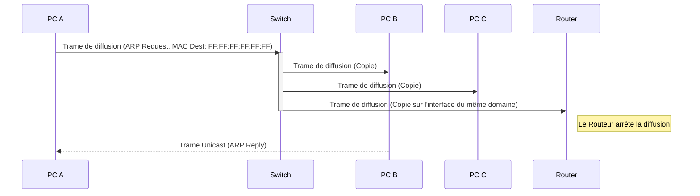

---
aliases:
  - Domaine de Diffusion
  - Broadcast Domain
archetype: concept-reseau
couche_osi:
  - "Couche 2 - Liaison"
technologie:
  - Ethernet
  - Switches
  - VLANs
  - Routeurs
cssclasses:
  - max
tags:
  - reseau/broadcast
  - reseau/segmentation
  - modele-osi/couche-2
  - protocole/arp
  - protocole/dhcp
  - reseau/congestion
  - securite/reseau
  - switch
  - routeur
  - modele-osi
  - reseau/adressage/mac
---

# Broadcast Domain

> [!abstract] Définition
> Un **domaine de diffusion** (Broadcast Domain) est une subdivision logique d'un réseau informatique dans laquelle tous les nœuds peuvent se joindre les uns les autres par diffusion (broadcast) au niveau de la couche liaison de données (couche 2 du modèle OSI). Lorsqu'un appareil envoie une trame de diffusion, tous les autres appareils faisant partie du même domaine de diffusion la reçoivent et la traitent.

## ⚙️ Mécanisme & Fonctionnement
Le fonctionnement du domaine de diffusion est intrinsèquement lié à la **couche liaison de données** (Couche 2) du modèle OSI et aux adresses MAC. Lorsqu'un appareil doit communiquer avec une destination dont il ne connaît pas l'adresse MAC (par exemple, pour résoudre une adresse IP en adresse MAC via ARP), il émet une trame de diffusion (broadcast frame).

Cette trame de diffusion a une adresse MAC de destination spécifique, généralement `FF:FF:FF:FF:FF:FF`, indiquant qu'elle est destinée à tous les appareils du segment réseau local.

*   **Comportement des commutateurs (switches)** : Un commutateur de couche 2 reçoit cette trame de diffusion sur un port et la **floode** (l'envoie) sur tous les autres ports du même domaine de diffusion, à l'exception du port d'où elle provient. Cela signifie que tous les appareils connectés à ce commutateur (ou à un ensemble de commutateurs interconnectés) se trouvent par défaut dans le même domaine de diffusion. Les commutateurs ne filtrent pas les trames de diffusion.
*   **Comportement des routeurs** : Un routeur, étant un équipement de couche 3 (couche réseau), **arrête les diffusions**. Chaque interface d'un routeur délimite un domaine de diffusion distinct. Les routeurs sont donc les dispositifs clés pour segmenter les grands domaines de diffusion en sous-réseaux plus petits et gérables.
*   **VLANs** : Les réseaux locaux virtuels (VLAN) permettent de segmenter un commutateur physique en plusieurs domaines de diffusion logiques. Un VLAN crée un domaine de diffusion indépendant, isolant le trafic de diffusion entre les groupes d'appareils, même s'ils partagent le même équipement physique.

### Encapsulation / Traitement
*   **Entrée** : Un périphérique (PC, serveur) souhaite communiquer avec un autre périphérique dont il connaît l'adresse IP mais pas l'adresse MAC. Il construit une requête ARP (Address Resolution Protocol), qui est une trame de diffusion de couche 2.
*   **Action** :
    1.  La trame ARP, avec l'adresse MAC de destination `FF:FF:FF:FF:FF:FF`, est envoyée au commutateur.
    2.  Le commutateur reçoit la trame et, reconnaissant son adresse de diffusion, la transmet à tous ses ports, sauf celui d'origine.
    3.  Si des routeurs sont présents, ils ne transmettront pas cette trame de diffusion au-delà de leur interface, délimitant ainsi le domaine.
    4.  Si des VLANs sont configurés, la trame est uniquement diffusée au sein du VLAN d'origine.
*   **Sortie** : Tous les périphériques du même domaine de diffusion reçoivent la trame ARP. Le périphérique dont l'adresse IP correspond à la requête répondra avec sa propre adresse MAC, permettant ainsi la communication unicast future.

## 💡 Cas d'Usage Typique
Les domaines de diffusion sont essentiels pour plusieurs protocoles et mécanismes réseau fondamentaux :
1.  **Résolution d'adresses (ARP)** : Les requêtes ARP sont des diffusions de couche 2 utilisées pour mapper une adresse IP à une adresse MAC. Sans domaine de diffusion, cette résolution ne serait pas possible au niveau local.
2.  **Découverte DHCP** : Les clients DHCP utilisent des messages de diffusion pour découvrir un serveur DHCP sur le réseau afin d'obtenir une configuration IP.
3.  **Annonces de services** : Certains services réseau peuvent utiliser des diffusions pour s'annoncer aux clients potentiels sur le réseau local.

## ⚠️ Limitations & Problèmes

> [!warning] Points d'attention
> *   **Performance** : Un domaine de diffusion trop grand peut entraîner une **congestion du réseau** due à un volume excessif de trafic de diffusion. Chaque diffusion doit être traitée par tous les appareils du domaine, consommant leur CPU et la bande passante, même si le message ne leur est pas directement pertinent. Cela peut entraîner un ralentissement des performances globales du réseau. Un domaine de diffusion comprenant des milliers d'appareils est généralement considéré comme trop grand.
> *   **Sécurité** : Un large domaine de diffusion augmente la surface d'attaque pour certaines menaces. Des attaques comme les "broadcast storms" (tempêtes de diffusion) peuvent facilement paralyser un réseau non segmenté. De plus, les diffusions peuvent être interceptées par n'importe quel appareil du domaine, exposant potentiellement des informations sensibles.
> *   **Gestion et Évolutivité** : La gestion des adresses IP et le dépannage deviennent plus complexes dans de très grands domaines de diffusion. Il est plus difficile d'organiser logiquement les appareils et d'appliquer des politiques de sécurité fines.

### Segmentation du Domaine de Diffusion
Pour atténuer ces problèmes, la segmentation des domaines de diffusion est cruciale :
*   **Routeurs** : Les routeurs sont les principaux dispositifs de couche 3 qui segmentent les domaines de diffusion. Chaque interface de routeur crée une nouvelle frontière de diffusion.
*   **VLANs (Virtual Local Area Networks)** : Les VLANs permettent de diviser logiquement un seul commutateur (ou un ensemble de commutateurs interconnectés) en plusieurs domaines de diffusion virtuels. Cela réduit la taille des domaines de diffusion, améliore la sécurité et optimise la bande passante sans nécessiter l'ajout de matériel de routage physique pour chaque segment. La communication entre différents VLANs nécessite un routage inter-VLAN, effectué par un routeur ou un commutateur de couche 3.