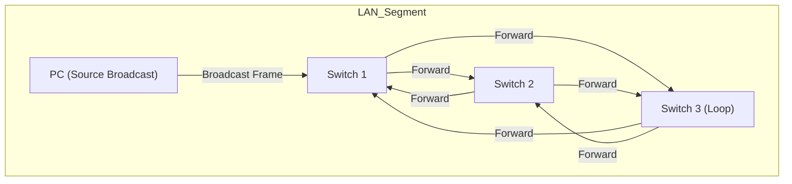

---
aliases:
  - Tempête de Diffusion
  - Broadcast Storm
archetype: concept-reseau
couche_osi:
  - "Couche 2 - Liaison"
technologie:
  - Ethernet Switching
cssclasses:
  - max
tags:
  - reseau/tempete-de-diffusion
  - attaque/deni-de-service
  - reseau/congestion
  - switch
  - protocole/stp
  - reseau/vlan
  - reseau/segmentation
  - reseau/boucle
  - bande-passante
  - perte-paquets
  - latence
  - reseau/trame
  - protocole/arp
  - protocole/dhcp
---

# Broadcast Storm

> [!abstract] Définition
> Une **tempête de diffusion** (*Broadcast Storm*) est un phénomène réseau où un nombre excessif de trames de diffusion (*broadcast frames*) inonde le réseau, consommant une part significative ou la totalité de la bande passante disponible et des ressources des équipements.

## ⚙️ Mécanisme & Fonctionnement
Une tempête de diffusion survient généralement dans des environnements Ethernet où des boucles physiques ou logiques de niveau 2 existent sans mécanisme de prévention adéquat. Lorsqu'une trame de diffusion est envoyée, les commutateurs la transmettent sur tous leurs ports (sauf celui d'entrée). Dans une boucle, cette trame est reçue par d'autres commutateurs qui la retransmettent à leur tour, créant une multiplication exponentielle des copies de la trame de diffusion qui circulent indéfiniment.

### Encapsulation / Traitement
*   **Entrée** : Une trame de diffusion (ex: ARP Request, DHCP Discover) est injectée dans un segment réseau.
*   **Action** : En présence d'une boucle de couche 2, les commutateurs participants reçoivent et retransmettent la trame de diffusion de manière répétée, saturant les liens et les tables MAC.
*   **Sortie** : Multiples copies de la trame de diffusion circulent en permanence, entraînant une consommation excessive des ressources réseau (bande passante, CPU des équipements).

## 💡 Prévention & Atténuation
Pour prévenir les tempêtes de diffusion, des mécanismes spécifiques sont mis en œuvre :
1.  **Spanning Tree Protocol ([[SpanningTreeProtocol|STP]])** : Ce protocole détecte et bloque les chemins redondants dans un réseau de couche 2 pour créer une topologie sans boucle logique, tout en assurant une redondance en cas de panne de lien.
2.  **Suppression de diffusion (*Broadcast Suppression*)** : Certains commutateurs permettent de configurer des seuils pour limiter le trafic de diffusion sur une interface. Si le volume de diffusion dépasse ce seuil, le commutateur commence à supprimer les trames de diffusion excédentaires.
3.  **Conception de réseau** : Une segmentation correcte du réseau en VLANs réduit la taille des domaines de diffusion, confinant les tempêtes potentielles à des segments plus petits.
4.  **Détection et isolement** : Des systèmes de gestion de réseau peuvent surveiller les niveaux de trafic de diffusion et alerter les administrateurs en cas d'activité anormale, permettant un isolement rapide du segment problématique.

## ⚠️ Limitations & Problèmes
> [!warning] Points d'attention
> *   **Saturation Réseau** : Une tempête de diffusion peut rapidement saturer toute la bande passante disponible, rendant le réseau inutilisable pour le trafic légitime.
> *   **Dégradation des Performances** : Les périphériques réseau (commutateurs, routeurs, serveurs) et les hôtes finaux voient leur CPU et leur mémoire surchargés par le traitement de ces trames excessives, entraînant des latences et des pertes de paquets.
> *   **Indisponibilité des Services** : Les applications et services dépendants du réseau deviennent inaccessibles.
> *   **Difficulté de Diagnostic** : Identifier l'origine d'une tempête de diffusion peut être complexe sans outils de surveillance adéquats, car la source peut être masquée par la prolifération du trafic.