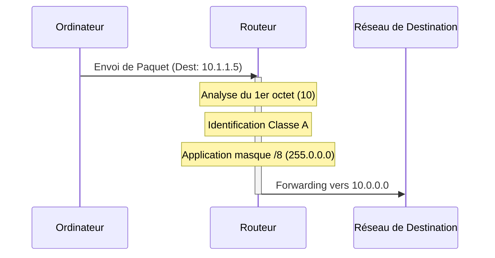

---
aliases:
  - Adressage Classique
  - Classful Addressing
  - IP Classful
archetype: concept-reseau
couche_osi:
  - "Couche 3 - Réseau"
technologie:
  - IP Addressing
cssclasses:
  - max
tags:
  - modele/adressage-classful
  - protocole/ip/ipv4
  - reseau/adressage/ip/classes
  - reseau/masque-de-sous-reseau
  - routage
  - reseau/multicast
  - protocole/ip/epuisement-adresses
  - reseau/cidr
  - reseau/vlsm
  - reseau/historique
---

# Classful Addressing

> [!abstract] Définition
> L'adressage *Classful* est une méthode historique de division de l'espace d'adresses IPv4 en classes prédéfinies (A, B, C, D, E). Chaque classe est associée à une taille de réseau fixe et un masque de sous-réseau par défaut, permettant de distinguer la partie réseau de la partie hôte d'une adresse IP.

## ⚙️ Mécanisme & Fonctionnement
Le système d'adressage *Classful* catégorise les adresses IP en fonction des premiers bits du premier octet, déterminant ainsi implicitement la taille du réseau et le masque de sous-réseau par défaut.

### Classes d'Adresses IP

*   **Classe A**
    *   **Plage** : 1.0.0.0 à 126.255.255.255 (Premier bit est `0`).
    *   **Masque par défaut** : 255.0.0.0 (/8).
    *   **Description** : Réseaux très grands. Un seul octet pour la partie réseau, trois octets pour les hôtes (environ 16 millions d'hôtes par réseau).
*   **Classe B**
    *   **Plage** : 128.0.0.0 à 191.255.255.255 (Premiers bits sont `10`).
    *   **Masque par défaut** : 255.255.0.0 (/16).
    *   **Description** : Réseaux de taille moyenne à grande. Deux octets pour le réseau, deux octets pour les hôtes (environ 65 536 hôtes par réseau).
*   **Classe C**
    *   **Plage** : 192.0.0.0 à 223.255.255.255 (Premiers bits sont `110`).
    *   **Masque par défaut** : 255.255.255.0 (/24).
    *   **Description** : Petits réseaux. Trois octets pour le réseau, un octet pour les hôtes (environ 256 hôtes par réseau).
*   **Classe D**
    *   **Plage** : 224.0.0.0 à 239.255.255.255 (Premiers bits sont `1110`).
    *   **Description** : Réservée pour les adresses de *multidiffusion* (multicast).
*   **Classe E**
    *   **Plage** : 240.0.0.0 à 255.255.255.255 (Premiers bits sont `1111`).
    *   **Description** : Réservée à des fins expérimentales et de recherche.

### Encapsulation / Traitement
*   **Entrée** : Un paquet IP arrive à un routeur avec une adresse de destination (par exemple, 10.1.1.5).
*   **Action** : Le routeur examine le premier octet de l'adresse IP de destination pour déterminer sa classe. Dans cet exemple (10.1.1.5), le premier octet est 10, ce qui indique une adresse de Classe A. Le routeur applique alors implicitement le masque de sous-réseau par défaut de la Classe A (255.0.0.0 ou /8) pour identifier la partie réseau (10.0.0.0) et la partie hôte (1.1.5).
*   **Sortie** : Le paquet IP est routé vers le réseau de destination 10.0.0.0 en se basant sur la classification de la Classe A.

## 💡 Cas d'Usage Typique
1.  **Contexte Historique** : L'adressage *Classful* a été la méthode initiale pour l'organisation de l'espace d'adresses IPv4. Il a été conçu pour simplifier le processus de routage en permettant aux routeurs de déterminer la frontière entre la partie réseau et la partie hôte d'une adresse IP sans nécessiter de masque de sous-réseau explicite dans les tables de routage.
2.  **Simplicité de configuration** : Pour les réseaux utilisant des masques par défaut, la configuration était plus simple car le masque n'avait pas besoin d'être explicitement configuré sur les interfaces ou annoncé dans les protocoles de routage.

## ⚠️ Limitations & Problèmes
> [!warning] Points d'attention
> *   **Gaspillage d'adresses** : La principale limitation est l'inefficacité dans l'allocation des adresses IP. Une organisation ayant besoin de 2000 hôtes devait se voir attribuer un réseau de Classe B (plus de 65 000 adresses disponibles), gaspillant ainsi des dizaines de milliers d'adresses. À l'inverse, un réseau de Classe C était souvent trop petit.
> *   **Épuisement des adresses IPv4** : Le gaspillage inhérent au système *Classful* a considérablement accéléré l'épuisement des adresses IPv4 disponibles.
> *   **Manque de flexibilité** : Impossible de créer des sous-réseaux de tailles variables pour mieux adapter l'allocation d'adresses aux besoins réels d'une organisation.
> *   **Transition vers CIDR** : En raison de ces limitations, l'adressage *Classful* a été progressivement remplacé par le *Classless Inter-Domain Routing* (CIDR) au milieu des années 1990, qui introduit le concept de masque de sous-réseau à longueur variable (VLSM) et permet une allocation plus granulaire et efficace des adresses IP.