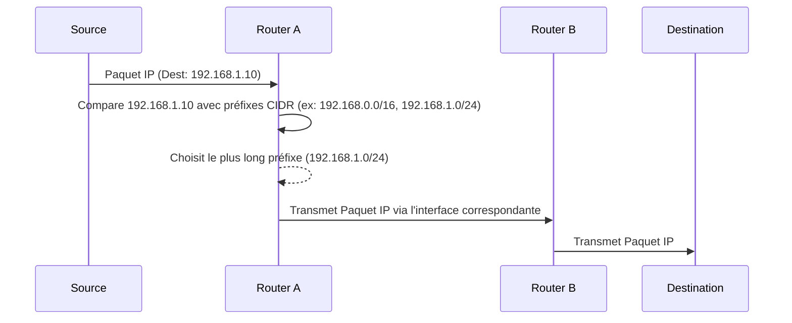

---
aliases:
  - Routage Inter-Domaine Sans Classe
  - Classless Inter-Domain Routing
  - CIDR
archetype: concept-reseau
couche_osi:
  - "Couche 3 - Réseau"
technologie:
  - IP Addressing
  - Routing
tags:
  - reseau/cidr
  - reseau/adressage/ip
  - reseau/vlsm
  - reseau/routage
  - routage/table
  - routage/longest-prefix-match
  - routage/agregation
  - reseau/segmentation
---

# Classless Inter-Domain Routing (CIDR)

> [!abstract] Définition
> Le **Classless Inter-Domain Routing (CIDR)** est une méthode d'adressage IP qui améliore l'allocation des adresses IP et l'efficacité du routage en remplaçant le système traditionnel de classes d'adresses IP (A, B, C). Il permet une allocation plus flexible et granulaire des blocs d'adresses.

## ⚙️ Mécanisme & Fonctionnement
Le CIDR fonctionne en utilisant un préfixe de réseau de longueur variable (**Variable Length Subnet Masking - VLSM**) pour définir la partie réseau d'une adresse IP, plutôt que des masques de sous-réseau fixes basés sur les classes d'adresses. Une adresse IP CIDR est représentée sous la forme `adresse_ip/longueur_du_préfixe`, où la `longueur_du_préfixe` indique le nombre de bits consécutifs du côté le plus à gauche de l'adresse IP qui constituent le préfixe réseau. Par exemple, `192.168.1.0/24` signifie que les 24 premiers bits identifient le réseau, et les 8 bits restants identifient les hôtes au sein de ce réseau.

### Encapsulation / Traitement
*   **Entrée** : Un paquet IP arrive sur un routeur, contenant une adresse IP de destination.
*   **Action** : Le routeur examine l'adresse IP de destination et la compare avec les entrées de sa table de routage. Il utilise le principe du *longest prefix match* (correspondance du préfixe le plus long), où l'itinéraire avec le préfixe CIDR le plus spécifique (le plus grand nombre de bits correspondants) est choisi pour acheminer le paquet. Cela permet une agrégation de routes efficace, où plusieurs réseaux peuvent être représentés par une seule entrée de routage plus large.
*   **Sortie** : Le paquet est transmis via l'interface de sortie associée à l'entrée de routage la plus spécifique trouvée dans la table.

## 💡 Cas d'Usage Typique
Pourquoi l'utilise-t-on ?
1.  **Allocation Efficace des Adresses IP** : Le CIDR permet aux organisations d'obtenir des blocs d'adresses IP de tailles variées, correspondant précisément à leurs besoins. Cela évite le gaspillage d'adresses qui était courant avec le système de classes fixes, où des blocs entiers étaient alloués même si seulement une petite partie était utilisée.
2.  **Réduction des Tables de Routage** : En permettant l'agrégation de routes (ou *route summarization*), le CIDR permet aux routeurs de représenter plusieurs sous-réseaux adjacents avec une seule entrée dans leur table de routage. Ceci réduit considérablement la taille des tables de routage sur Internet, améliorant ainsi la performance et la stabilité du routage.

## ⚠️ Limitations & Problèmes
> [!warning] Points d'attention
> *   **Performance** : Bien que le CIDR réduise la taille des tables de routage globales, la recherche du *longest prefix match* peut être légèrement plus complexe que la simple recherche de classe, bien que les routeurs modernes soient optimisés pour cela.
> *   **Sécurité** : Une mauvaise planification ou une mauvaise configuration des blocs CIDR peut entraîner des chevauchements d'adresses IP ou des problèmes de routage inattendus. La complexité de la gestion des sous-réseaux de différentes tailles (VLSM) peut introduire des erreurs si elle n'est pas gérée avec rigueur.