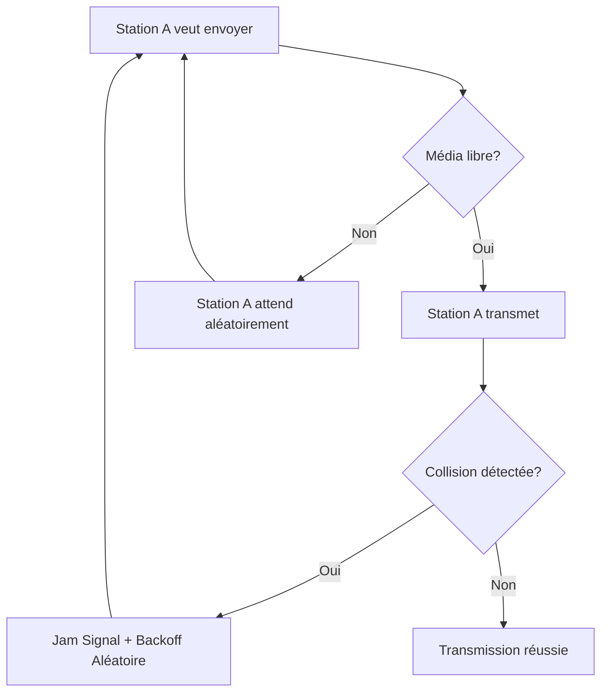

---
aliases:
  - "Domaine de Collision"
  - "Collision Domain"
archetype: concept-reseau
couche_osi:
  - "Couche 1 - Physique"
  - "Couche 2 - Liaison"
technologie:
  - "Ethernet"
  - "CSMA/CD"
  - "Half-Duplex"
cssclasses:
  - max
tags:
  - domaine-collision
  - reseau
  - reseau/segmentation
  - mode-transmission/semi-duplex
  - bande-passante/partagee
  - latence
  - protocole/csma/cd
  - materiel/reseau/hub
  - materiel/reseau/switch
  - materiel/reseau/routeur
  - modele-osi/couche-1
  - modele-osi/couche-2
  - modele-osi/couche-3
  - communication/full-duplex
  - reseau/depannage
  - reseau/scalabilite
  - retransmission
  - jam-signal
  - binary-exponential-backoff
---

# Collision Domain

> [!abstract] Définition
> Un **domaine de collision** est un segment de réseau où des paquets de données peuvent entrer en collision si plusieurs appareils tentent de transmettre simultanément. Ce phénomène se produit principalement dans les environnements à communication *half-duplex* (semi-duplex) et avec une bande passante partagée, comme les anciennes configurations Ethernet utilisant des hubs. Les collisions dégradent les performances du réseau en exigeant des retransmissions et en introduisant de la latence.

## ⚙️ Mécanisme & Fonctionnement

Dans un domaine de collision, un seul appareil peut transmettre des données à la fois. Si deux appareils ou plus tentent d'émettre simultanément, leurs signaux se chevauchent, corrompant les données et nécessitant une retransmission. Ce processus est géré par des protocoles tels que **CSMA/CD (Carrier Sense Multiple Access with Collision Detection)** dans les réseaux Ethernet.

*   **CSMA/CD**: Les appareils "écoutent" le réseau avant de transmettre (détection de porteuse, *carrier sense*). Si le médium est libre, ils commencent à émettre. Si une collision est détectée pendant la transmission, ils arrêtent, envoient un "signal de brouillage" (*jam signal*), puis attendent une durée aléatoire avant de retenter la transmission (détection de collision, *collision detection*).

### Dispositifs Réseau Impactés : Hubs vs. Switches

*   **Hubs (Concentrateurs)** :
    *   Les hubs opèrent à la **Couche 1 - Physique** du modèle OSI.
    *   Ce sont des répéteurs multi-ports qui transmettent indistinctement tout signal entrant sur un port vers tous les autres ports.
    *   Par conséquent, tous les appareils connectés à un hub appartiennent au *même domaine de collision unique*. Cela signifie que seul un appareil connecté au hub peut transmettre à un moment donné sans provoquer de collision, limitant considérablement l'efficacité du réseau à mesure que le nombre d'appareils augmente.

*   **Switches (Commutateurs)** :
    *   Les switches opèrent à la **Couche 2 - Liaison** du modèle OSI.
    *   Contrairement aux hubs, les switches transmettent intelligemment les trames de données uniquement au port de destination spécifique, en se basant sur les adresses MAC.
    *   Chaque port d'un switch crée son *propre domaine de collision dédié*. Cette segmentation réduit ou élimine considérablement les collisions, en particulier lorsque le switch fonctionne en mode **full-duplex**, où les appareils peuvent envoyer et recevoir des données simultanément. Même en mode half-duplex, un switch isole les domaines de collision par port. Les réseaux modernes reposent en grande partie sur les switches et la communication full-duplex pour éviter les problèmes liés aux domaines de collision.

*   **Routers (Routeurs)** :
    *   Les routeurs opèrent à la **Couche 3 - Réseau** du modèle OSI.
    *   Chaque interface d'un routeur délimite un domaine de collision distinct, ainsi qu'un domaine de diffusion.

### Encapsulation / Traitement
*   **Entrée** : Une trame Ethernet prête à être transmise sur un support partagé.
*   **Action** :
    1.  **Écoute du support (Carrier Sense)** : La station vérifie si le médium de transmission est libre.
    2.  **Transmission**: Si le support est libre, la station commence à envoyer la trame.
    3.  **Détection de collision (Collision Detection)** : Pendant la transmission, la station continue de surveiller le support pour détecter une augmentation de tension ou un chevauchement de signaux, indiquant une collision.
    4.  **Signalisation de collision**: Si une collision est détectée, la station envoie un "jam signal" pour informer toutes les autres stations de la collision.
    5.  **Attente et Retransmission**: La station attend une durée aléatoire (selon l'algorithme de *binary exponential backoff*) avant de tenter de retransmettre la trame.
*   **Sortie** : Trame transmise avec succès ou retransmission suite à une collision.

## 💡 Cas d'Usage Typique
1.  **Optimisation des performances réseau** : La réduction ou l'élimination des domaines de collision améliore le débit et réduit la latence en minimisant les retransmissions de données.
2.  **Conception de réseau** : L'utilisation de commutateurs (switches) et de la communication full-duplex permet de segmenter efficacement les réseaux et d'éliminer les collisions, ce qui est crucial pour les infrastructures modernes à haute bande passante.
3.  **Dépannage** : Comprendre les domaines de collision est essentiel pour identifier les goulots d'étranglement et les problèmes de performance, en particulier dans les réseaux plus anciens ou hybrides.
4.  **Évolutivité** : La segmentation des domaines de collision facilite l'extension des réseaux sans dégrader les performances, permettant une meilleure gestion du trafic à mesure que le réseau grandit.

## ⚠️ Limitations & Problèmes
> [!warning] Points d'attention
> *   **Performance** : Les collisions entraînent une dégradation significative des performances réseau, une utilisation inefficace de la bande passante et une latence accrue due aux retransmissions de paquets.
> *   **Évolutivité** : Les grands domaines de collision (typiques des réseaux à hubs) ne sont pas adaptés aux besoins des réseaux modernes, car l'augmentation du nombre de périphériques accroit exponentiellement le risque de collisions et de défaillances réseau.
> *   **Équipements hérités** : L'utilisation de hubs ou de répéteurs crée des domaines de collision étendus, rendant ces équipements obsolètes pour les applications à forte bande passante d'aujourd'hui.
> *   **Latence de détection** : Si un domaine de collision est trop grand, une "late collision" (collision tardive) peut se produire où la première station finit de transmettre avant de recevoir le signal de collision. Cela entraîne une perte de paquet non détectée et une inefficacité accrue du réseau.