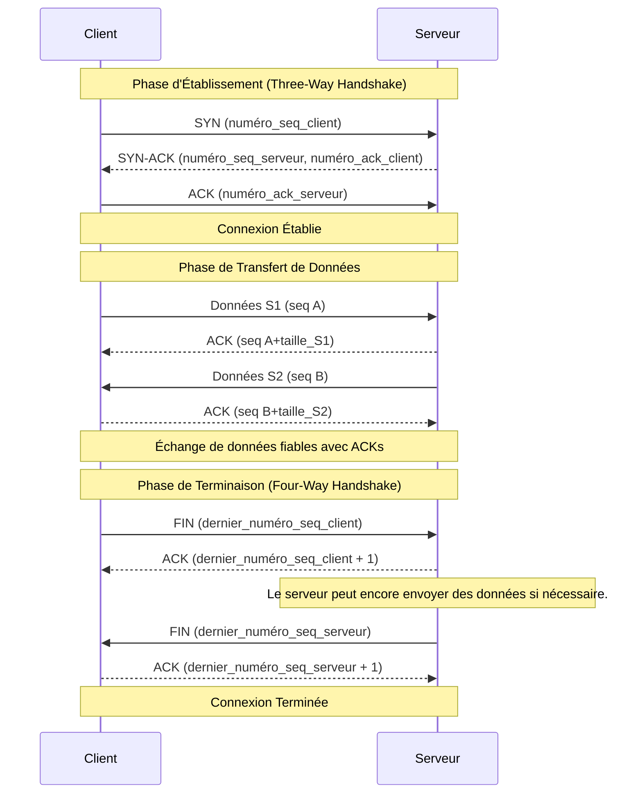

---
cssclasses:
  - max
aliases:
  - Communication Orientée Connexion
  - Connection Oriented Communication
  - COC
  - Communication à Circuit Virtuel
archetype: concept-reseau
couche_osi:
  - Couche 4 - Transport
technologie:
  - TCP
  - X.25
  - ATM
  - Frame Relay
  - MPLS
  - SCTP
tags:
  - protocole/orientee-connexion
  - protocole/tcp
  - protocole/tcp/etablissement-connexion
  - protocole/tcp/terminaison-connexion
  - communication/handshake
  - protocole/tcp/acquittement
  - protocole/tcp/controle-flux
  - protocole/tcp/controle-erreur
  - fiabilite
  - encapsulation
  - gestion-session
  - modele/tcp-ip/couche-transport
  - connexion/controle
  - protocole/ip
---

# Communication Orientée Connexion

> [!abstract] Définition
> La communication orientée connexion est un mode de communication réseau où une **session** ou une **connexion logique (virtuelle)** est préalablement établie entre deux entités communicantes avant tout transfert de données utiles. Cette connexion garantit que les données seront livrées dans le bon ordre et de manière fiable, à l'instar d'un appel téléphonique où une ligne est dédiée pour la durée de la conversation.

## ⚙️ Mécanisme & Fonctionnement

La communication orientée connexion se caractérise par un processus en trois phases distinctes : l'établissement de la connexion, le transfert des données et la terminaison de la connexion. Ce mécanisme permet de maintenir l'état de la communication et d'assurer une livraison ordonnée et fiable.

### Phases de Communication

1.  **Phase d'Établissement (Connection Establishment)**:
    Avant l'échange de données, les deux parties négocient et établissent une connexion logique. Le protocole le plus courant pour cette phase est le **Three-Way Handshake** (poignée de main en trois étapes) du protocole TCP.
    *   **SYN (Synchronize)**: Le client envoie un segment SYN au serveur pour initier la connexion et synchroniser les numéros de séquence.
    *   **SYN-ACK (Synchronize-Acknowledge)**: Le serveur répond avec un segment SYN-ACK pour accuser réception de la demande du client et synchroniser ses propres numéros de séquence.
    *   **ACK (Acknowledge)**: Le client envoie un segment ACK final pour confirmer l'établissement de la connexion.
    Durant cette phase, les paramètres de connexion sont négociés et un **circuit virtuel** est mis en place, identifié par un identifiant de circuit virtuel (VCI) dans certains protocoles de couche inférieure.

2.  **Phase de Transfert de Données (Data Transfer)**:
    Une fois la connexion établie, les données peuvent être échangées. Les données de l'application sont segmentées en paquets, chacun étant numéroté pour garantir leur ordre. Le protocole assure :
    *   **Livraison ordonnée**: Les paquets arrivent à destination dans le même ordre qu'ils ont été envoyés.
    *   **Accusés de réception (ACKs)**: Le récepteur envoie des ACK pour confirmer la bonne réception des paquets.
    *   **Récupération d'erreurs et retransmission**: Si un paquet est perdu ou corrompu, le récepteur ne l'accuse pas, déclenchant une retransmission par l'expéditeur.
    *   **Contrôle de flux**: Empêche le récepteur ou le réseau d'être submergé en gérant le débit de transmission.

3.  **Phase de Terminaison (Connection Termination)**:
    Lorsque la communication est terminée, la connexion est coupée pour libérer les ressources. Ceci est souvent réalisé par une **poignée de main en quatre étapes** (four-way handshake) pour TCP.
    *   **FIN (Finish)**: Une des parties (client ou serveur) envoie un segment FIN pour indiquer qu'elle n'a plus de données à envoyer.
    *   **ACK**: L'autre partie accuse réception du FIN.
    *   **FIN**: L'autre partie envoie à son tour un segment FIN quand elle est prête à fermer sa propre direction de la connexion.
    *   **ACK**: La première partie accuse réception du second FIN, et la connexion est entièrement terminée.

### Encapsulation / Traitement
*   **Entrée** : Flux de données de l'application (octets).
*   **Action** : Les données sont segmentées. À chaque segment, un en-tête TCP est ajouté, incluant des numéros de séquence, des numéros d'acquittement, et des drapeaux (SYN, ACK, FIN) pour gérer l'état de la connexion. Ce segment TCP est ensuite encapsulé dans un datagramme IP. Le processus maintient un état de connexion (par ex., SYN_SENT, ESTABLISHED, FIN_WAIT) pour suivre le dialogue.
*   **Sortie** : Datagrammes IP contenant les segments TCP, prêts à être transmis à la couche réseau.

## 💡 Cas d'Usage Typique
Les communications orientées connexion sont utilisées chaque fois que la **fiabilité**, l'**ordre** des données et l'**intégrité** sont primordiaux.
1.  **Navigation Web (HTTP/HTTPS)** : Garantit que les pages web se chargent complètement et correctement.
2.  **Courrier Électronique (SMTP, POP3, IMAP)** : Assure la transmission complète et sécurisée des messages.
3.  **Transfert de Fichiers (FTP, SFTP)** : Empêche la corruption des fichiers lors de transferts importants.
4.  **Administration à Distance (SSH)** : Maintient une communication fiable pour la gestion à distance.
5.  **Streaming de Données** : Dans des contextes où la livraison garantie est plus importante que la latence minimale, même si UDP est plus courant pour le streaming temps réel.

## ⚠️ Limitations & Problèmes

> [!warning] Points d'attention
> *   **Performance** : L'établissement et la terminaison de la connexion (handshakes), ainsi que les mécanismes d'acquittement et de retransmission, introduisent une surcharge (overhead) significative. Cela peut entraîner une latence plus élevée par rapport aux communications sans connexion, rendant cette approche moins adaptée aux applications très sensibles au délai (comme la voix sur IP en temps réel).
> *   **Consommation de ressources** : Le maintien de l'état de chaque connexion (mémoire tampon, numéros de séquence, timers) consomme des ressources système sur les hôtes et les équipements réseau.
> *   **Sécurité** : Bien que plus fiable, TCP n'est pas exempt de vulnérabilités, notamment les attaques par déni de service (DoS), le détournement de connexion (connection hijacking) et les attaques de réinitialisation (reset attacks). La nature "stateful" de ces protocoles peut être exploitée.