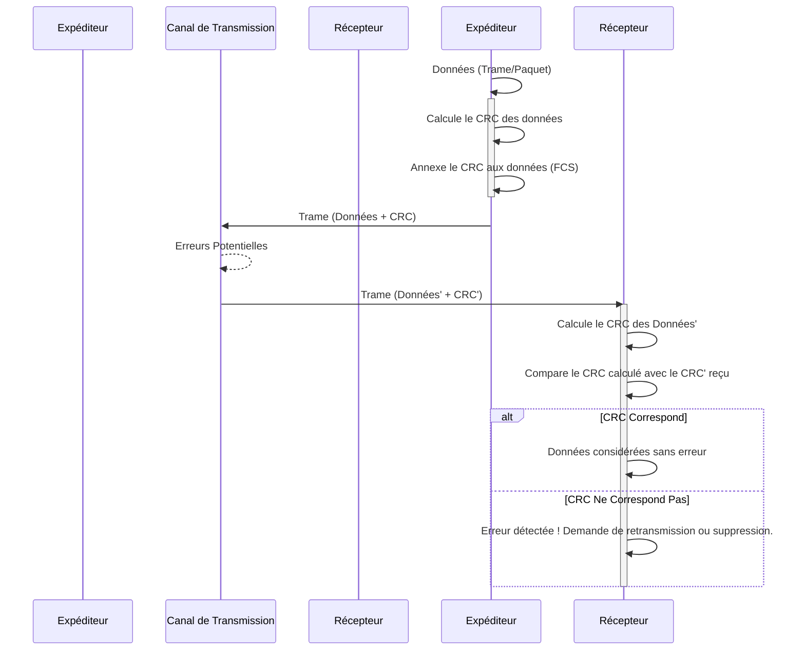

---
aliases:
  - Contrôle de Redondance Cyclique
  - Cyclic Redundancy Check
  - CRC
  - CRC Error Detection
archetype: concept-reseau
couche_osi:
  - "Couche 1 - Physique"
  - "Couche 2 - Liaison"
technologie:
  - Error Detection
  - Data Integrity
cssclasses:
  - max
tags:
  - crc
  - detection-erreur
  - checksum
  - redondance
  - mecanisme
  - protocole/pdu/trame
  - reseau/transmission-donnees
---

# Cyclic Redundancy Check

> [!abstract] Définition
> Le *Cyclic Redundancy Check* (CRC), ou **Contrôle de Redondance Cyclique**, est un code de détection d'erreurs largement utilisé dans les réseaux numériques et les dispositifs de stockage pour identifier les altérations accidentelles des données numériques. Il génère une valeur de contrôle de longueur fixe (checksum) basée sur un calcul polynomial de son contenu.

## ⚙️ Mécanisme & Fonctionnement

Le CRC fonctionne en traitant un bloc de données comme un long nombre binaire, puis en effectuant une division polynomiale sur ce nombre.

### Principe de Fonctionnement
Le principe fondamental du CRC repose sur l'idée d'ajouter une information *redondante* aux données d'origine, permettant au récepteur de vérifier l'intégrité de ces dernières. L'expéditeur calcule une valeur CRC (le reste d'une division binaire spécifique) et l'annexe aux données. Le récepteur effectue la même opération de calcul. Si la valeur CRC calculée localement correspond à celle reçue, les données sont considérées comme exemptes d'erreurs de transmission. Dans le cas contraire, une corruption des données est détectée.

Les CRC sont particulièrement efficaces pour détecter les *erreurs en rafale* (burst errors), c'est-à-dire des séquences contiguës de bits erronés, ce qui est courant dans de nombreux canaux de communication.

### Calcul du CRC
Le processus de calcul du CRC implique une arithmétique polynomiale binaire (modulo-2).

1.  **Sélection du Polynôme Générateur :** Un polynôme générateur (ou diviseur) `G(x)` de degré `n` est choisi et convenu entre l'expéditeur et le destinataire. Ce polynôme est représenté par une séquence binaire.
2.  **Extension des Données :** Les `k` bits de données d'origine `M(x)` sont complétés par `n` zéros à leur extrémité droite. Cela équivaut à multiplier `M(x)` par `x^n`.
3.  **Division Binaire :** Une division binaire est effectuée entre les données étendues et le polynôme générateur `G(x)`. Cette division utilise des opérations XOR (ou addition/soustraction modulo-2) au lieu des opérations arithmétiques habituelles.
4.  **Génération du CRC :** Le reste de cette division est le code CRC, qui a une longueur de `n` bits.
5.  **Transmission :** Le code CRC est ajouté aux données d'origine (`M(x)`) pour former un "mot de code" (`M(x)x^n + R(x)`) qui est ensuite transmis.
6.  **Vérification à la Réception :** Le récepteur divise le mot de code reçu par le même polynôme générateur `G(x)`. Si le reste de cette division est zéro, cela signifie qu'aucune erreur n'a été détectée. Tout reste non nul indique une corruption des données.

**Exemple simplifié (conceptuel)** :
Imaginez que vous vouliez transmettre le nombre 1000. Vous choisissez un diviseur (par exemple, 6). La division de 1000 par 6 donne un quotient de 166 et un reste de 4. Vous transmettez alors le nombre 1000 et le reste 4. À la réception, le destinataire divise le 1000 reçu par 6. S'il obtient un reste de 4, il suppose que le 1000 est intact. Si, en raison d'une erreur de transmission, le nombre reçu est 998, la division par 6 donnerait un reste de 2. Puisque 2 ne correspond pas à 4, le récepteur sait qu'une erreur s'est produite. Le CRC applique ce même principe, mais avec des nombres binaires et une arithmétique polynomiale plus complexe.

### Encapsulation / Traitement
*   **Entrée** : Données brutes (payload) au niveau de la couche de liaison de données, souvent sous forme de trame ou de paquet.
*   **Action** :
    1.  L'émetteur prend la séquence de bits des données à transmettre.
    2.  Il calcule le CRC en utilisant le polynôme générateur prédéfini.
    3.  Le CRC obtenu est ajouté à la fin des données d'origine, formant le champ "Frame Check Sequence" (FCS) dans la bande-annonce (trailer) de la trame.
    4.  La trame complète (données + CRC) est transmise sur le canal.
    5.  À la réception, le récepteur sépare les données du CRC.
    6.  Il recalcule le CRC sur les données reçues en utilisant le même polynôme générateur.
    7.  Le CRC calculé est comparé au CRC reçu (FCS).
*   **Sortie** : Si les CRC correspondent, la trame est acceptée et transmise aux couches supérieures. Si les CRC ne correspondent pas, la trame est généralement rejetée et peut déclencher une demande de retransmission.

## 💡 Cas d'Usage Typique
Le CRC est un mécanisme fondamental pour garantir l'intégrité des données dans de nombreux scénarios techniques :

1.  **Communications Réseau** : Le CRC est intrinsèquement intégré dans les protocoles de la couche de liaison de données (Layer 2) et de la couche physique (Layer 1) du modèle OSI. Il est essentiel pour la détection d'erreurs dans les trames Ethernet, les paquets Wi-Fi, les transmissions USB et Bluetooth, assurant la fiabilité des échanges entre nœuds.
2.  **Stockage de Données** : Il est largement utilisé dans les systèmes de fichiers, les disques durs (HDD), les disques SSD (Solid State Drives) et les mémoires flash pour vérifier l'intégrité des blocs de données lors de leur écriture et de leur lecture, prévenant ainsi la corruption silencieuse.
3.  **Transferts de Fichiers et Protocoles** : De nombreux protocoles de transfert de fichiers et de communication de bas niveau intègrent le CRC pour valider l'exactitude des données échangées, garantissant que les fichiers et messages arrivent intacts.

## ⚠️ Limitations & Problèmes
> [!warning] Points d'attention
> *   **Performance** : Le calcul du CRC est conçu pour être très efficace et rapide. Il est souvent implémenté directement en matériel (par exemple, dans les cartes d'interface réseau - NIC), ce qui minimise son impact sur la performance du processeur et la bande passante, même à des débits élevés.
> *   **Sécurité** : Le CRC n'est *pas* un mécanisme de sécurité cryptographique. Il ne fournit aucune protection contre les modifications *intentionnelles* des données. Un attaquant pourrait facilement altérer les données et recalculer un nouveau CRC valide, rendant la falsification indétectable par ce moyen. Il est conçu pour détecter les erreurs *accidentelles*.
> *   **Correction d'Erreurs** : Le CRC est un code de *détection* d'erreurs, et non de *correction*. Lorsqu'une erreur est détectée, le mécanisme CRC ne peut pas restaurer les données d'origine. La réponse typique est de rejeter la trame ou le paquet corrompu et de demander une retransmission à l'expéditeur.
> *   **Détection d'Erreurs Multiples** : Bien que les CRC soient excellents pour détecter les erreurs simples et en rafale, l'efficacité pour détecter des motifs d'erreurs multiples plus complexes dépend fortement du polynôme générateur spécifique choisi. Certains motifs d'erreurs multiples peuvent ne pas être détectés par certains polynômes CRC.