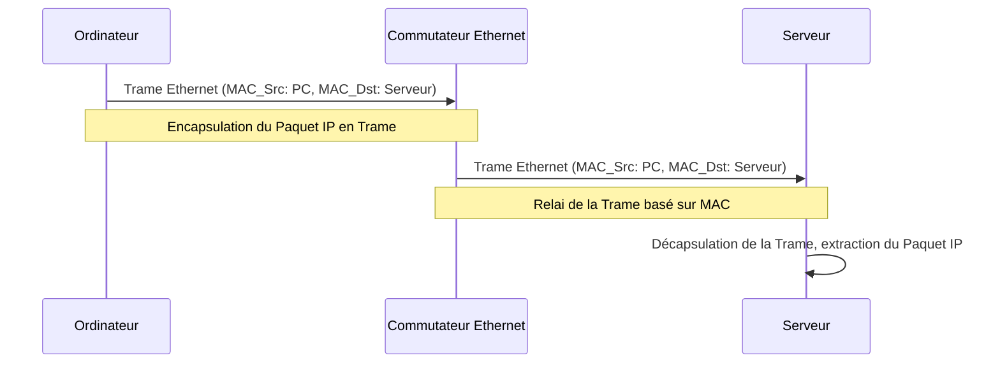

---
aliases:
  - Trame de Liaison
  - Data Link Frame
  - Frame
  - Ethernet Frame
  - Mac Frame
archetype: concept-reseau
couche_osi:
  - "Couche 2 - Liaison"
technologie:
  - Ethernet
  - IEEE 802.3
cssclasses:
  - max
tags:
  - protocole/pdu/trame
  - modele-osi/couche-2
  - protocole/ethernet
  - mecanisme/encapsulation
  - detection-erreur
  - reseau/adressage/mac
  - crc
  - protocole/ethernet/preamble
  - protocole/ethernet/sfd
  - ethertype
  - paquet
  - reseau/lan
  - synchronisation/horloge
  - controle-erreur
---

# Data Link Frame

> [!abstract] Définition
> Une **Trame de Liaison** (ou *Data Link Frame*) est l'unité de données protocolaire ([[ProtocolDataUnit|PDU]]) de la **Couche 2** du modèle OSI. Elle est responsable du transport fiable des données entre deux nœuds directement connectés sur un segment de réseau local. La trame encapsule des données provenant de la couche réseau (généralement un paquet IP) en y ajoutant des informations d'en-tête et de fin pour la livraison physique, le contrôle d'erreur et la gestion du flux de données.

## ⚙️ Mécanisme & Fonctionnement

La trame de liaison est fondamentale pour la communication au sein d'un réseau local (LAN). Elle permet aux équipements (comme les commutateurs et les cartes réseau) de diriger les données vers la bonne destination physique et de détecter d'éventuelles erreurs de transmission.

### Structure et Composants d'une Trame

La structure exacte d'une trame varie selon le protocole de la couche liaison de données (ex: Ethernet, Wi-Fi), mais les composants fondamentaux restent similaires. L'exemple le plus courant est la trame Ethernet (IEEE 802.3).

*   **Préambule (Preamble)** : Séquence de 7 octets alternant 1 et 0 (10101010) utilisée pour la synchronisation des horloges entre l'émetteur et le récepteur.
*   **Délimiteur de début de trame (Start Frame Delimiter - SFD)** : Un octet (10101011) qui signale la fin du préambule et le début des informations de la trame.
*   **Adresse MAC de Destination (Destination MAC Address)** : Champ de 6 octets identifiant l'adresse physique (MAC) du périphérique destinataire de la trame sur le segment de réseau local.
*   **Adresse MAC Source (Source MAC Address)** : Champ de 6 octets identifiant l'adresse physique (MAC) du périphérique émetteur de la trame.
*   **Champ Type/Longueur (Type/Length Field)** : Champ de 2 octets.
    *   S'il est supérieur ou égal à 1536 (0x0600), il indique le *Type* du protocole encapsulé dans la trame (ex: 0x0800 pour IPv4, 0x0806 pour ARP, 0x86DD pour IPv6).
    *   S'il est inférieur ou égal à 1500, il indique la *Longueur* de la charge utile (données) en octets.
*   **Données (Data / Payload)** : Contient le paquet de la couche réseau (par exemple, un paquet IP) ou d'autres données encapsulées. Sa taille varie généralement de 46 à 1500 octets pour Ethernet. Si les données sont inférieures à 46 octets, un *remplissage* (padding) est ajouté pour atteindre la taille minimale de la charge utile.
*   **Séquence de Contrôle de Trame (Frame Check Sequence - FCS / CRC)** : Champ de 4 octets à la fin de la trame, contenant une valeur de *Cyclic Redundancy Check* (CRC). Cette valeur est calculée par l'émetteur sur l'ensemble de la trame (adresses, type/longueur, données) et est recalculée par le récepteur pour vérifier l'intégrité des données reçues. Si les valeurs ne correspondent pas, la trame est considérée comme corrompue et est généralement rejetée.

### Encapsulation / Traitement
Les trames sont le résultat du processus d'encapsulation qui se déroule au niveau de la couche liaison de données.

*   **Entrée** : Un **Paquet** (PDU de couche 3, ex: Paquet IP) est reçu de la couche réseau.
*   **Action** :
    1.  La couche liaison de données ajoute un **en-tête** (Préambule, SFD, Adresses MAC Source/Destination, Type/Longueur) au début du paquet.
    2.  Elle ajoute une **queue** (FCS/CRC) à la fin du paquet.
    3.  Si nécessaire, un *remplissage* est ajouté pour atteindre la taille minimale de la charge utile.
*   **Sortie** : Une **Trame de Liaison** est formée et passée à la couche physique pour être convertie en signaux électriques ou optiques et transmise sur le support physique.

## 💡 Cas d'Usage Typique
1.  **Communication Locale** : Les trames permettent la communication directe entre des appareils sur le même segment de réseau local. Les commutateurs utilisent les adresses MAC des trames pour transférer les données vers le bon port et le bon appareil.
2.  **Détection d'Erreurs** : Grâce au champ FCS/CRC, les trames permettent aux récepteurs de détecter les erreurs de transmission sur le support physique et de rejeter les données corrompues, assurant ainsi une certaine intégrité des données au niveau de la couche 2.
3.  **Identification du Protocole de Couche Supérieure** : Le champ Type/Longueur dans les trames Ethernet permet au système d'exploitation du récepteur de savoir à quel protocole de couche réseau (par exemple, IPv4 ou IPv6) le contenu de la charge utile doit être remis, facilitant le processus de décapsulation.

## ⚠️ Limitations & Problèmes
> [!warning] Points d'attention
> *   **Non routable** : Les trames de liaison ne sont pas routables au-delà du réseau local. Elles utilisent des adresses MAC qui ne sont pertinentes que sur un segment de réseau partagé. Pour la communication inter-réseaux, les paquets IP (couche 3) et les routeurs sont nécessaires.
> *   **Surcharge (Overhead)** : Chaque trame ajoute un *overhead* (en-têtes et queues) aux données utiles. Bien que cet overhead soit relativement faible (environ 26 octets pour Ethernet sans VLAN tag), il réduit légèrement la bande passante effective disponible pour les données d'application.
> *   **Taille Maximale (MTU)** : La taille maximale d'une trame (Maximum Transmission Unit - MTU, généralement 1500 octets pour la charge utile Ethernet) limite la quantité de données qui peut être transmise en une seule fois. Des paquets plus grands doivent être fragmentés au niveau de la couche réseau, ce qui peut entraîner des inefficacités.