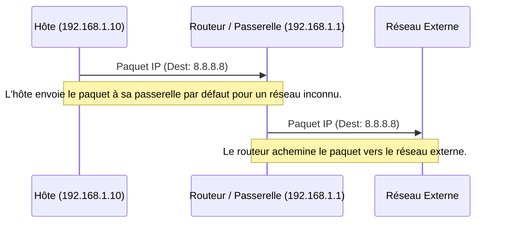

---
aliases:
  - "Passerelle par Défaut"
  - "Default Gateway"
  - "Gateway"
archetype: concept-reseau
couche_osi:
  - "Couche 3 - Réseau"
technologie:
  - "Routage IP"
cssclasses:
  - max
tags:
  - reseau/passerelle-par-defaut
  - reseau
  - routeur
  - routage
  - routage/table
  - protocole/ip
  - paquet
  - trame
  - encapsulation
  - decapsulation
  - modele-osi/couche-3
  - reseau/couche-3
  - protocole/dhcp
  - internet/acces
  - interconnexion-reseau
  - reseau/congestion
  - risque
  - securite/reseau
  - attaque/deni-de-service
  - systeme/fiabilite/defaillance-unique
---

# Default Gateway

> [!abstract] Définition
> La **passerelle par défaut** est l'adresse IP d'un routeur sur un réseau local à laquelle le trafic réseau est envoyé lorsqu'il est destiné à une destination en dehors du réseau local actuel. Elle agit comme le point de sortie principal pour la communication avec des réseaux externes, y compris Internet.

## ⚙️ Mécanisme & Fonctionnement
Au niveau de la **couche réseau (couche 3)** du modèle OSI, lorsqu'un hôte doit envoyer un paquet IP à une adresse de destination qui n'appartient pas à son sous-réseau local, il consulte sa **table de routage**. Si aucune route spécifique n'est trouvée pour cette destination, l'hôte transfère le paquet à l'adresse IP de sa passerelle par défaut. La passerelle par défaut, qui est typiquement un **routeur**, prend alors la responsabilité d'acheminer le paquet vers sa destination finale à travers d'autres réseaux. La passerelle est configurée sur chaque hôte du réseau, généralement de manière automatique via DHCP ou manuellement.

### Encapsulation / Traitement
*   **Entrée** : Un paquet IP dont l'adresse de destination est située en dehors du sous-réseau local de l'hôte émetteur. L'adresse MAC de destination de la trame de liaison est celle de la passerelle par défaut.
*   **Action** : L'hôte consulte sa table de routage. En l'absence de route spécifique pour la destination, il encapsule le paquet IP dans une trame de couche 2 dont l'adresse MAC de destination est celle de la passerelle par défaut. Le routeur (passerelle) reçoit la trame, la décapsule pour extraire le paquet IP, examine l'adresse IP de destination, consulte sa propre table de routage et détermine le prochain saut. Il ré-encapsule ensuite le paquet IP dans une nouvelle trame pour l'interface de sortie appropriée.
*   **Sortie** : Un paquet IP routé par le routeur vers le réseau suivant ou la destination finale, prêt pour son prochain saut.

## 💡 Cas d'Usage Typique
Pourquoi l'utilise-t-on ?
1.  **Accès à Internet** : La passerelle par défaut est indispensable pour permettre à tous les hôtes d'un réseau local d'accéder aux ressources situées sur Internet. Tout le trafic non local est dirigé vers le routeur connecté au fournisseur d'accès Internet (FAI).
2.  **Communication inter-réseaux en entreprise** : Elle facilite la communication entre différents sous-réseaux au sein d'une organisation (par exemple, entre un VLAN des utilisateurs et un VLAN des serveurs) en désignant un routeur comme point central d'interconnexion.
3.  **Simplification du routage** : Elle simplifie la configuration de la table de routage des hôtes en éliminant le besoin d'une entrée spécifique pour chaque réseau externe possible. Au lieu de cela, une seule route par défaut suffit.

## ⚠️ Limitations & Problèmes
> [!warning] Points d'attention
> *   **Point de défaillance unique** : Si la passerelle par défaut tombe en panne ou est mal configurée, tous les hôtes qui en dépendent perdent leur connectivité aux réseaux externes, coupant ainsi l'accès à Internet ou aux autres segments de réseau.
> *   **Performance** : Le routeur agissant comme passerelle doit traiter tout le trafic sortant du réseau local. En cas de forte charge réseau, cela peut entraîner un goulot d'étranglement, impactant les performances globales.
> *   **Sécurité** : La passerelle par défaut est un point d'entrée et de sortie critique pour le réseau. Une mauvaise sécurisation ou configuration peut la rendre vulnérable aux attaques (par exemple, des attaques de déni de service, ou l'interception de trafic), compromettant la sécurité du réseau.