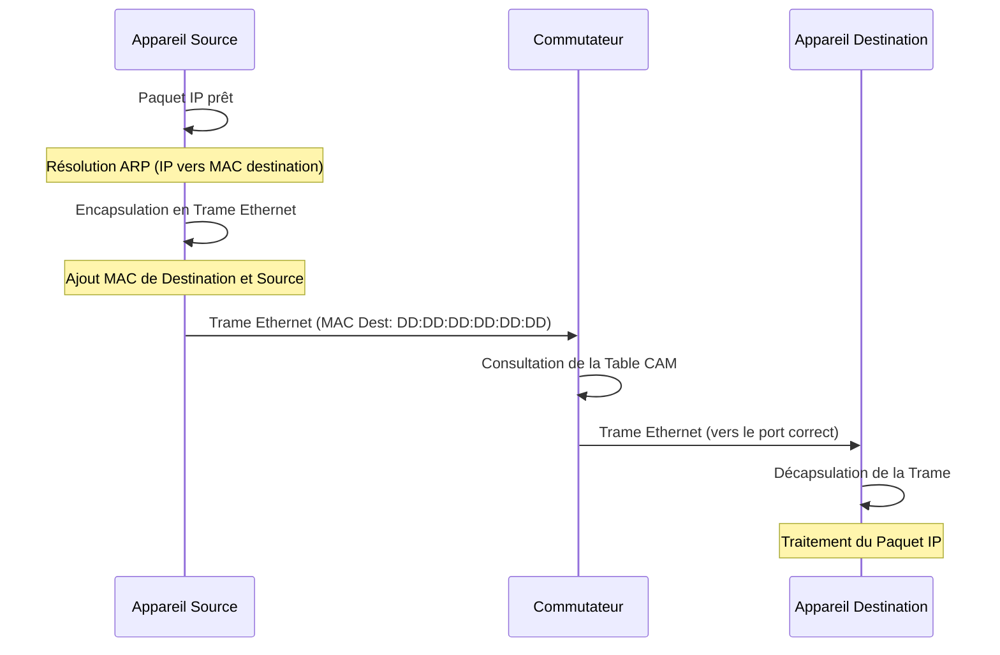

---
aliases:
  - "Adresse MAC de Destination"
  - "Destination MAC Address"
  - "MAC de destination"
archetype: concept-reseau
couche_osi:
  - "Couche 2 - Liaison"
technologie:
  - Ethernet
cssclasses:
  - max
tags:
  - reseau/adressage/mac
  - modele-osi/couche-2
  - protocole/ethernet
  - reseau/lan
  - materiel/reseau/switch
  - cam-table
  - protocole/arp
  - reseau/trame
  - mecanisme/encapsulation
  - reseau/unicast
  - reseau/multicast
  - reseau/broadcast
  - reseau/vlan
  - attaque/mac-spoofing
  - attaque/cam-table-overflow
  - reseau/flooding
  - reseau/commutation
  - reseau/routage
---

# Destination MAC Address

> [!abstract] Définition
> L'adresse MAC de destination est un identifiant physique de 48 bits (6 octets) utilisé au niveau de la couche liaison de données du modèle OSI pour spécifier le récepteur d'une trame Ethernet au sein d'un réseau local (LAN). Elle permet aux périphériques, comme les commutateurs, de diriger les trames vers le port de destination correct.

## ⚙️ Mécanisme & Fonctionnement
L'adresse MAC de destination joue un rôle crucial dans le processus d'acheminement des données au sein d'un segment de réseau local. Lorsque des données sont transmises, l'adresse MAC de destination est placée dans l'en-tête de la trame Ethernet pour indiquer le destinataire prévu.

### Encapsulation / Traitement
*   **Entrée** : Un paquet IP (couche 3) est reçu par la carte réseau d'une machine émettrice. Le protocole ARP (Address Resolution Protocol) est utilisé pour résoudre l'adresse IP de destination en son adresse MAC correspondante si elle n'est pas déjà connue.
*   **Action** : La couche liaison de données encapsule le paquet IP dans une trame Ethernet. L'adresse MAC de destination est insérée au début de l'en-tête Ethernet, suivie de l'adresse MAC source et du type [[EtherTypeField|EtherType]]. Le commutateur lit cette adresse MAC de destination pour déterminer sur quel port il doit transférer la trame. Il utilise sa table d'adresses MAC (CAM table) pour faire correspondre l'adresse MAC de destination avec un port de sortie. Si l'adresse n'est pas trouvée, la trame est diffusée sur tous les ports, sauf celui d'où elle provient (flooding).
*   **Sortie** : La trame Ethernet complète, contenant l'adresse MAC de destination, est transmise sur le support physique (ex: câble Ethernet) et reçue par le périphérique dont l'adresse MAC correspond à celle de destination. Le périphérique récepteur décapsule la trame, retire l'en-tête Ethernet et passe le paquet IP à la couche réseau pour traitement ultérieur.

## 💡 Cas d'Usage Typique
L'adresse MAC de destination est fondamentale pour l'opération de la couche liaison de données dans divers scénarios d'entreprise :
1.  **Communication Unicast Locale** : Elle permet à un périphérique d'envoyer des données directement à un autre périphérique spécifique sur le même segment de réseau local. Par exemple, un ordinateur accédant à un serveur de fichiers situé dans le même *VLAN*.
2.  **Redirection de Commutateur (Switching)** : Les commutateurs utilisent l'adresse MAC de destination pour apprendre les emplacements des périphériques et construire leurs tables CAM, ce qui leur permet de transmettre les trames de manière efficace vers le port de sortie correct, réduisant ainsi le trafic non nécessaire sur les autres ports.
3.  **Adresses Multicast et Broadcast** : Au-delà de l'unicast, l'adresse MAC de destination peut être une adresse de *multicast* (pour adresser un groupe de périphériques) ou une adresse de *broadcast* (FF:FF:FF:FF:FF:FF) pour envoyer des trames à tous les périphériques sur le segment LAN, comme lors des requêtes ARP initiales.

## ⚠️ Limitations & Problèmes
> [!warning] Points d'attention
> *   **Localisation et Portée** : Les adresses MAC de destination sont pertinentes uniquement pour la communication au sein d'un même domaine de diffusion (généralement un LAN ou un *VLAN*). Elles ne sont pas utilisées pour le routage entre différents réseaux IP. Un routeur changera l'adresse MAC de destination à chaque saut.
> *   **Sécurité** : La nature transparente de l'acheminement basé sur les adresses MAC dans les commutateurs peut être exploitée. Des attaques comme le *MAC spoofing* (usurpation d'adresse MAC) ou le *CAM table overflow* (inondation de la table MAC) peuvent perturber le réseau ou permettre l'interception de trafic.
> *   **Performance** : Si un commutateur ne connaît pas l'adresse MAC de destination, il doit diffuser la trame (flooding), ce qui peut augmenter l'utilisation de la bande passante et la charge de traitement pour les périphériques sur le segment. Un nombre excessif de diffusions peut dégrader les performances du réseau.