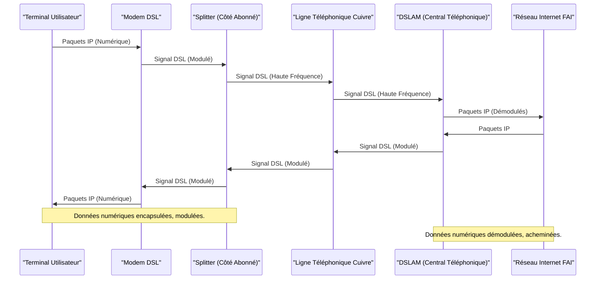

---
aliases:
  - "Digital Subscriber Line"
  - "DSL"
  - "Ligne d'abonné numérique"
  - "ADSL"
  - "VDSL"
archetype: concept-reseau
couche_osi:
  - "Couche 1 - Physique"
  - "Couche 2 - Liaison"
technologie:
  - "ADSL"
  - "VDSL"
cssclasses:
  - max
tags:
  - reseau/dsl
  - reseau/adsl
  - reseau/vdsl
  - reseau/cable/cuivre
  - materiel/reseau/modem
  - materiel/reseau/dslam
  - reseau/multiplexage-frequence
  - telecommunications/pots
  - modulation
  - demodulation
  - materiel/reseau/splitter
  - protocole/pppoe
  - protocole/atm
  - debit
  - reseau/performance
  - encapsulation
  - decapsulation
  - protocole/ip
  - reseau/trame
---

# Digital Subscriber Line (DSL)

> [!abstract] Définition
> La *Digital Subscriber Line* (DSL) est une famille de technologies qui permettent la transmission de données numériques à haut débit sur des lignes téléphoniques en cuivre existantes. Elle transforme une ligne téléphonique analogique standard en une ligne de données à large bande passante, rendant ainsi possible l'accès à internet tout en permettant les appels téléphoniques simultanément sur la même ligne.

## ⚙️ Mécanisme & Fonctionnement
Le fonctionnement de la DSL repose sur l'utilisation du *multiplexage par répartition en fréquence* (FDM) pour diviser la bande passante disponible sur la ligne téléphonique en plusieurs canaux. Ces canaux sont alloués à différentes fonctions : un canal pour la voix (POTS - Plain Old Telephone Service) et plusieurs canaux pour le transfert de données. Le canal vocal utilise la bande de fréquences la plus basse (typiquement 0 à 4 kHz), tandis que les données numériques sont transmises sur des fréquences plus élevées, évitant ainsi les interférences avec les communications vocales.

### Principes Techniques

*   **Modulation du Signal** : Les modems DSL convertissent les données numériques en signaux analogiques de haute fréquence qui peuvent voyager sur les lignes en cuivre. À l'autre extrémité (au central téléphonique de l'opérateur), un *DSLAM* (Digital Subscriber Line Access Multiplexer) démodule ces signaux pour récupérer les données numériques.
*   **Séparation des Fréquences** : Un filtre appelé *splitter* ou *micro-filtre* est utilisé chez l'abonné pour séparer le signal vocal du signal de données, dirigeant le premier vers le téléphone et le second vers le modem DSL. Au central, le DSLAM assure une fonction similaire.
*   **Distance et Débit** : La performance de la DSL, en particulier le débit, est fortement influencée par la distance entre le modem de l'abonné et le DSLAM, ainsi que par la qualité de la ligne en cuivre. Plus la distance est grande, plus l'[[SignalAttenuation|atténuation du signal]] est importante, entraînant une diminution du débit.

### Variantes de DSL

1.  **ADSL (Asymmetric Digital Subscriber Line)** :
    *   **Principe** : L'ADSL est "asymétrique" car les débits de téléchargement (*downstream*) sont significativement plus élevés que les débits d'envoi (*upstream*). Cela est optimisé pour les utilisateurs finaux qui consomment plus de données qu'ils n'en produisent (par exemple, navigation web, streaming vidéo).
    *   **Débits** : Typiquement, l'ADSL offre des débits descendants allant jusqu'à 8 Mbps (ADSL1) ou 24 Mbps (ADSL2+), et des débits montants allant jusqu'à 1 Mbps ou 3.5 Mbps (ADSL2+).
    *   **Fréquences** : Utilise une bande de fréquences d'environ 25 kHz à 1,1 MHz.

2.  **VDSL (Very High-Speed Digital Subscriber Line)** :
    *   **Principe** : La VDSL offre des débits beaucoup plus élevés que l'ADSL, mais sa portée est plus limitée. Elle est souvent déployée plus près de l'abonné, par exemple depuis une armoire de rue (FTTC - Fiber to the Curb), où la fibre optique apporte le signal jusqu'à l'armoire, et les derniers mètres sont en cuivre.
    *   **Débits** : La VDSL2 peut atteindre des débits descendants allant jusqu'à 100 Mbps et des débits montants de 50 Mbps sur de courtes distances (moins de 300 mètres).
    *   **Fréquences** : Utilise une bande de fréquences beaucoup plus large, allant jusqu'à 12 MHz ou même 30 MHz pour VDSL2.

### Composants Clés

*   **Modem DSL** : Équipement chez l'abonné qui module et démodule les signaux de données.
*   **Splitter/Micro-filtre** : Sépare les signaux voix et données chez l'abonné.
*   **DSLAM (Digital Subscriber Line Access Multiplexer)** : Situé au central téléphonique de l'opérateur, il agrège les connexions DSL de multiples abonnés et les connecte au réseau internet de l'opérateur.
*   **Ligne Téléphonique en Cuivre** : Le support physique sur lequel les signaux DSL sont transmis.

### Encapsulation / Traitement
*   **Entrée** : Paquets IP générés par les applications de l'utilisateur (Couche 3).
*   **Action** :
    1.  Les paquets IP sont encapsulés dans des trames de protocole de liaison de données (PPP sur Ethernet - PPPoE, ou ATM - Asynchronous Transfer Mode).
    2.  Ces trames sont ensuite segmentées et adaptées pour être modulées en signaux analogiques par le modem DSL.
    3.  Les signaux modulés sont envoyés sur la ligne en cuivre via la bande de fréquences dédiée aux données.
    4.  Au niveau du DSLAM, les signaux analogiques sont démodulés pour récupérer les trames de liaison.
    5.  Les trames sont ensuite acheminées vers le réseau IP de l'opérateur.
*   **Sortie** : Trame de données adaptée pour le transport sur la ligne en cuivre et, après décapsulation, paquets IP acheminés vers le réseau.

## 💡 Cas d'Usage Typique
1.  **Accès Internet Résidentiel et Professionnel** : La DSL est largement utilisée pour fournir un accès Internet à large bande aux foyers et aux petites et moyennes entreprises, particulièrement dans les zones où la fibre optique n'est pas encore disponible.
2.  **Solutions de Secours** : Dans certains scénarios, une connexion DSL peut servir de solution de secours (failover) pour une connexion principale en fibre optique ou autre technologie, garantissant une certaine continuité de service.

## ⚠️ Limitations & Problèmes
> [!warning] Points d'attention
> *   **Performance** :
    *   **Distance** : La performance (débit) de la DSL est fortement dégradée par la distance par rapport au DSLAM. Cela signifie que les abonnés éloignés du central téléphonique ou de l'armoire de rue auront des vitesses beaucoup plus faibles.
    *   **Interférences** : Les lignes en cuivre sont sensibles aux interférences électromagnétiques, ce qui peut affecter la stabilité et le débit de la connexion.
    *   **Symétrie** : L'ADSL, la variante la plus répandue, est asymétrique, ce qui peut être une limitation pour les usages nécessitant un débit montant élevé (télétravail avec visioconférence intensive, hébergement de serveurs).
*   **Sécurité** : Bien que la DSL elle-même n'introduise pas de vulnérabilités majeures spécifiques, le fait qu'elle utilise un réseau partagé (DSLAMS) peut, théoriquement, présenter des risques si l'équipement n'est pas correctement sécurisé. Cependant, les opérateurs mettent en place des mesures d'isolation pour chaque abonné.
*   **Obsolescence** : Face à l'essor de la fibre optique (FTTH), qui offre des débits et une stabilité bien supérieurs, la DSL est progressivement remplacée dans de nombreuses régions.