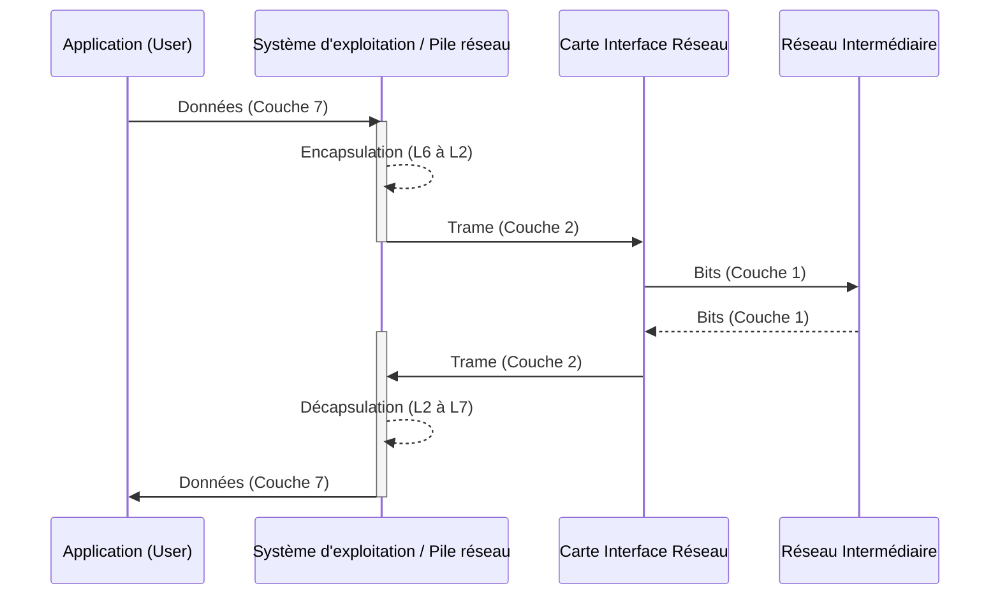

---
aliases:
  - Terminaux
  - Périphériques finaux
  - Endpoint Devices
archetype: concept-reseau
couche_osi:
  - "Couche 1 - Physique"
  - "Couche 2 - Liaison"
  - "Couche 3 - Réseau"
  - "Couche 4 - Transport"
  - "Couche 5 - Session"
  - "Couche 6 - Présentation"
  - "Couche 7 - Application"
technologie:
  - Workstations
  - Servers
  - IoT Devices
  - Mobile Devices
cssclasses:
  - max
tags:
  - architecture
  - architecture/reseau
  - reseau
  - reseau/materiel
  - device
  - device/end-device
  - peripherique
  - modele-osi
  - encapsulation
  - decapsulation
  - materiel/carte-reseau
  - endpoint-security
  - vulnerabilite
  - serveur
  - materiel/ordinateur
  - appareil/smartphone
  - iot
  - application/voip
---

# End Devices

> [!abstract] Définition
> Les **End Devices**, ou *terminaux*, sont les composants d'un réseau informatique qui initient ou terminent le flux de données. Ce sont les points d'interaction entre les utilisateurs et le réseau sous-jacent, servant de sources ou de destinations pour les informations transmises. Chaque terminal sur un réseau est identifié par une adresse unique, telle qu'une adresse IP, pour permettre une communication ciblée.

## ⚙️ Mécanisme & Fonctionnement

Les End Devices sont essentiels car ils sont à l'origine et à la fin de toutes les communications réseau. Ils sont dotés de **cartes d'interface réseau (NIC)**, qu'elles soient filaires ou sans fil, qui leur permettent de se connecter au réseau et d'envoyer ou de recevoir des données. Un End Device ne génère pas de données utilisateur, il ne fait que filtrer et transmettre les données utilisateur.

Le fonctionnement des terminaux s'étend à travers toutes les couches du modèle OSI :

*   **Couche Application (Couche 7)** : Les applications utilisateur (navigateurs web, clients email) interagissent directement avec cette couche pour initier la communication.
*   **Couche Présentation (Couche 6)** : Les données sont préparées, formatées, compressées ou chiffrées pour être exploitables par la couche application.
*   **Couche Session (Couche 5)** : Les sessions de communication entre les applications sont établies, gérées et terminées.
*   **Couche Transport (Couche 4)** : Assure la livraison de bout en bout des données entre les applications, gérant la segmentation, le contrôle de flux et la correction d'erreurs (ex: TCP, UDP).
*   **Couche Réseau (Couche 3)** : Gère l'adressage (IP), le routage et le transfert des paquets de données à travers différents réseaux.
*   **Couche Liaison de Données (Couche 2)** : Gère le transfert de données entre nœuds sur le même réseau local (LAN) en utilisant les adresses MAC des cartes réseau.
*   **Couche Physique (Couche 1)** : Responsable de la transmission des bits bruts sur le support physique (câbles, ondes radio).

### Encapsulation / Traitement
*   **Entrée** : Données générées par une application utilisateur (ex: email, requête web).
*   **Action** : Les données traversent la pile protocolaire du terminal (du haut vers le bas du modèle OSI). À chaque couche, des en-têtes et/ou des pieds de page sont ajoutés (encapsulation), transformant les données en segments, paquets, trames et enfin en bits.
*   **Sortie** : Bits transmis via l'interface réseau vers le support de transmission (câble, ondes).

## 💡 Cas d'Usage Typique

Les End Devices sont omniprésents et essentiels pour la fonctionnalité de tout réseau. Voici quelques cas d'usage typiques :
1.  **Stations de travail et serveurs** : Les ordinateurs de bureau, les ordinateurs portables et les serveurs sont des terminaux fondamentaux. Les serveurs fournissent des services (web, email, fichiers) aux clients, tandis que les clients demandent et affichent ces informations.
2.  **Appareils mobiles** : Smartphones, tablettes et autres appareils portables permettent la connectivité en déplacement, l'accès aux applications et la communication.
3.  **Périphériques d'impression et de numérisation** : Les imprimantes et scanners réseau sont des terminaux qui partagent des ressources d'impression et de numérisation au sein d'un réseau.
4.  **Dispositifs IoT (Internet des Objets)** : Caméras de sécurité, capteurs, thermostats intelligents et autres appareils connectés qui collectent et échangent des données dans divers environnements.
5.  **Terminaux de communication spécialisés** : Téléphones VoIP (Voice over IP) et systèmes de téléprésence.

## ⚠️ Limitations & Problèmes

> [!warning] Points d'attention
> Les End Devices constituent souvent la **première ligne de contact** avec les acteurs malveillants et représentent les maillons faibles les plus courants dans la posture de sécurité d'une organisation. Leur importance en cybersécurité a considérablement augmenté avec l'essor du télétravail, du cloud computing et des politiques *Bring Your Own Device (BYOD)*, élargissant la surface d'attaque.

*   **Performance** :
    *   **Capacité des appareils** : Des terminaux sous-dimensionnés ou mal configurés peuvent entraîner des goulots d'étranglement, impactant la performance réseau globale.
    *   **Congestion réseau** : Un grand nombre de terminaux actifs et gourmands en bande passante peut provoquer une congestion, réduisant la vitesse et la réactivité du réseau.

*   **Sécurité** : Les terminaux sont des cibles privilégiées pour les cybercriminels, car ils agissent comme des passerelles vers le réseau.
    *   **Vulnérabilités courantes** :
        *   **Logiciels obsolètes ou non patchés** : Les systèmes d'exploitation et applications non mis à jour contiennent des failles connues que les attaquants peuvent exploiter.
        *   **Authentification faible / Mots de passe faibles** : Des mots de passe faciles à deviner ou l'absence d'authentification multifacteur (MFA) offrent un accès facile aux attaquants.
        *   **Malware et Ransomware** : Les terminaux sont les vecteurs les plus courants pour l'introduction de logiciels malveillants, souvent via des emails de phishing ou des téléchargements infectés.
        *   **Mauvaises configurations** : Des paramètres de sécurité incorrects sur les appareils ou le réseau (ex: Wi-Fi non sécurisé, pare-feux mal configurés) créent des portes dérobées.
        *   **Dispositifs IoT non sécurisés** : Ces appareils sont souvent conçus avec des mesures de sécurité limitées, les rendant très vulnérables.
        *   **Dispositifs amovibles** : Les clés USB, cartes mémoire et CD/DVD peuvent introduire des malwares si non scannés.
    *   **Impact d'un terminal compromis** : Une fois un terminal compromis, les attaquants peuvent l'utiliser comme point d'ancrage pour se déplacer latéralement dans le réseau, escalader les privilèges, exfiltrer des données ou lancer des attaques plus vastes comme des ransomwares.
    *   **Mesures de sécurité** :
        *   **Solutions de sécurité des terminaux (EPP/EDR)** : Implémentation de plateformes de protection des terminaux (EPP) et de détection et réponse des terminaux (EDR) pour une surveillance en temps réel, la détection des menaces et une réponse rapide.
        *   **Gestion des correctifs** : Application rigoureuse et régulière des mises à jour logicielles et des correctifs de sécurité.
        *   **Politiques d'accès strictes** : Mise en œuvre de politiques de *Zero Trust Network Access (ZTNA)* et de gestion des accès pour bloquer les appareils non conformes.
        *   **Authentification forte** : Implémentation de l'authentification multifacteur (MFA) pour tous les comptes.
        *   **Sensibilisation des utilisateurs** : Éducation des employés aux risques de phishing et aux bonnes pratiques de sécurité.
        *   **Contrôle des périphériques amovibles** : Scan systématique et application de politiques d'utilisation strictes.
        *   **Segmentation réseau** : Utilisation de VLANs pour isoler les terminaux les plus vulnérables (ex: IoT) du reste du réseau.
        *   **Surveillance réseau** : Détection des activités anormales provenant des terminaux pour identifier les compromissions.