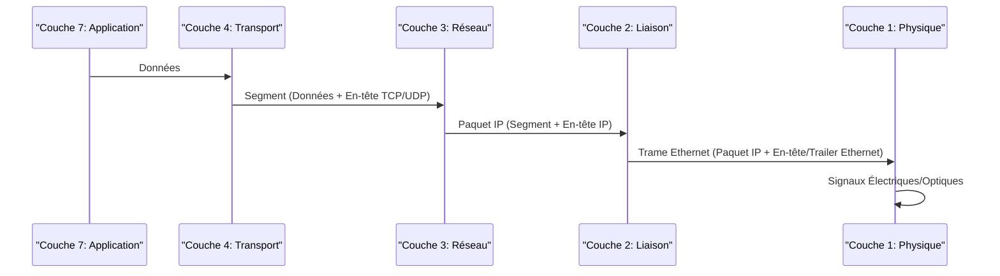

---
cssclasses:
  - max
aliases:
  - "Ethernet"
  - "Ethernet Standard"
archetype: concept-reseau
couche_osi:
  - "Couche 1 - Physique"
  - "Couche 2 - Liaison"
technologie:
  - "LAN"
  - "Ethernet"
tags:
  - ethernet
  - reseau/lan
  - reseau/wan
  - modele-osi
  - modele-osi/couche-1
  - modele-osi/couche-2
  - reseau/trame
  - protocole/csma/cd
  - materiel/reseau/switch
  - materiel/cable
  - cable/utp
  - cable/stp
  - materiel/cable/fibre-optique
  - cable/utp/cat5e
  - cable/utp/cat6
  - cable/utp/cat6a
  - cable/utp/cat7
  - cable/utp/cat8
  - rj45
  - reseau/adressage/mac
  - protocole/ethernet/preamble
  - protocole/ethernet/sfd
  - reseau/trame/fcs
  - norme/ieee-802-3
  - mecanisme/encapsulation
  - bit
---

# Ethernet

> [!abstract] Définition
> **Ethernet** est une famille de technologies de réseaux informatiques filaires couramment utilisée dans les réseaux locaux (LAN) et les réseaux étendus (WAN) pour connecter des appareils au sein d'un espace physique défini. Il fournit les moyens pour que les ordinateurs et autres appareils puissent communiquer entre eux sur un réseau. Ethernet opère principalement aux couches physiques et de liaison de données du modèle OSI, définissant les formats de trames et les protocoles pour la transmission des données.

## ⚙️ Mécanisme & Fonctionnement

Ethernet permet la communication entre les appareils en utilisant des trames de données qui encapsulent les informations transmises. Son fonctionnement a évolué avec le temps, passant des topologies de bus partagé avec *CSMA/CD* à des topologies en étoile basées sur des *commutateurs* (switches).

### **Couche Physique (Couche 1 du modèle OSI)**

La couche physique d'Ethernet définit les spécifications électriques et physiques des médias réseau, y compris les types de câbles, les connecteurs, et la manière dont les signaux sont transmis.

*   **Câbles** : Principalement le câble à paires torsadées (Utp ou STP) pour les réseaux locaux, mais aussi la fibre optique pour les liaisons à longue distance ou à haute vitesse.
    *   *Cat5e, Cat6, Cat6a, Cat7, Cat8* sont des catégories courantes de câbles UTP, supportant différentes bandes passantes et distances.
    *   La fibre optique (multimode ou monomode) est utilisée pour le *Fast Ethernet*, *Gigabit Ethernet* et les vitesses supérieures sur de plus longues distances.
*   **Connecteurs** : Le connecteur RJ45 est le plus répandu pour les câbles à paires torsadées.
*   **Équipements** : Les commutateurs (switches) sont les principaux dispositifs de la couche physique qui connectent les appareils au sein d'un réseau Ethernet. Ils transmettent les trames uniquement au port de destination, réduisant ainsi les collisions.

### **Couche de Liaison de Données (Couche 2 du modèle OSI)**

La couche de liaison de données d'Ethernet est responsable du formatage des données en trames et de leur transmission fiable entre deux nœuds directement connectés.

*   **Trame Ethernet** : L'unité de données de base à la couche 2 est la trame Ethernet. Une trame Ethernet typique (IEEE 802.3) comprend plusieurs champs :
    *   **Préambule et Délimiteur de Début de Trame (SFD)** : Utilisés pour la synchronisation.
    *   **Adresses MAC de destination et de source** : Adresses physiques de 48 bits identifiant de manière unique les interfaces réseau.
    *   **Type/Longueur** : Indique le protocole de couche supérieure (type) ou la longueur des données (longueur).
    *   **Données (Charge utile)** : Les données réelles des couches supérieures.
    *   **Séquence de Vérification de Trame (FCS)** : Un champ de 32 bits utilisé pour la détection d'erreurs.
*   **CSMA/CD (Carrier Sense Multiple Access with Collision Detection)** : Dans les versions antérieures d'Ethernet (topologies partagées utilisant des hubs), CSMA/CD était le mécanisme permettant aux stations de partager le même support de transmission sans interférence constante. Il permettait aux stations d'écouter le support avant de transmettre et de détecter les collisions. Si une collision se produisait, les stations arrêtaient la transmission, attendaient un temps aléatoire, puis réessayaient. Avec l'avènement des commutateurs et des connexions point à point full-duplex, CSMA/CD est devenu obsolète.
*   **Standards IEEE 802.3** : L'IEEE 802.3 est la norme qui définit Ethernet. Au fil du temps, elle a évolué pour inclure différentes vitesses et technologies :
    *   **Ethernet d'origine** (10BASE-T) : 10 Mbps.
    *   **Fast Ethernet** (100BASE-TX) : 100 Mbps.
    *   **Gigabit Ethernet** (1000BASE-T, 1000BASE-X) : 1 Gbps.
    *   **10 Gigabit Ethernet** (10GBASE-R, 10GBASE-T) : 10 Gbps.
    *   Des évolutions plus récentes incluent le 25 Gigabit Ethernet, 40 Gigabit Ethernet, 50 Gigabit Ethernet, 100 Gigabit Ethernet, 200 Gigabit Ethernet et 400 Gigabit Ethernet, principalement pour les centres de données et les infrastructures de cœur de réseau.

### Encapsulation / Traitement
*   **Entrée** : Segment de données (couche 3 et supérieures).
*   **Action** : La couche de liaison de données ajoute l'en-tête et le *trailer* Ethernet (incluant les adresses MAC et le FCS) pour former une **trame Ethernet**. La couche physique convertit la trame en signaux électriques ou optiques pour la transmission sur le support.
*   **Sortie** : Trame Ethernet transmise sous forme de bits sur le câble réseau.

## 💡 Cas d'Usage Typique
Pourquoi l'utilise-t-on ?
1.  **Réseaux Locaux (LAN)** : Ethernet est la technologie dominante pour la connexion d'ordinateurs, de serveurs, d'imprimantes et d'autres périphériques au sein des réseaux d'entreprise, domestiques ou de campus. Il fournit une connectivité fiable et à haut débit pour le partage de ressources et l'accès à Internet.
2.  **Dorsales de Réseau (Backbones)** : Les versions plus rapides d'Ethernet (Gigabit, 10 Gigabit et au-delà) sont largement utilisées pour les liaisons de dorsale (backbones) dans les grands réseaux d'entreprise, les centres de données et les fournisseurs de services Internet, où des débits de données élevés sont essentiels.

## ⚠️ Limitations & Problèmes
> [!warning] Points d'attention
> *   **Collision Domains (historique)** : Dans les réseaux Ethernet anciens utilisant des hubs, toutes les stations partageaient le même [[CollisionDomain|domaine de collision]], ce qui pouvait entraîner des dégradations de performance en cas de trafic élevé. Les commutateurs modernes ont éliminé ce problème en créant des domaines de collision par port.
> *   **Distance** : La portée des câbles Ethernet en cuivre est limitée (par exemple, 100 mètres pour le Fast/Gigabit Ethernet sur Cat5e/6), nécessitant des répéteurs ou des liens fibre optique pour des distances plus importantes.
> *   **Sécurité physique** : Les connexions câblées peuvent être physiquement interceptées si l'accès physique au câblage n'est pas sécurisé.